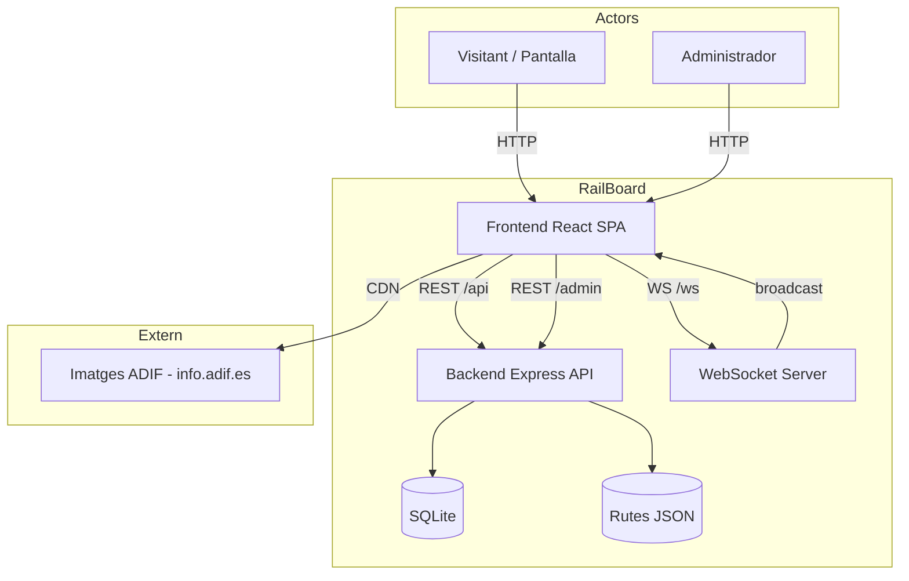
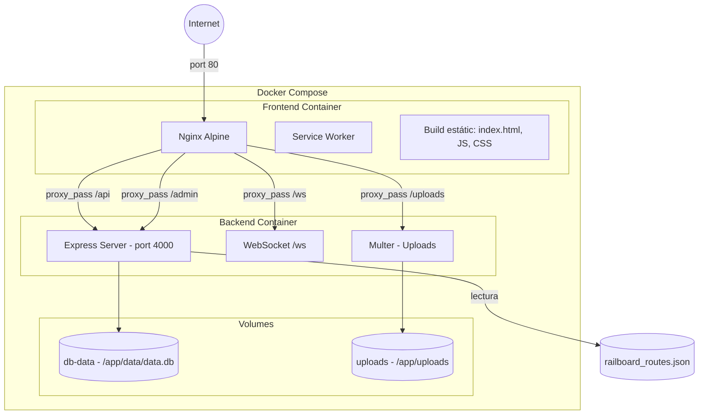
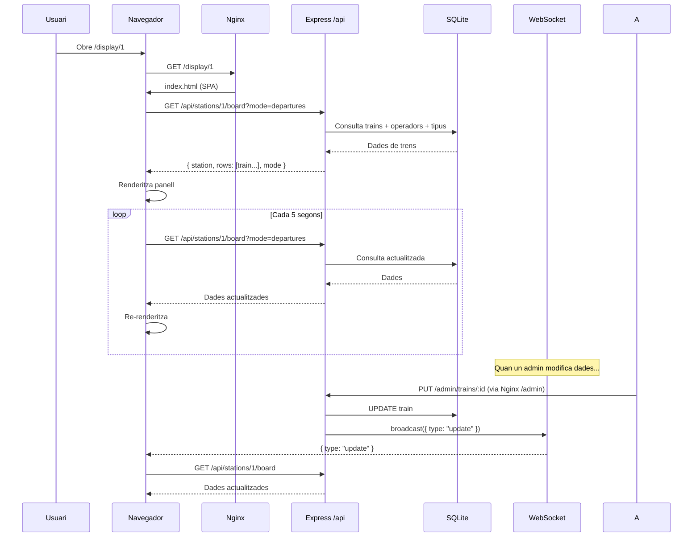
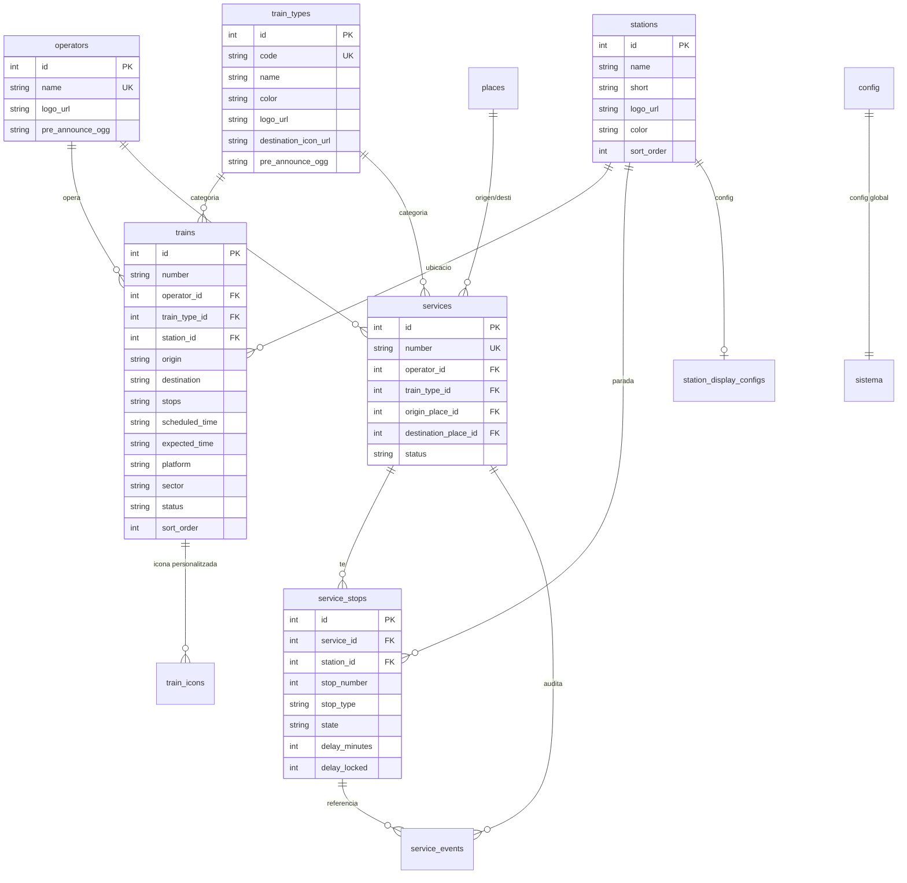

# Anàlisi Tècnica del Projecte RailBoard

> **Data:** 2026-07-17
> **Abast:** Anàlisi completa del repositori `/Users/andreu/Documents/Treball/railboard`
> **Analista:** Auditor tècnic automatitzat
> **Commint analitzat:** Vegeu `git log --oneline -1`

## Índex

- [1. Resum executiu](#1-resum-executiu)
- [2. Inventari tècnic](#2-inventari-tècnic)
- [3. Arquitectura actual](#3-arquitectura-actual)
- [4. Documentació funcional](#4-documentació-funcional)
- [5. Model de domini](#5-model-de-domini)
- [6. Anàlisi de qualitat del codi](#6-anàlisi-de-qualitat-del-codi)
- [7. Anàlisi de deuda tècnica](#7-anàlisi-de-deuda-tècnica)
- [8. Matriu de priorització](#8-matriu-de-priorització)
- [9. Seguretat](#9-seguretat)
- [10. Testing i qualitat](#10-testing-i-qualitat)
- [11. Rendiment i escalabilitat](#11-rendiment-i-escalabilitat)
- [12. Observabilitat i operació](#12-observabilitat-i-operació)
- [13. Dependències i obsolescència](#13-dependències-i-obsolescència)
- [14. Experiència de desenvolupament](#14-experiència-de-desenvolupament)
- [15. Documentació que cal crear](#15-documentació-que-cal-crear)
- [16. ADR: decisions arquitectòniques](#16-adr-decisions-arquitectòniques)
- [17. Roadmap de millora](#17-roadmap-de-millora)
- [18. Pla 30-60-90 dies](#18-pla-30-60-90-dies)
- [19. Quick wins](#19-quick-wins)
- [20. Riscos](#20-riscos)
- [21. Preguntes pendents](#21-preguntes-pendents)

---

## 1. Resum executiu

### Propòsit del sistema

**RailBoard** és un simulador de panells informatius de sortides/arribades de trens d'estació, inspirat en els panells de la xarxa ferroviària espanyola (estil Gravita/ADIF). El sistema genera dades sintètiques de trens, les presenta en un panell visual tipus "board" optimitzat per pantalles grans, i ofereix una interfície d'administració per configurar estacions, operadors, tipus de tren i locucions.

### Usuaris principals

1. **Operadors de maquetes ferroviàries** — usen el panell com a decoració/ambientació
2. **Administradors** — configuren estacions, generen trens, gestionen operadors i tipus
3. **Visitants d'exposicions** — veuen el panell en pantalles en esdeveniments

### Funcionalitats essencials

- **Panell de sortides/arribades** en temps real amb estil Renfe/ADIF
- **Administració completa** d'operadors, tipus de tren, estacions, places
- **Generació automàtica** de trens sintètics basats en rutes reals
- **Suport multiestació** — múltiples pantalles per a diferents estacions
- **Multilingüe** — castellà, català, anglès, francès, basc, gallec
- **Locucions/TTS** — anuncis sonors amb plantilles i veus per idioma
- **Serveis multi-parada** — gestió de serveis amb múltiples parades i propagació de retards
- **PWA** — instal·lable offline amb Service Worker

### Stack tecnològic

| Capa | Tecnologia | Versió |
|------|-----------|--------|
| Frontend | React 18 + TypeScript | 18.3.x |
| Bundler | Vite | 5.4.x |
| Estils | Tailwind CSS 3 | 3.4.x |
| Backend | Node.js + Express | 20 LTS / 4.21.x |
| Base de dades | SQLite (better-sqlite3) | 11.3.x |
| Realtime | WebSocket (ws) | 8.18.x |
| Auth | HTTP Basic Auth (express-basic-auth) | 1.2.x |
| Testing | Vitest | 4.1.x |

### Arquitectura general

```
[Navegador/PWA] ←→ [Nginx (proxy)] ←→ [Express (API + WS)]
                                           ↕
                                      [SQLite]
                                           ↕
                                   [railboard_routes.json]
```

Aplicació monolítica amb frontend React SPA servit per nginx i backend Express amb SQLite. Comunicació via REST + WebSocket per a actualitzacions en temps real.

### Estat tècnic actual

El projecte es troba en un estat **madur però actiu** — té funcionalitats completes, tests que passen, Docker Compose per producció, i PWA. No obstant, acumula **deute tècnic significatiu** en forma de fitxers massius (>3000 línies), lògica duplicada, i un model de dades que ha evolucionat per acumulació.

### Principals fortaleses

1. **Qualitat visual del panell** — molt realista, estil Gravita/ADIF
2. **Testing sòlid** — 72 tests al backend, cobertura de casos crítics
3. **Infraestructura en Docker** — desplegament senzill amb Docker Compose
4. **PWA + fonts offline** — funciona sense connexió un cop carregat
5. **Generació intel·ligent de trens** — basada en dades reals de rutes

### Riscos més rellevants

1. **SQLite sense backups automàtics** — pèrdua potencial de dades
2. **Admin panel monolític** (`Admin.tsx` > 3100 línies) — difícils de mantenir
3. **Auth bàsica HTTP** — credencials en text pla, sense MFA, sense rotació
4. **No hi ha tests de frontend** — error de configuració impedia executar-los, ara s'han resolt però no hi ha tests reals
5. **Pujada d'arxius sense validació de contingut** — risc d'execució de fitxers maliciosos
6. **Dependències creuades entre backend i frontend** — tipus duplicats en TypeScript i JS

### Valoracions

| Àrea | Puntuació (1-10) | Justificació |
|------|:-----------------:|--------------|
| **Salut tècnica** | 7 | Funciona correctament, tests passen, però amb deute tècnic moderat |
| **Mantenibilitat** | 5 | Fitxers molt grans, lògica duplicada, manca de separació en mòduls |
| **Seguretat** | 5 | Auth bàsica sense HTTPS forçat, pujada d'arxius sensible, secrets per defecte |
| **Escalabilitat** | 4 | SQLite no escala a múltiples lectors/escriptors, tot en un sol procés |
| **Observabilitat** | 3 | Logs sense estructura, sense mètriques, sense tracing, sense alertes |
| **Documentació** | 6 | `docs/` amb 11 fitxers, però desactualitzats i incomplets |
| **Facilitat d'incorporació** | 7 | Docker facilita l'inici, però manca de onboarding estructurat |

---

## 2. Inventari tècnic

### Aplicació — stack complet

| Element | Tecnologia | Versió | Ús | Evidència | Estat |
|---------|-----------|--------|----|-----------|-------|
| **Lenguatge backend** | JavaScript (ESM) | ES2022 | API i lògica de negoci | `backend/src/*.js` "type": "module" a package.json | ✅ Actiu |
| **Lenguatge frontend** | TypeScript | 5.x | UI i lògica de client | `frontend/src/*.tsx` / `.ts` | ✅ Actiu |
| **Framework backend** | Express | 4.21.0 | Servidor HTTP | `backend/src/index.js` | ✅ Actiu |
| **Framework frontend** | React | 18.3.x | UI reactiva | `frontend/src/main.tsx` | ✅ Actiu |
| **Bundler** | Vite | 5.4.21 | Build i dev server | `frontend/vite.config.ts` | ✅ Actiu |
| **Estils** | Tailwind CSS 3 | 3.4.x | CSS utilitari | `frontend/src/styles/index.css`, `tailwind.config.js` | ✅ Actiu |
| **Base de dades** | SQLite (better-sqlite3) | 11.3.0 | Persistència | `backend/src/db.js` | ✅ Actiu |
| **Realtime** | ws | 8.18.0 | WebSocket | `backend/src/ws.js` | ✅ Actiu |
| **Auth** | express-basic-auth | 1.2.1 | HTTP Basic Auth | `backend/src/routes.js` | ⚠️ Sense manteniment |
| **Rate limiting** | express-rate-limit | 8.5.2 | Protecció abús | `backend/src/index.js` | ✅ Actiu |
| **Seguretat HTTP** | helmet | 8.2.0 | Headers seguretat | `backend/src/index.js` | ✅ Actiu |
| **Pujada fitxers** | multer | 1.4.5-lts.1 | Upload imatges/àudio | `backend/src/routes.js` | ⚠️ LTS antiga |
| **Test runner** | Vitest | 4.1.7 | Tests unitaris i integració | Ambdós `vitest.config.*` | ✅ Actiu |
| **HTTP testing** | supertest | 7.2.2 | Tests d'API | `backend/src/__tests__/` | ✅ Actiu |

### Frontend — detall

| Element | Tecnologia | Evidència |
|---------|-----------|-----------|
| **Router** | react-router-dom | `Display.tsx` `useParams`, `Admin.tsx` `Link` |
| **Icons** | lucide-react | `Admin.tsx` línia 2 |
| **DnD** | @dnd-kit/core + @dnd-kit/sortable | `Trains.tsx` |
| **I18n** | Propi (fitxer `i18n.ts`) | `frontend/src/lib/i18n.ts` |
| **TTS** | Web Speech API | `frontend/src/lib/tts.ts` |
| **SW** | Service Worker manual | `frontend/public/sw.js` |
| **Tipografies** | Local (Bebas Neue, Inter, JetBrains Mono, Oswald, Roboto Condensed, Roboto Mono) | `frontend/public/fonts/` |
| **Gestor estats** | React hooks (useState, useEffect, useMemo, useRef) | No hi ha estat global (Redux, Zustand, etc.) |

### Backend — detall

| Element | Tecnologia | Evidència |
|---------|-----------|-----------|
| **Controladors** | Inline a `routes.js` | 1676 línies al fitxer amb totes les rutes |
| **Capes** | DB directa (db.js) + rutes (routes.js) | Sense capa de servei ni repositori |
| **Migracions** | SQL migrator propi (`migrations.js`) | Llegeix fitxers .sql de `backend/migrations/` |
| **Seed** | Script `seed.js` | Crea operadors, tipus, places i trens de demostració |
| **Rutes** | JSON estàtic (`railboard_routes.json`) | 30+ rutes reals de xarxa ferroviària espanyola |

### Persistència

| Element | Detall | Evidència |
|---------|--------|-----------|
| **Motor** | SQLite (better-sqlite3) | `backend/src/db.js` |
| **Mode WAL** | Activat | `db.pragma("journal_mode=WAL")` a db.js |
| **Migracions** | SQL progressiu + ALTER TABLE en db.js | `backend/migrations/*.sql` + lògica de detecció a db.js |
| **Taules principals** | config, operators, train_types, places, stations, station_display_configs, trains, train_icons, services, service_stops, service_events | db.js línies 25-130 |
| **Backup** | Cap mecanisme implementat | — |

### Infraestructura

| Element | Tecnologia | Evidència |
|---------|-----------|-----------|
| **Contenidors** | Docker + Docker Compose | `docker-compose.yml` |
| **Proxy** | Nginx (alpine) | `docker/nginx.conf` |
| **Volums** | db-data (SQLite), uploads (imatges/àudio) | `docker-compose.yml` |
| **Entorns** | Un sol entorn (producció per defecte) | `NODE_ENV=production` al compose |
| **CI/CD** | Cap | — |
| **Monitorització** | Cap | — |

### Eines de desenvolupament

| Element | Tecnologia | Evidència |
|---------|-----------|-----------|
| **Control versions** | Git | `.git` |
| **Testing** | Vitest | `vitest.config.*` |
| **Linting** | Cap configurat | No hi ha `.eslintrc*` ni `.prettierrc*` |

---

## 3. Arquitectura actual

### Diagrama de context



### Diagrama de contenidors



### Diagrama de flux principal — Panell de sortides



### Mapa de mòduls

| Mòdul | Responsabilitat | Entrades | Sortides | Dependències | Riscos |
|-------|-----------------|----------|----------|--------------|--------|
| **index.js** | Configuració Express, middleware, muntatge rutes | Env vars | Servidor HTTP | express, helmet, cors, ws | Configuració dispersa |
| **db.js** | Capa de persistència, CRUD, migracions inline | CRUD calls | Dades SQL | better-sqlite3 | 882 línies, barreja migracions amb CRUD |
| **routes.js** | Totes les rutes admin, lògica de negoci inline | Peticions /admin | Respostes JSON | db.js, multer, express-basic-auth | 1676 línies, acoblament alt |
| **railRoutesApi.js** | API pública /api, lògica del panell | Peticions /api | Board data | db.js | Duplica part de routes.js |
| **ws.js** | WebSocket, broadcast | Servidor HTTP | Missatges WS | ws | 18 línies, responsabilitat mínima |
| **migrations.js** | Execució de migracions SQL | Fitxers .sql | Esquema DB | db.js, fs | Rollback hardcoded |
| **seed.js** | Dades de demostració | — | DB poblada | db.js, fs | Esborra dades existents |
| **routeService.js** | Càrrega i consulta de rutes JSON | JSON estàtic | Array de rutes | fs | Dades en memòria, sense refresh automàtic |
| **Admin.tsx** | Panell d'administració complet | — | UI admin | Totes les API | 3128 línies, component monolític |
| **Display.tsx** | Panell de sortides/arribades | stationId | UI panell | API /api | 841 línies, lògica complexa |

### Comunicacions

| Tipus | Origen | Destí | Protocol | Freqüència |
|-------|--------|-------|----------|------------|
| Consulta panell | Frontend | /api/stations/:id/board | REST (GET) | Cada 5s (polling) + WebSocket |
| Admin CRUD | Frontend | /admin/* | REST (GET/POST/PUT/PATCH/DELETE) | Sota demanda |
| Actualitzacions | Backend | Frontend (WS) | WebSocket | Després de cada mutació |
| Fitxers estàtics | Nginx | Navegador | HTTP | Una vegada (cache 30d) |
| Pujada fitxers | Frontend | /admin/* | REST multipart | Ocasional |

---

## 4. Documentació funcional

### Funcionalitat: Panell de sortides/arribades

**Objectiu:** Mostrar en temps real un panell informatiu de trens amb estil Renfe/ADIF.

**Actors:** Visitant, Pantalla d'estació.

**Precondicions:** L'estació té trens assignats (taula `trains`) o serveis (`services`/`service_stops`).

**Flux principal:**
1. L'usuari accedeix a `/display/:stationId` (o `/display` si displayMode="single")
2. El frontend carrega configuració, estacions i places
3. Fa GET `/api/stations/:id/board?mode=departures|arrivals`
4. El backend consulta `trains` (i fallback a `services`)
5. Retorna dades normalitzades: número, operador, tipus, destí/origen, parades, hora, andana, estat
6. El frontend renderitza el panell amb columnes: HORA, DESTÍ, PRODUCTE, ANDANA
7. Cada 5 segons re-polla; també rep WebSockets
8. Cada 30 segons actualitza el rellotge

**Variants:**
- Mode "arrivals" — mostra l'origen en lloc del destí
- Mode "single" — ignora `stationId` de la URL, usa l'estació de config global
- Mode "multiple" — cada display mostra una estació diferent
- Canvi d'idioma cada 5 segons si múltiples idiomes configurats

**Errors esperables:**
- 404 si stationId no existeix
- Llista buida si no hi ha trens
- Error 500 de base de dades

**Permisos:** Públic, no requereix autenticació.

**Dades implicades:** `trains`, `operators`, `train_types`, `stations`, `config/station_display_configs`.

**Arxius principals:**
- `frontend/src/pages/Display.tsx` (841 línies)
- `backend/src/railRoutesApi.js` (209 línies)
- `backend/src/routes.js` (endpoint `/admin/stations/:stationId/board`)
- `backend/src/db.js` (funcions `listTrains`, `getStationDisplayConfig`)
- `docker/nginx.conf` (proxy pass /api/)

### Funcionalitat: Administració de trens

**Objectiu:** Gestionar el catàleg de trens (crear, editar, eliminar, reordenar, importar, generar automàticament).

**Actors:** Administrador.

**Flux principal:**
1. L'admin accedeix a `/admin` (qualsevol ruta sota `/admin`)
2. Nginx serveix l'SPA React; el frontend fa routing intern
3. L'admin pot:
   - Veure llista de trens amb detalls
   - Crear tren manualment (formulari)
   - Editar tren (modal)
   - Eliminar tren (amb confirmació)
   - Reordenar trens (drag & drop)
   - Generar 1 tren aleatori (basat en rutes reals)
   - Generar tota la graella
   - Carregar trens ficticis de demostració
   - Auto-generar amb interval configurable
   - Importar/exportar JSON

**Riscos:**
- `clearTrains()` NO demana confirmació en totes les vies
- `seedTrains()` esborra TOTES les dades existents

### Funcionalitat: Gestió multiestació i serveis

**Objectiu:** Suportar múltiples estacions amb configuracions independents i serveis multi-parada.

**Flux principal:**
1. L'admin crea estacions des del panell d'admin
2. Cada estació té: nom, short, logo, color, pre-announce audio, sort_order
3. Cada estació pot tenir config independent (mode, idiomes, colors)
4. Els trens s'assignen a una estació (`station_id`)
5. El panell de display mostra els trens de l'estació corresponent
6. Els serveis (`services`) són trens multi-parada amb:
   - Origen i destí (referència a `places`)
   - Parades intermèdies (`service_stops`)
   - Propagació de retards entre parades
   - Estats: Scheduled → Arrived → Departed → Completed
   - Au dittrail d'events (`service_events`)

**Arxius principals:**
- `backend/src/db.js` (funcions services/serviceStops/serviceEvents)
- `backend/src/routes.js` (endpoints /admin/services/*, /admin/stops/*)
- `backend/migrations/001-services.sql`, `002-service-events.sql`, `003-trains-compatibility.sql`

### Funcionalitat: Locucions i TTS

**Objectiu:** Generar anuncis sonors automàtics per a les sortides/arribades de trens.

**Flux principal:**
1. L'admin configura plantilles d'anunci per idioma
2. Configura veus TTS (per idioma) via Web Speech API
3. Configura presets d'anunci (benvinguda, tancament, retards, etc.)
4. L'admin pot disparar anuncis manualment des del panell
5. El sistema reprodueix l'anunci amb la veu configurada

**Arxius principals:**
- `frontend/src/lib/tts.ts` (lògica TTS + plantilles)
- `frontend/src/components/admin/LocutionsPanel.tsx`
- `frontend/src/pages/Admin.tsx` (secció Locutions / Voice)

---

## 5. Model de domini

### Glossari de domini

| Terme | Significat |
|-------|-----------|
| **Train** | Un servei/tren individual amb horari, andana, estat |
| **Operator** | Companyia operadora (Renfe, Avlo, Iryo, Ouigo) |
| **Train Type** | Categoria de tren (AVE, AVLO, ALVIA, Cercanías, etc.) |
| **Station** | Estació física amb nom i display config |
| **Place** | Destí/Origen genèric (ciutat) |
| **Service** | Servei multi-parada amb recorregut complet |
| **Service Stop** | Parada individual dins d'un servei |
| **Route** | Ruta ferroviària amb estacions, operador i horari tipus |
| **Display Config** | Configuració per pantalla (idioma, colors, mode) |
| **Icon** | Icona personalitzada per a tren o tipus |
| **Pre-announce** | Àudio pre-gravat per a anuncis |

### Entitats principals

#### Train
- **Atributs:** id, number, operator_id (FK), train_type_id (FK), origin, destination, stops (JSON), scheduled_time, expected_time, platform, sector, status, station_id (FK), sort_order, custom_icon_url, icon_mode, observations
- **Estats:** Scheduled → Boarding → Departed / Arrived → Cancelled (qualsevol estadi)
- **Regles:** Si expected_time != scheduled_time → Delayed; Si status = "Delayed" → expected_time > scheduled_time
- **Operacions:** CRUD, reorder, delay add, status change, platform change
- **Evidència:** `backend/src/db.js` funcions `createTrain`, `updateTrain`, `rowToTrain`

#### Operator
- **Atributs:** id, name, logo_url, pre_announce_ogg
- **Regles:** name és UNIQUE
- **Operacions:** CRUD, logo upload, pre-announce upload/delete
- **Evidència:** `backend/src/db.js` objecte `operators`

#### TrainType
- **Atributs:** id, code (UNIQUE), name, color, logo_url, destination_icon_url, pre_announce_ogg
- **Regles:** code és clau natural (s'usa per upsert)
- **Operacions:** CRUD, logo upload, destination icon upload

#### Station
- **Atributs:** id, name, short, logo_url, pre_announce_ogg, color, sort_order
- **Regles:** NO es pot eliminar l'última estació; les estacions tenen configs per display
- **Operacions:** CRUD, display config get/set

#### Service
- **Atributs:** id, number, operator_id, train_type_id, origin_place_id, destination_place_id, status, notes, started_at, completed_at, cancelled_at
- **Estats:** Scheduled → In Progress → Completed; pot anar a Cancelled des de qualsevol estat
- **Regles:** En marcar l'última parada com Departed, el servei passa a Completed

#### ServiceStop
- **Atributs:** id, service_id, station_id, stop_number, stop_type (Origin/Stop/Pass/Destination), arrival_scheduled, departure_scheduled, arrival_expected, departure_expected, arrival_actual, departure_actual, state (Scheduled/Arrived/Departed/Passed/Cancelled/Skipped), platform, sector, delay_minutes, delay_locked
- **Regles de negoci crítiques:**
  - Quan s'arriba a una parada, es calcula el retard i es PROPAGA a les següents
  - Si delay_locked=1, NO hereta retards de parades anteriors
  - Quan es marxa de l'última parada → servei "Completed"
  - L'ordre de parades es manté per stop_number i es pot reordenar

### Diagrama d'entitats



### Regles de negoci detectades

| Regla | On està implementada | Problema |
|-------|---------------------|----------|
| No es pot eliminar l'última estació | `routes.js:1200` (aprox) | ✅ Centralitzada |
| `delay_locked` evita propagació de retards | `db.js:serviceStops.markArrival()` | ✅ Documentada |
| En marcar última parada Departed → Completed | `db.js:serviceStops.markDeparture()` | ✅ |
| `seedTrains()` esborra totes les dades | `routes.js` endpoint POST `/admin/seed-trains` | ⚠️ No demana confirmació |
| `clearTrains()` requereix `X-Confirm: yes` | `routes.js` DELETE `/admin/trains` | ✅ |
| `station_id` per defecte 1 a seed | `seed.js` | ⚠️ Valor mágic |
| Probabilitats de retard per tipus de tren | `routes.js:profileForType()` | ✅ |
| Les rutes han de tenir camps obligatoris | `routeService.js` | ✅ |
| Totes les claus i18n han d'existir a tots els idiomes | `i18n.test.ts` | ✅ Testejat |

---

## 6. Anàlisi de qualitat del codi

### Disseny

| Hallazgo | Evidència | Impacte | Probabilitat | Severitat | Recomanació |
|----------|-----------|---------|-------------|-----------|-------------|
| **Manca de separació de responsabilitats** a `routes.js` | 1676 línies amb lògica de negoci, validació, transformació | Alt | Alta | Alta | Extreure serveis a fitxers separats |
| **Admin.tsx monolític** | 3128 línies, mescla sidebar + taules + modals | Alt | Alta | Alta | Dividir en subcomponents |
| **Duplicació de lògica d'helper** | `normalizeStation` a routes.js i helpers.unit.test.js | Mig | Alta | Mig | Consolidar en un mòdul compartit |
| **Acoblament db.js ↔ routes.js** | routes.js depèn de l'estructura interna de db.js | Mig | Alta | Alt | Introduir repositori/servei |
| **Barreja migracions SQL + ALTER TABLE inline** | db.js: migracions inline via `PRAGMA table_info` + `ALTER TABLE` | Mig | Alta | Mig | Unificar a SQL migrator |

### Complexitat

| Hallazgo | Evidència |
|----------|-----------|
| `Admin.tsx` — 3128 línies, múltiples components inline | `frontend/src/pages/Admin.tsx` |
| `routes.js` — 1676 línies, responsable de totes les rutes admin | `backend/src/routes.js` |
| `db.js` — 882 línies, barreja creació de taules, migracions i CRUD | `backend/src/db.js` |
| `Display.tsx` — 841 línies, lògica de render + polling + WS | `frontend/src/pages/Display.tsx` |
| `DisplayConfig.tsx` — 1001 línies | `frontend/src/pages/DisplayConfig.tsx` |

### Legibilitat

| Aspecte | Valoració |
|---------|-----------|
| Noms de variables | ✅ Generalment clars (ex: `train.destination`, `scheduled_time`) |
| Convencions | ⚠️ Barreja camelCase (JS) amb snake_case (SQL/JSON API) |
| Valors màgics | ⚠️ `station_id: 1` a seed.js |
| Codi mort | ✅ `Admin.tsx.bak` (backup), `routeService.ts` (duplicat de .js) |
| Comentaris | ⚠️ Pocs comentaris, cap JSDoc |

---

## 7. Anàlisi de deuda tècnica

### DT-001: Component admin monolític

**Categoria:** Deuda de codi / Deuda d'arquitectura
**Component:** `frontend/src/pages/Admin.tsx` (3128 línies)
**Descripció:** L'únic component d'admin conté sidebar, dashboard, taules de trens, modals d'edició, gestió d'operadors, tipus, places, estacions, serveis, locucions, veus, estils, i més. No hi ha separació en fitxers ni lazy loading.
**Origen:** Creixement incremental sense refactorització.
**Impacte actual:** Dificulta el manteniment, les revisions de codi i l'addició de noves funcionalitats. Un sol canvi pot afectar múltiples àrees no relacionades.
**Risc futur:** Bloquejarà l'evolució del producte. Alta probabilitat d'introduir regressions.
**Probabilitat:** Alta | **Severitat:** Alta | **Esforç:** L
**Natura:** Accidental e imprudent
**Tipus:** Deuda estructural

### DT-002: Routes.js amb responsabilitats múltiples

**Categoria:** Deuda de codi / Deuda d'arquitectura
**Component:** `backend/src/routes.js` (1676 línies)
**Descripció:** Conté definició de rutes, lògica de negoci, validació, transformació de dades, generació de trens aleatoris, i observacions multilingües.
**Origen:** Arquitectura plana Express.
**Impacte actual:** Difícil de testejar per unitats i de modificar sense risc.
**Esforç:** M
**Natura:** Accidental e imprudent

### DT-003: db.js amb migracions inline

**Categoria:** Deuda de dades / Deuda de codi
**Component:** `backend/src/db.js`
**Descripció:** Les migracions d'esquema es fan tant via fitxers .sql (migrations.js) com via codi inline a db.js (detectant columnes que falten amb `PRAGMA table_info` i fent `ALTER TABLE`).
**Origen:** Necessitat d'afegir columnes sense crear fitxers de migració.
**Impacte actual:** Dues fonts de veritat per a l'esquema. Difícil de saber si una columna existeix o no.
**Esforç:** S
**Natura:** Accidental i prudent
**Tipus:** Deuta localitzada

### DT-004: Duplicació de tipus entre backend i frontend

**Categoria:** Deuda de dades
**Component:** `backend/src/types/railRoute.ts`, `frontend/src/types/railRoute.ts`
**Descripció:** La interfície `RailRoute` està definida tant al backend (TypeScript però no s'usa en JS) com al frontend. No hi ha un package compartit.
**Origen:** Dos repositoris separats originalment.
**Impacte actual:** Les definicions poden divergir.
**Esforç:** XS

### DT-005: Manca de tests de frontend

**Categoria:** Deuda de testing
**Component:** Frontend complet
**Descripció:** Els 3 tests existents (StatusPill, Clock, i18n) són molt bàsics. No hi ha tests de components complexos (Display, Admin, DisplayConfig, Trains). No hi ha tests d'integració ni E2E.
**Origen:** No prioritzat.
**Impacte actual:** Canvis al frontend no tenen xarxa de seguretat.
**Esforç:** XL
**Natura:** Deliberada e imprudent

### DT-006: Manca de linting i format

**Categoria:** Deuda d'experiència de desenvolupament
**Component:** Ambdós projectes
**Descripció:** No hi ha ESLint, Prettier, ni cap eina d'anàlisi estàtica configurada.
**Origen:** No prioritzat.
**Impacte actual:** Inconsistències d'estil, no es poden automatitzar correccions.
**Esforç:** XS

### DT-007: Auth bàsica per a admin

**Categoria:** Deuda de seguretat
**Component:** `backend/src/routes.js`
**Descripció:** L'autenticació admin és HTTP Basic Auth amb contrasenya en text pla. No hi ha MFA, tokens, sessions, ni rotació de credencials. La contrasenya per defecte ("railboard") es documentada al codi.
**Origen:** Simplicitat inicial.
**Impacte actual:** Vulnerable a atacs de credencials per defecte i escolta de xarxa si no s'usa HTTPS.
**Esforç:** S

### DT-008: Pujada d'arxius sense validació de contingut

**Categoria:** Deuda de seguretat
**Component:** `backend/src/routes.js` (multer)
**Descripció:** Multer filtra per extensió però no valida el contingut real del fitxer. Un fitxer .png amb contingut maliciós passaria el filtre.
**Origen:** Mínim necessari per funcionar.
**Impacte actual:** Risc de RCE o emmagatzematge de fitxers no permesos.
**Esforç:** S

### DT-009: Logs no estructurats

**Categoria:** Deuda d'observabilitat
**Component:** Backend complet
**Descripció:** Tota la sortida de log és via `console.log`. No hi ha nivells de log (`info`, `warn`, `error`), ni JSON, ni correlació de peticions, ni request IDs.
**Origen:** Mínim necessari.
**Impacte actual:** Difícil depurar incidents en producció.
**Esforç:** S

### DT-010: Sense backup de base de dades

**Categoria:** Deuda d'infraestructura / Deuda de processos
**Descripció:** No hi ha cap mecanisme de backup automàtic per a la base de dades SQLite ni per als fitxers pujats.
**Origen:** No implementat.
**Impacte actual:** Pèrdua total de dades en cas de fallada del volume Docker.
**Risc:** Crític
**Esforç:** XS

### DT-011: Valors màgics

**Categoria:** Deuda de codi
**Evidència:** `seed.js` línia `station_id: 1`, `seedStationsAndTrains.mjs` valors hardcoded
**Impacte actual:** Si l'estació 1 és esborrada o reordenada, el seed genera dades incorrectes.
**Esforç:** XS

### DT-012: Sense gestor d'estat global al frontend

**Categoria:** Deuda d'arquitectura
**Descripció:** Totes les dades es carreguen via hooks `useState` + `useEffect` a cada component. No hi ha cache compartida entre vistes.
**Impacte actual:** Cada vegada que es navega entre administració i display, es recarreguen dades. Manca d'estat compartit causa re-renders innecessaris.
**Esforç:** M

### DT-013: routeService.ts no s'usa

**Categoria:** Deuda de codi
**Evidència:** `backend/src/services/routeService.ts` — duplicat TypeScript de `routeService.js`, no importat per cap fitxer JS.
**Impacte actual:** Codi mort que pot confondre.
**Esforç:** XS

### DT-014: Servei Worker sense estratègia de cache robusta

**Categoria:** Deuda de rendiment
**Descripció:** El SW a `frontend/public/sw.js` usa cache-first per a estática i network-first per a API, però no té gestió de versions ni purge de cache antiga.
**Esforç:** S

---

## 8. Matriu de priorització

| Prioritat | ID | Deuda | Impacte Tècnic | Impacte Negoci | Risc Seguretat | Freqüència | Cost Retard | Esforç | Puntuació | Recomanació |
|-----------|-----|-------|:----:|:-----:|:-----:|:-----:|:-----:|:-----:|:-----:|-------------|
| 1 | DT-010 | Sense backup DB | 5 | 5 | 4 | 1 | 5 | 1 | 20.0 | Backup automàtic (WAL + cron/db-dump) |
| 2 | DT-007 | Auth bàsica | 3 | 3 | 5 | 1 | 4 | 1 | 16.0 | Canviar a token-based o OAuth2 proxy |
| 3 | DT-008 | Upload sense validació | 4 | 3 | 5 | 1 | 4 | 1 | 17.0 | Validar contingut amb `file-type` |
| 4 | DT-005 | Sense tests frontend | 4 | 4 | 1 | 5 | 4 | 4 | 4.5 | Tests de Display i Admin |
| 5 | DT-001 | Admin monolític | 4 | 3 | 1 | 4 | 3 | 5 | 3.0 | Refactoritzar en subcomponents |
| 6 | DT-002 | routes.js massiu | 4 | 3 | 1 | 3 | 3 | 3 | 4.7 | Extreure serveis |
| 7 | DT-003 | Migracions inline | 2 | 1 | 1 | 2 | 2 | 1 | 8.0 | Unificar a SQL migrator |
| 8 | DT-009 | Logs no estructurats | 3 | 2 | 2 | 5 | 4 | 1 | 16.0 | pino o winston |
| 9 | DT-006 | Linting absent | 2 | 1 | 1 | 5 | 3 | 1 | 12.0 | ESLint + Prettier |
| 10 | DT-011 | Valors màgics | 2 | 1 | 1 | 2 | 2 | 1 | 8.0 | Constants amb nom |
| 11 | DT-012 | Sense gestor estat | 3 | 1 | 1 | 3 | 2 | 3 | 3.3 | TanStack Query o Zustand |
| 12 | DT-013 | Codi mort TypeScript | 1 | 1 | 1 | 1 | 1 | 1 | 5.0 | Eliminar fitxer |
| 13 | DT-014 | SW sense versionat | 2 | 1 | 1 | 1 | 2 | 1 | 7.0 | Afegir cache versioning |

---

## 9. Seguretat

### Anàlisi defensiu

| Hallazgo | Tipus | Severitat | Descripció | Mitigació |
|----------|-------|-----------|------------|-----------|
| **HTTP Basic Auth sense HTTPS** | Configuració insegura | Alt | Les credencials viatgen en base64 (text pla) si no hi ha HTTPS. El Docker Compose no configura TLS. | Forçar HTTPS al proxy o usar token-based auth |
| **Contrasenya per defecte** | Configuració insegura | Critic | `ADMIN_PASSWORD=railboard` per defecte. Molts usuaris no la canviaran. | Exigir canvi de password al primer inici |
| **Upload sense validació de contingut** | Risc potencial | Alt | Multer filtra per extensió, però es pot canviar l'extensió d'un executable. | Usar `file-type` per validar MIME real |
| **No rate limit a /api** | Risc potencial | Mig | El rate limit només aplica a `/admin`. `/api/stations/:id/board` no té protecció. | Afegir rate limit a /api |
| **SQLite no xifrat** | Risc potencial | Mig | Si algú accedeix al volume, pot llegir la base de dades sencera. | Xifratge a nivell de disc o SQLite Encryption Extension |
| **CORS massa permissiu** | Configuració insegura | Mig | En no-prod, permet qualsevol origen `http://localhost:*`. | Restringir a origens coneguts |
| **Helmet desactivat parcialment** | Configuració insegura | Baix | `crossOriginResourcePolicy: "cross-origin"` | Avaluar si és necessari |
| **Stops sencers a logs** | Risc potencial | Baix | Si algun dia es loggen peticions, les contrasenyes Basic Auth hi apareixeran. | Usar middleware que sanititzi headers |
| **No CSRF protection** | Risc potencial | Mig | Tot i que l'auth Basic Auth via headers no és vulnerable a CSRF clàssic, les peticions GET/POST a /admin amb credencials desades al navegador sí. | Implementar CSRF token o SameSite cookies |
| **XSS al panell** | Risc potencial | Mig | Les dades de trens (observations, stops) es renderitzen com a text. Si un admin maliciós injecta HTML, es podria executar. | Revisar que React escapa correctament |
| **IDOR a /api/stations/:id** | Risc potencial | Baix | L'API pública no requereix auth. Es pot llistar qualsevol estació. | No rellevant per al cas d'ús (dades públiques) |

### Classificació final

| Nivell | Comptador |
|--------|:---------:|
| Crític | 1 (contrasenya per defecte) |
| Alt | 3 (Basic auth sense HTTPS, upload sense validació, rate limit /api) |
| Mig | 4 (SQLite no xifrat, CORS permissiu, CSRF, XSS potencial) |
| Baix | 2 (Helmet, logs) |

---

## 10. Testing i qualitat

### Tests existents

| Suite | Fitxer | Tests | Tipus |
|-------|--------|:-----:|-------|
| DB unit tests | `backend/src/__tests__/db.unit.test.js` | — | Unitari (temp DB) |
| Helpers unit tests | `backend/src/__tests__/helpers.unit.test.js` | — | Unitari |
| E2E API | `backend/src/__tests__/e2e.test.js` | — | Integració |
| Routes integration | `backend/src/__tests__/routes.integration.test.js` | — | Integració |
| Total backend | 4 fitxers | **72 tests** | ✅ Tots passen |
| StatusPill | `frontend/src/components/__tests__/StatusPill.test.tsx` | 8 | Unitari |
| Clock | `frontend/src/components/__tests__/Clock.test.tsx` | 3 | Unitari |
| i18n | `frontend/src/lib/__tests__/i18n.test.ts` | 10 | Unitari |
| Total frontend | 3 fitxers | **21 tests** | ✅ Tots passen |

### Cobertura aparent

L'única àrea sense test cobrir és:
- **Frontend:** Display.tsx, Admin.tsx, DisplayConfig.tsx, Trains.tsx (components principals)
- **Backend:** ws.js, services/routeService.js

### Piràmide de testing proposada

```
         ╱╲
        ╱ E2E ╲           → Playwright/Cypress (0 tests → 2-3 crítics)
       ╱────────╲
      ╱ Integració ╲      → supertest + Vitest (3 → 5 tests)
     ╱──────────────╲
    ╱   Components    ╲   → Testing Library (3 → 10 tests)
   ╱────────────────────╲
  ╱     Unit tests        ╲ → Vitest (72 → 80 tests backend; 0 → 20 frontend)
 ╱──────────────────────────╲
```

### Fluxos crítics sense cobertura

1. **Panell de display** — renderització amb dades reals, canvi d'idioma, marquee scrolling
2. **Generació de tren aleatori** — càlcul de ruta, horari, retards
3. **Serveis multi-parada** — creació, propagació de retards, canvis d'estat
4. **Pujada d'imatges** — validesa del fitxer, emmagatzematge, URL resultant
5. **WebSocket** — connexió, recepció de broadcast, reconnexió

---

## 11. Rendiment i escalabilitat

### Avaluació

| Aspecte | Estat | Risc |
|---------|-------|------|
| **SQLite sense concurrència** | WAL mode permet lectors concurrents, però només un escriptor | Cua d'escriptura en cas de moltes actualitzacions |
| **Polling 5 segons** | GET /api/stations/:id/board cada 5s per cada client | Amb N clients, N peticions/5s |
| **Càrrega de rutes JSON** | `railboard_routes.json` (1981 línies) es carrega a memòria a l'inici | Dades estàtiques, no cal refresh |
| **Operacions N+1** | `routes.js` consulta dades relacionades amb JOINs | ✅ Ja optimitzat amb JOINs a db.js |
| **Paginació** | `listTrains()` no té paginació | Acceptable per a desenes de trens; problemàtic amb centenars |
| **Fitxers estàtics** | Nginx serveix directament amb cache 30d | ✅ |
| **Uploads** | Emmagatzemats al sistema de fitxers | Sense límit de tamany per usuari (només 15MB a nginx) |

### Conclusió

El rendiment actual és adequat per a l'ús previst (maquetes ferroviàries, exposicions). No s'identifiquen colls d'ampolla crítics. En cas de créixer a centenars de clients concurrents, caldria:
1. Afegir Redis com a cache per al panell
2. Limitar el polling i dependre més de WebSocket
3. Indexar `station_id` + `status` a la taula `trains`

---

## 12. Observabilitat i operació

### Estat actual

| Aspecte | Estat |
|---------|-------|
| Logs | `console.log` a tot arreu |
| Nivells de log | Cap (info/warn/error barrejats) |
| Request ID | Cap |
| Mètriques | Cap |
| Tracing | Cap |
| Health check | GET /health → `{ ok: true }` |
| Alertes | Cap |
| Dashboard | Cap |

### Proposta mínima

**Mètriques tècniques:**
- Nombre de trens per estació
- Temps de resposta /api/stations/:id/board
- Nombre de connexions WebSocket
- Memòria i CPU del contenidor

**Alertes:**
- Health check falla 3 vegades seguides
- DB space < 100MB
- Temps de resposta > 2s

**Runbooks necessaris:**
- Caiguda del servei → `docker compose restart`
- Recuperació de base de dades → restaurar volume backup
- Rotació de logs → DOCKER no fa rotació per defecte

---

## 13. Dependències i obsolescència

| Dependència | Versió | Ús | Estat | Risc | Acció |
|-------------|--------|----|-------|------|-------|
| better-sqlite3 | ^11.3.0 | Base de dades | ✅ Suportada | Baix | Mantenir |
| express | ^4.21.0 | Framework | ✅ Mantingut | Baix | Mantenir |
| ws | ^8.18.0 | WebSocket | ✅ Mantingut | Baix | Mantenir |
| multer | ^1.4.5-lts.1 | Upload | ⚠️ LTS (no noves features) | Baix | Mantenir |
| helmet | ^8.2.0 | Seguretat | ✅ Mantingut | Baix | Mantenir |
| express-basic-auth | ^1.2.1 | Auth | ⚠️ Sense canvis des de 2021 | Mig | Migrar a passport o auth middleware propi |
| express-rate-limit | ^8.5.2 | Rate limit | ✅ Mantingut | Baix | Mantenir |
| lucide-react | ^1.24.0 | Icones | ✅ Actiu | Baix | Mantenir |
| vitest | ^4.1.7 | Testing | ✅ Última versió | Baix | Mantenir |
| supertest | ^7.2.2 | HTTP testing | ✅ Mantingut | Baix | Mantenir |
| @dnd-kit | ^6 | Drag & drop | ✅ Mantingut | Baix | Mantenir |
| tailwindcss | ^3.4 | CSS | ✅ Mantingut | Baix | Mantenir |
| @rolldown/binding-darwin-arm64 | ^1.2.0 | Native binding | ⚠️ Causa problemes d'instal·lació | Mig | Eliminar o ignorar (no es necessita en producció) |

---

## 14. Experiència de desenvolupament

### Passos actuals per començar

1. Clonar repositori
2. `docker compose up` → tot en marxa
3. Obrir `http://localhost` → panell
4. Obrir `http://localhost/admin` → admin (user: `admin`, password: `railboard`)

### Problemes identificats

| Problema | Impacte | Solució |
|----------|---------|---------|
| No hi ha `.nvmrc` ni `.node-version` | Un dev pot usar versió incorrecta de Node | Afegir `.nvmrc` amb "20" |
| No hi ha ESLint/Prettier | Inconsistències d'estil | Configurar ESLint + Prettier |
| `README.md` existeix però està incomplet | Un nou dev no sap per on començar | Millorar README (vegeu ONBOARDING.md) |
| Docker requereix build inicial | 2-3 minuts per al primer `docker compose up` | Documentar temps esperat |
| No hi ha scripts de seed automàtics | Cal executar `node seed.js` manualment | Afegir al `CMD` del Dockerfile o a `docker-compose.yml` |

---

## 15. Documentació que cal crear

```text
docs/
├── README.md                    (millorar l'existent)
├── architecture/
│   ├── overview.md              (aquest ANALYSIS.md)
│   ├── context.md               (diagrames)
│   ├── containers.md            (diagrama Docker)
│   ├── decisions/
│   │   └── 001-sqlite.md        (ADR per què SQLite)
├── domain/
│   ├── glossary.md              (taula de termes)
│   ├── entities.md              (diagrames ER)
│   ├── business-rules.md        (llistat complet)
├── development/
│   ├── setup.md                 (ONBOARDING.md)
│   ├── coding-standards.md      (convencions)
│   ├── testing.md               (TESTING-STRATEGY.md)
│   └── troubleshooting.md       (problemes comuns)
├── operations/
│   ├── deployment.md            (Docker Compose)
│   ├── monitoring.md            (operacions)
│   ├── backup.md                (backup/restore)
│   └── runbooks/                (incidents)
└── security/
    ├── authentication.md        (auth actual i millores)
    └── security-controls.md     (llista de controls)
```

---

## 16. ADR: decisions arquitectòniques

### ADR-001: SQLite com a base de dades

**Estat:** Aparentment acceptat (pendent de validació amb l'equip)
**Context:** Necessitat d'una base de dades incrustada sense servidor, fàcil de distribuir amb Docker.
**Decisió aparent:** Usar better-sqlite3 amb mode WAL.
**Alternatives:** PostgreSQL, MySQL, SQLite.
**Conseqüències positives:** Zero configuració, sense servidor extern, còpia de seguretat trivial.
**Conseqüències negatives:** Sense concurrència d'escriptura, sense escalat horitzontal.
**Riscos:** Pèrdua de dades en escriptura concurrent (WAL mitiga però no elimina), corrupció en cas de fallada de disc.

### ADR-002: HTTP Basic Auth per a admin

**Estat:** Decisió conscient pendent de revisió
**Context:** Necessitat de protegir les rutes d'administració.
**Decisió:** Usar express-basic-auth amb usuari fix "admin" i contrasenya configurable per variable d'entorn.
**Alternatives:** Sessions, JWT, OAuth2, Auth proxy (Authelia, oauth2-proxy).
**Conseqüències:** Simple d'implementar, però insegur per a entorns exposats a internet. Sense MFA, sense tokens.

### ADR-003: Frontend React SPA amb Nginx

**Estat:** Confirmat
**Context:** Necessitat d'una interfície rica per al panell i l'administració.
**Decisió:** React + Vite + Tailwind, servit per Nginx amb SPA fallback.
**Alternatives:** Next.js (SSR), Vue, Svelte.
**Conseqüències positives:** Experiència reactiva ràpida, desplegament estàtic senzill.
**Conseqüències negatives:** SEO limitat (no rellevant per al cas d'ús), bundle gran (448KB JS).

---

## 17. Roadmap de millora

### Fase 0: Estabilització immediata

| Iniciativa | Problema | Dependències | Esforç | Risc | Resultat |
|------------|----------|--------------|--------|------|----------|
| Backup automàtic DB | DT-010 | Docker | XS | Baix | Script que copia data.db cada hora |
| Canvi password per defecte | DT-007 | cap | XS | Baix | Forçar canvi al primer inici |

### Fase 1: Visibilitat i control

| Iniciativa | Problema | Dependències | Esforç | Risc | Resultat |
|------------|----------|--------------|--------|------|----------|
| Logs estructurats (pino) | DT-009 | cap | S | Baix | Logs JSON amb nivells |
| ESLint + Prettier | DT-006 | cap | XS | Baix | Codi consistent |
| Health check ampliat | — | cap | XS | Baix | Verificar DB, uploads, memòria |
| CI (GitHub Actions) | — | Repo a GH | S | Baix | Tests automàtics a cada PR |

### Fase 2: Reducció de deuda

| Iniciativa | Problema | Dependències | Esforç | Risc | Resultat |
|------------|----------|--------------|--------|------|----------|
| Tests de Display | DT-005 | Fase 1 | M | Mig | Tests dels components crítics |
| Refactor routes.js | DT-002 | cap | M | Mig | Serveis separats |
| Unificar migracions | DT-003 | cap | S | Baix | Una sola font de veritat |
| Validació d'uploads | DT-008 | cap | XS | Baix | file-type checking |

### Fase 3: Evolució arquitectònica

| Iniciativa | Problema | Dependències | Esforç | Risc | Resultat |
|------------|----------|--------------|--------|------|----------|
| Refactor Admin.tsx | DT-001 | Fase 2 | L | Mig | Subcomponents + lazy loading |
| Gestor d'estat global | DT-012 | cap | M | Baix | Dades compartides |
| Migrar auth a tokens | DT-007 | Fase 0 | M | Mig | JWT o Auth proxy |

---

## 18. Pla 30-60-90 dies

### Primers 30 dies

| Setmana | Acció | Entregable |
|---------|-------|------------|
| 1 | Backup DB + forçar canvi password | Script backuper, `.env.example` actualitzat |
| 2 | Logs estructurats + health check ampliat | PR amb pino + /health millorat |
| 3 | ESLint + Prettier + CI | `.eslintrc`, `.prettierrc`, workflow GH |
| 4 | Tests de Display + Admin bàsic | 5-10 tests de components |

### Dies 31-60

| Setmana | Acció | Entregable |
|---------|-------|------------|
| 5-6 | Refactor routes.js en serveis | Fitxers `trainService.js`, `operatorService.js`, etc. |
| 7 | Unificar migracions SQL | Migrar migracions inline a fitxers .sql |
| 8 | Validació d'uploads amb file-type | Middleware de validació |

### Dies 61-90

| Setmana | Acció | Entregable |
|---------|-------|------------|
| 9-10 | Refactor Admin.tsx en subcomponents | 5-8 fitxers nous |
| 11 | TanStack Query o Zustand | Cache compartida, menys peticions |
| 12 | Documentació + onboarding | README, docs/ actualitzats |

---

## 19. Quick wins

| Acció | Benefici | Esforç | Risc | Arxius afectats |
|-------|----------|--------|------|-----------------|
| Backup automàtic (cron dins contenidor) | Pèrdua zero de dades | XS | Baix | `docker-compose.yml`, script backup.sh |
| Canvi contrasenya per defecte | Seguretat millorada | XS | Baix | `README.md`, `.env.docker` |
| Validar contingut d'arxius pujats | Evita RCE | XS | Baix | `routes.js` (multer middleware) |
| Eliminar `routeService.ts` | Codi net | XS | Baix | `backend/src/services/routeService.ts` |
| Afegir `.nvmrc` | Experiència dev | XS | Baix | `.nvmrc` |
| Afegir `X-Request-ID` middleware | Depuració | XS | Baix | `index.js` |
| Afegir `rejectUnauthorized` a multer | Seguretat | XS | Baix | `routes.js` |

---

## 20. Riscos

| ID | Risc | Causa | Probabilitat | Impacte | Mitigació | Contingència |
|----|------|-------|:------------:|:-------:|-----------|--------------|
| R-01 | Pèrdua de dades | Fallada volume Docker, corrupció SQLite | Baixa | Crític | Backup automàtic a host | Restaurar des de backup |
| R-02 | Accés no autoritzat a admin | Contrasenya per defecte, Basic auth sense HTTPS | Mitjana | Alt | Forçar canvi de password, proxy auth | Revocar accés, canviar password |
| R-03 | RCE via upload | Fitxer maliciós amb extensió vàlida | Baixa | Crític | Validar MIME real | Revisar logs, eliminar fitxer |
| R-04 | Bloqueig per falta de mantenibilitat | Admin.tsx + routes.js massius | Alta | Mig | Refactoritzar | Congelar features, només refactor |
| R-05 | Fuita d'informació | Logs amb dades sensibles | Baixa | Mig | Sanititzar logs | Audit log, rotació |
| R-06 | Incompatibilitat Node 22+ | Dependències natives (better-sqlite3) | Mitjana | Mig | Testjar amb Node 22 | Pin Node 20 a Dockerfile |
| R-07 | Pèrdua de coneixement | Cap documentació de domini, decisions no registrades | Mitjana | Alt | ADRs, documentació | Mantenir almenys ANALYSIS.md |

---

## 21. Preguntes pendents

| Pregunta | Per a | Impacte potencial |
|----------|-------|-------------------|
| Quin és l'ús real del sistema? (nombre de desplegaments, usuaris concurrents) | Producte | Severitat de DT-001 i R-04 |
| Hi ha plans d'exposar-ho a internet? | Producte/Seguretat | Canvi total d'estratègia d'auth |
| El sistema de rutes JSON es manté manualment o es genera? | Operacions | Necessitat de refresh automàtic |
| Hi ha un entorn de staging? | Operacions | Prioritat de CI/CD |
| Es fan backups manualment ara? | Operacions | Severitat de R-01 |
| El projecte té un mantenidor actiu? | Equip | Totes les estimacions d'esforç |
| S'espera suportar múltiples usuaris admin concurrents? | Producte | Necessitat d'autenticació per usuari |

---

> **Fi de l'ANÀLISI.**
> Document generat el 2026-07-17. Basat en evidències del codi font, configuració, tests i infraestructura.
> Àrees no analitzades: rendiment sota càrrega, seguretat de xarxa, compliment GDPR/LOPD.
