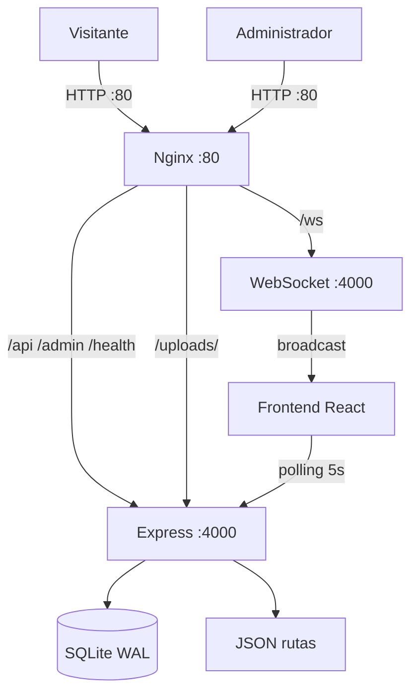
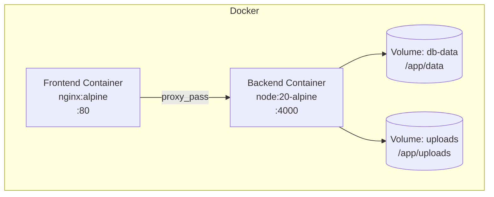
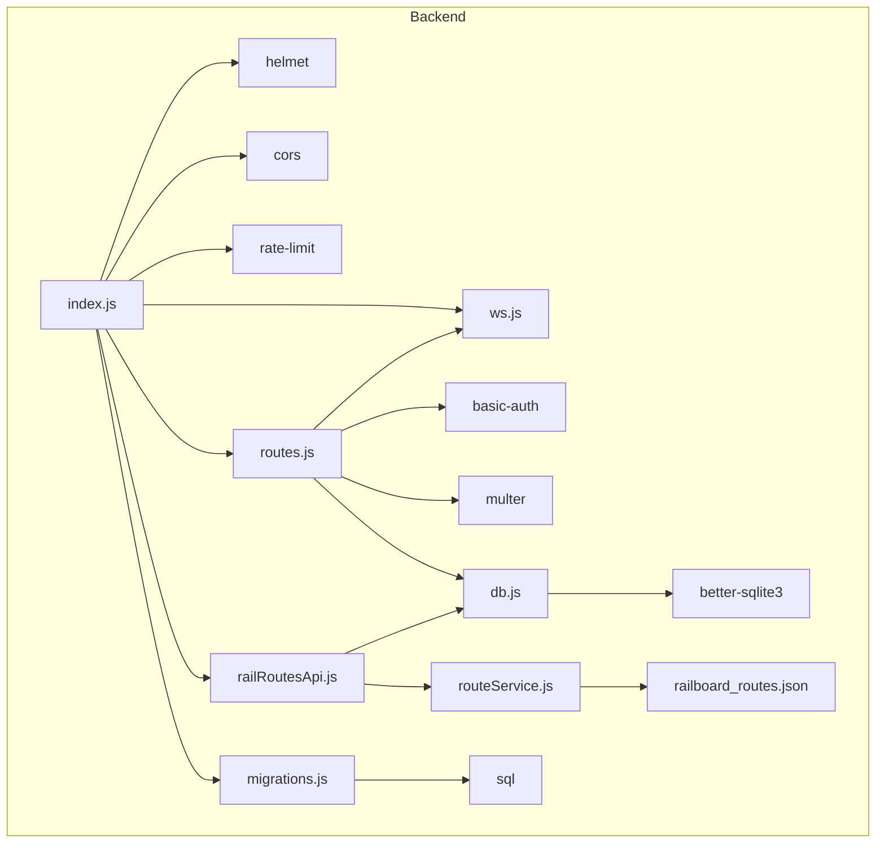
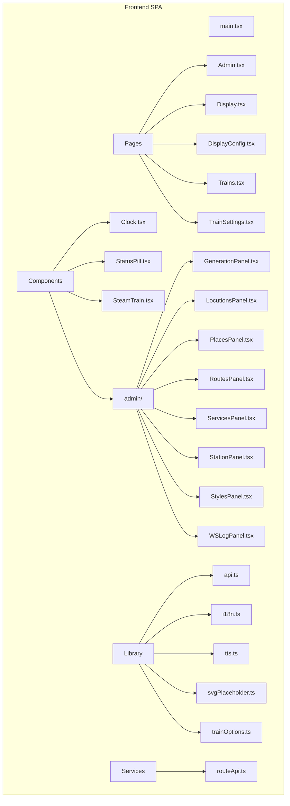
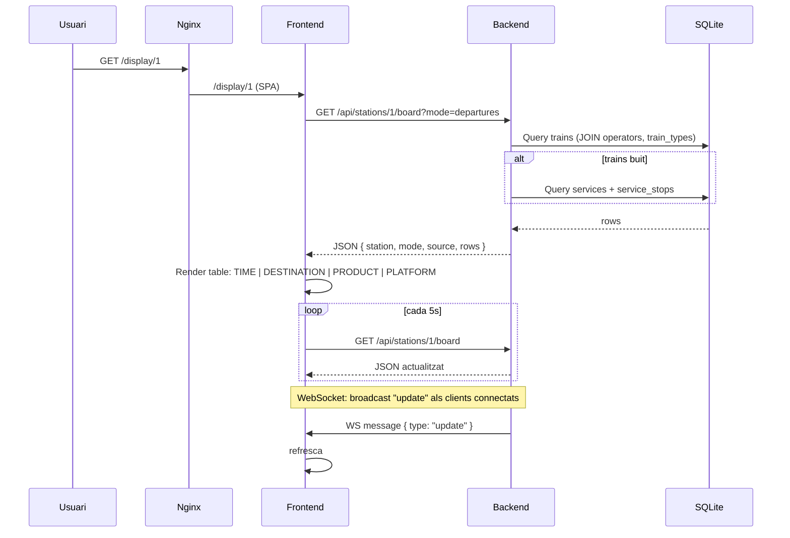
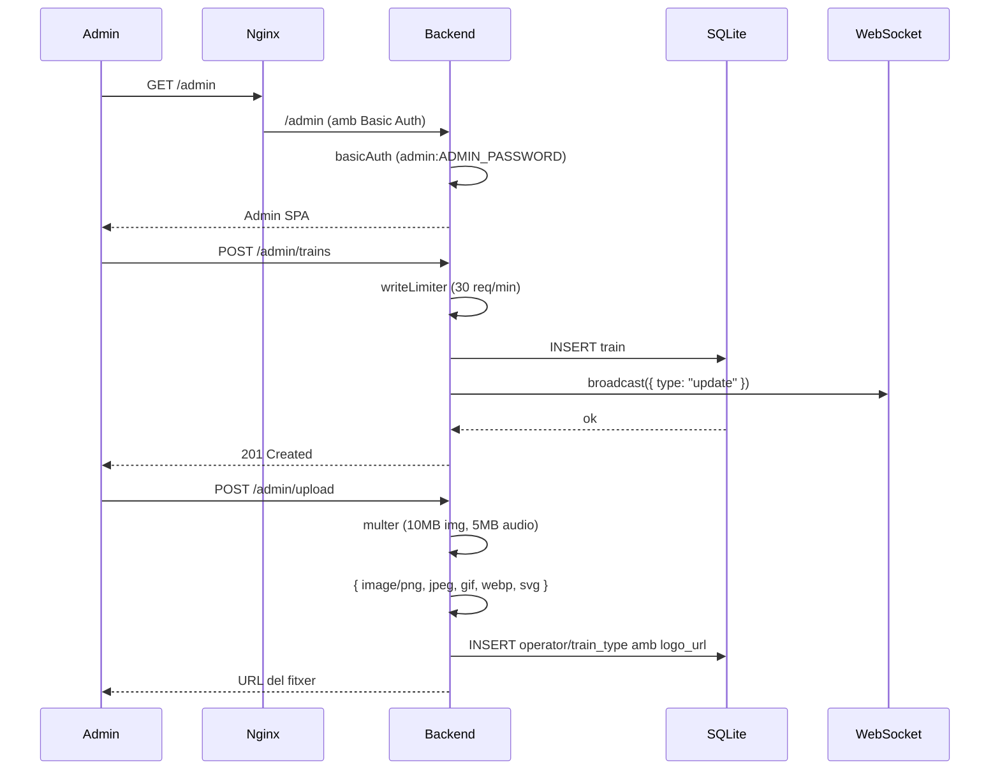

# Arquitectura de RailBoard

## 1. Visió general

RailBoard és un sistema monorepo per a la visualització de panells informatius ferroviaris en estacions. Consta de dos subsistemes: un _backend_ Express amb SQLite i WebSocket, i un _frontend_ React amb Vite i Tailwind. El desplegament es fa mitjançant Docker Compose amb un proxy Nginx que encamina el tràfic als contenidors corresponents.

| Subsistema | Tecnologia | Punts d'entrada |
|---|---|---|
| Backend | Express (Node 20), better-sqlite3, ws | `:4000` |
| Frontend | React + Vite + Tailwind, Nginx (prod) | `:80` |
| Base de dades | SQLite (WAL) | fitxer `data.db` |
| Temps real | WebSocket | `/ws` |

**Fitxers clau:**
- `backend/src/index.js` (89 línies) — punt d'entrada del backend
- `backend/src/routes.js` (1676 línies) — rutes administratives
- `backend/src/railRoutesApi.js` (209 línies) — API pública
- `backend/src/db.js` (882 línies) — capa de base de dades
- `backend/src/ws.js` (18 línies) — servidor WebSocket
- `frontend/src/pages/Admin.tsx` (3128 línies) — panell d'administració
- `frontend/src/pages/Display.tsx` (841 línies) — pantalla de visualització
- `docker-compose.yml` (47 línies) — orquestració de serveis
- `docker/nginx.conf` (89 línies) — configuració del proxy invers

---

## 2. Diagrama de context



- El visitant accedeix al panell informatiu via `GET /display/:stationId`.
- L'administrador accedeix al panell de control via `/admin`.
- Nginx fa de proxy invers únic: tot el tràfic passa per ell.
- El frontend es comunica amb el backend via REST i WebSocket.
- El backend llegeix de SQLite i d'un fitxer JSON estàtic de rutes.

---

## 3. Diagrama de contenidors



**Configuració dels contenidors:**

| Servei | Dockerfile | Base | Expose | Healthcheck |
|---|---|---|---|---|
| Backend | `backend/Dockerfile` (14 línies) | `node:20-alpine` | 4000 | `GET /health` cada 30s |
| Frontend | `frontend/Dockerfile` (21 línies, multi-stage) | `nginx:alpine` | 80 | — |

**Volums persistents:**
- `db-data`: base de dades SQLite (`/app/data/data.db`)
- `uploads`: fitxers pujats (logotips, àudio)

---

## 4. Diagrama de components

### 4.1 Backend



### 4.2 Frontend



### 4.3 Base de dades

**Taules principals** (creades automàticament a `db.js:12-80`):

| Taula | Finalitat | Clau forana |
|---|---|---|
| `config` | Configuració clau/valor | — |
| `operators` | Operadors ferroviaris | — |
| `train_types` | Tipus de tren (AVE, Avlo, Cercanías…) | — |
| `places` | Llocs/orígens/destins | — |
| `stations` | Estacions | — |
| `station_display_configs` | Configuració per estació | `station_id` → `stations(id)` |
| `trains` | Trens individuals (mode simple) | `operator_id`, `train_type_id`, `station_id` |
| `train_icons` | Icones personalitzades | — |
| `services` | Serveis/expedicions (mode multiciutat) | `operator_id`, `train_type_id`, `origin_place_id`, `destination_place_id` |
| `service_stops` | Parades d'un servei | `service_id`, `station_id` |
| `service_events` | Registre d'esdeveniments | `service_id`, `stop_id` |
| `schema_migrations` | Control de migracions | — |

**Migracions SQL** (directori `backend/migrations/`):
1. `001-services.sql` — taules `services` i `service_stops`
2. `002-service-events.sql` — taula `service_events`
3. `003-trains-compatibility.sql` — compatibilitat amb trens

**Dades de demo:** `backend/src/seed.js` (206 línies) crea operadors (Renfe, Avlo, Iryo, Ouigo), tipus de tren (AVE, Alvia, IC, MD, Avant, Cercanías), places i trens de demostració amb logotips SVG generats inline.

---

## 5. Fluxos de dades

### 5.1 Flux principal: Panell informatiu



**Detalls de la consulta** (`railRoutesApi.js:166-196`):
1. Es llegeix la configuració de l'estació (`getStationDisplayConfig`)
2. Primer s'intenta obtenir dades de la taula `trains` (`buildRowsFromTrains`)
3. Si no hi ha trens, es cau als serveis (`buildRowsFromServices`)
4. Les files s'ordenen per hora esperada i número de tren
5. Es retorna JSON amb `station`, `mode`, `source` ("trains" | "services"), `rows`

**Columnes renderitzades** (`Display.tsx`):
- **TIME** — 11.17% amplada, hora prevista
- **DESTINATION** — 56.33% amplada, destí + parades intermèdies
- **PRODUCT** — 18% amplada, logotip del tipus + número
- **PLATFORM** — 7.5% amplada, via
- **STATUS** — fila inferior sota TIME
- **STOPS** — fila inferior sota DESTINATION

### 5.2 Flux administratiu



**Rutes administratives** (`routes.js`): CRUD complet per a operadors, tipus de tren, places, estacions, trens, serveis, parades, configuració, pujada de fitxers i àudio, gestió de rutes, icones, etc. Cada mutació emet un `broadcast` via WebSocket.

---

## 6. Patrons de comunicació

| Patró | Protocol | Origen → Destí | Ús |
|---|---|---|---|
| Síncron (REST) | HTTP | Frontend → Backend | CRUD, consultes de panell |
| Síncron (REST) | HTTP | Admin → Backend | Operacions d'escriptura |
| Asíncron (pub/sub) | WebSocket | Backend → Frontend | Notificacions de canvis (`{ type: "update" }`) |
| Polling | HTTP | Frontend → Backend | Refresc periòdic cada 5s (Display.tsx:280) |
| Servei de fitxers | HTTP | Nginx → Backend | Fitxers estàtics a `/uploads/` |
| Proxy invers | HTTP | Nginx → Backend | `/api/`, `/admin/`, `/ws`, `/health`, `/uploads/` |

**WebSocket** (`ws.js:5-9`):
- Servidor muntat al mateix port HTTP amb `path: "/ws"`
- Envia un missatge `{ type: "hello" }` en connectar-se
- `broadcast(data)` envia a tots els clients connectats

**Conexió del frontend** (`api.ts:430-462`):
- Converteix `http://` a `ws://` automàticament
- Reconeció automàtica amb 1.5s de retard
- Suport per a _listeners_ d'esdeveniments específics

---

## 7. Arquitectura de seguretat

### 7.1 Autenticació
- **HTTP Basic Auth** per a totes les rutes `/admin` (`routes.js:23-27`)
- Usuari fix: `admin`
- Contrasenya: variable d'entorn `ADMIN_PASSWORD`, valor per defecte `"railboard"`
- Implementat amb `express-basic-auth` amb `challenge: true`

### 7.2 Capes de seguretat HTTP
- **Helmet** amb `crossOriginResourcePolicy: "cross-origin"` (necessari per a imatges de tercers)
- **CORS** configurat dinàmicament: origin exacte `CORS_ORIGIN` o qualsevol `localhost:*` en desenvolupament
- **Rate limiting**:
  - `/admin` general: 120 req/min en producció, 1000 en desenvolupament
  - Operacions d'escriptura (POST/PUT/PATCH/DELETE): 30 req/min
- **Headers de seguretat Nginx** (`nginx.conf:85-88`):
  - `X-Frame-Options: SAMEORIGIN`
  - `X-Content-Type-Options: nosniff`
  - `X-XSS-Protection: 1; mode=block`
  - `Referrer-Policy: strict-origin-when-cross-origin`

### 7.3 Validació de fitxers
- Imatges (multer): 10MB màxim, només PNG/JPG/GIF/WebP/SVG
- Àudio: 5MB màxim, només OGG/Opus/MP3
- Tamany màxim del body JSON: 1MB

### 7.4 Manca de seguretat
- **Sense HTTPS** (el xifratge es delega al proxy extern o load balancer)
- **Sense CSRF** (no hi ha tokens anti-CSRF)
- **Sense MFA** (l'autenticació és només Basic Auth)
- Contrasenya per defecte feble (`"railboard"`)

---

## 8. Arquitectura de desplegament

### 8.1 Entorns

| Entorn | Port | CORS_ORIGIN | RATE_LIMIT_MAX | ADMIN_PASSWORD |
|---|---|---|---|---|
| Desenvolupament | `:4000` (backend directe) | `http://localhost:5173` | 1000 | `railboard` |
| Producció (Docker) | `:80` (Nginx) | `http://localhost` | 120 | Variable |

### 8.2 Proxy Nginx

```
:80
├── /               → serveix SPA (try_files → index.html)
├── /admin          → proxy_pass http://backend:4000
├── /admin/         → proxy_pass http://backend:4000 (15m body)
├── /api/           → proxy_pass http://backend:4000
├── /health         → proxy_pass http://backend:4000
├── /uploads/       → proxy_pass http://backend:4000 (cache 7d)
├── /ws             → proxy_pass http://backend:4000 (Upgrade WebSocket, timeout 86400s)
└── /*.js|css|png…  → static files (cache 30d)
```

### 8.3 Volums i persistència
- La base de dades SQLite es guarda al volum `db-data:/app/data`
- Les pujades es guarden al volum `uploads:/app/uploads`
- Les migracions SQL s'apliquen automàticament en iniciar el backend (`runMigrations` a `index.js:82`)

### 8.4 PWA
- `manifest.json` per a instal·lació com a aplicació
- `sw.js` (service worker) per a cache offline
- Fonts locals servides des de `/fonts/`
- El frontend es construeix amb Vite i es desplega com a SPA amb fallback a `index.html`

---

## 9. Decisions arquitecturals clau

### 9.1 SQLite en lloc de PostgreSQL/MySQL
**Evidència:** `backend/src/db.js` utilitza `better-sqlite3` amb mode WAL.
**Raó:** Projecte monousuari o de petita escala. SQLite simplifica el desplegament (no cal servidor de base de dades extern), les còpies de seguretat i la configuració. El mode WAL permet lectures concurrents sense bloquejos.

### 9.2 Monorepo amb dos contenidors separats
**Evidència:** `docker-compose.yml` defineix `backend` i `frontend` com a serveis independents.
**Raó:** Separació de responsabilitats. El frontend pot desenvolupar-se i escalar-se independentment del backend. Nginx fa de proxy i servei d'arxius estàtics.

### 9.3 WebSocket al mateix port HTTP
**Evidència:** `index.js:78-79`: el WebSocket es connecta al mateix servidor HTTP (`http.createServer` + `attachWebSocket`).
**Raó:** Evita configuracions complexes de ports addicionals i simplifica el desplegament darrere de Nginx (que gestiona l'upgrade de protocol).

### 9.4 Polling + WebSocket
**Evidència:** `Display.tsx:280` estableix un `setInterval(refresh, 5000)` i `Display.tsx:294` connecta WebSocket.
**Raó:** El polling garanteix actualitzacions fins i tot si el WebSocket es perd; el WebSocket proporciona actualitzacions immediates quan hi ha canvis. Patró híbrid de robustesa i baixa latència.

### 9.5 `station_id` opcional a la taula `trains`
**Evidència:** `db.js:109-112`: columna afegida posteriorment mitjançant migració.
**Raó:** Suport per a múltiples estacions es va afegir després del disseny inicial. La columna és opcional (`SET NULL` en cascada) per a compatibilitat enrere.

### 9.6 Sistema dual: `trains` i `services`
**Evidència:** `railRoutesApi.js:174-176`: primer prova `buildRowsFromTrains`, si no hi ha resultats cau a `buildRowsFromServices`.
**Raó:** El mode `trains` (taula plana) és més senzill i va ser el primer a implementar-se. El mode `services` (amb parades múltiples i gestió de retards en cadena) és més complet i es va afegir posteriorment per al suport multiciutat. Ambdós conviuen per a compatibilitat.

### 9.7 Configuració per estació heretada de la global
**Evidència:** `db.js:468-478`: `getStationDisplayConfig` combina `getConfig()` global, valors per defecte de l'estació i `config_json` de `station_display_configs`.
**Raó:** Patró de configuració per capes (global → estació → override JSON), similar a CSS.

### 9.8 Nginx com a proxy invers i servidor web
**Evidència:** `docker/nginx.conf`: gestiona SPA, API, WebSocket, fitxers estàtics i cache.
**Raó:** Nginx és eficient servint fitxers estàtics i gestionant connexions WebSocket de llarga durada. El backend Express es centra exclusivament en la lògica de negoci.

---

## 10. Riscos arquitecturals

| Risc | Descripció | Impacte | Mitigació |
|---|---|---|---|
| **Concurrència SQLite** | SQLite no escala amb escriptures concurrents elevades | Pèrdua de dades o bloquejos en alta càrrega d'administradors | Mode WAL, operacions d'escriptura limitades a 30 req/min |
| **Contrasenya per defecte** | `ADMIN_PASSWORD` per defecte és `"railboard"` | Accés no autoritzat al panell d'administració | Documentar canvi obligatori en producció; variable d'entorn `ADMIN_PASSWORD` |
| **Pèrdua de dades en reinici** | SQLite emmagatzemat en volum Docker | Pèrdua de dades si el volum esborra o corromp | Còpies de seguretat externes; healthcheck per detectar errors |
| **Manca de HTTPS** | El tràfic entre navegador i Nginx va en clar | Intercepció de contrasenyes i dades | Delegar HTTPS a un reverse proxy extern (Traefik, Caddy, cloud LB) |
| **Manca de CSRF** | No hi ha protecció contra CSRF a les rutes d'admin | Atacs de falsificació de peticions | L'autenticació Basic Auth mitiga parcialment (el navegador no envia credencials creuades automàticament) |
| **Dependència de `better-sqlite3`** | És una dependència nativa compilada per a Node 20 | Errors en actualitzar Node o plataforma no compatible | `package-lock.json` fixa la versió; Alpine Linux compatible |
| **Retard en WebSocket** | El WebSocket es reconecta cada 1.5s en caure | Petita finestra de desactualització al panell | Polling cada 5s com a fallback garanteix actualització ≤5s |
| **Tamany de `routes.js`** | 1676 línies en un sol fitxer | Mantenibilitat reduïda, dificultat de testing | Refactorització en mòduls més petits (`routes/` directoris) |
| **Tamany de `Admin.tsx`** | 3128 línies en un sol component | Mantenibilitat reduïda, renderitzat lent | Dividir en subcomponents (ja existeixen 8 panells a `components/admin/`) |
