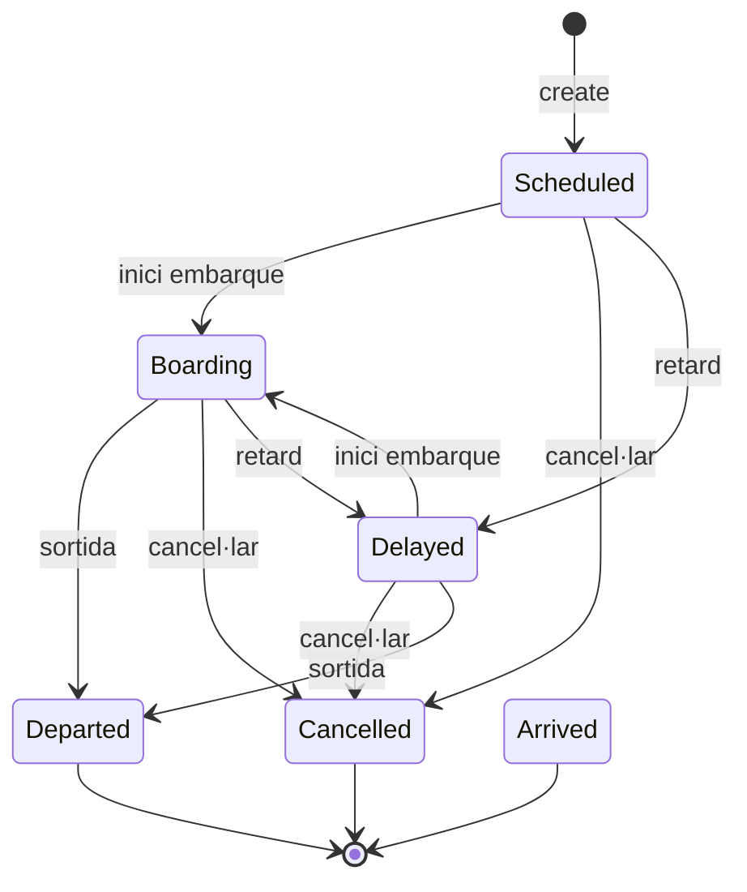
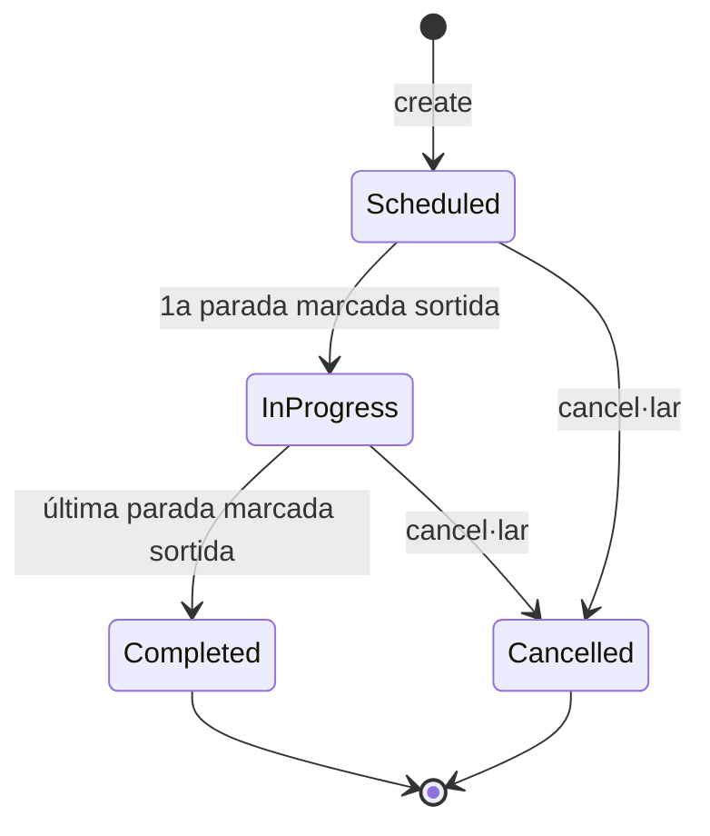
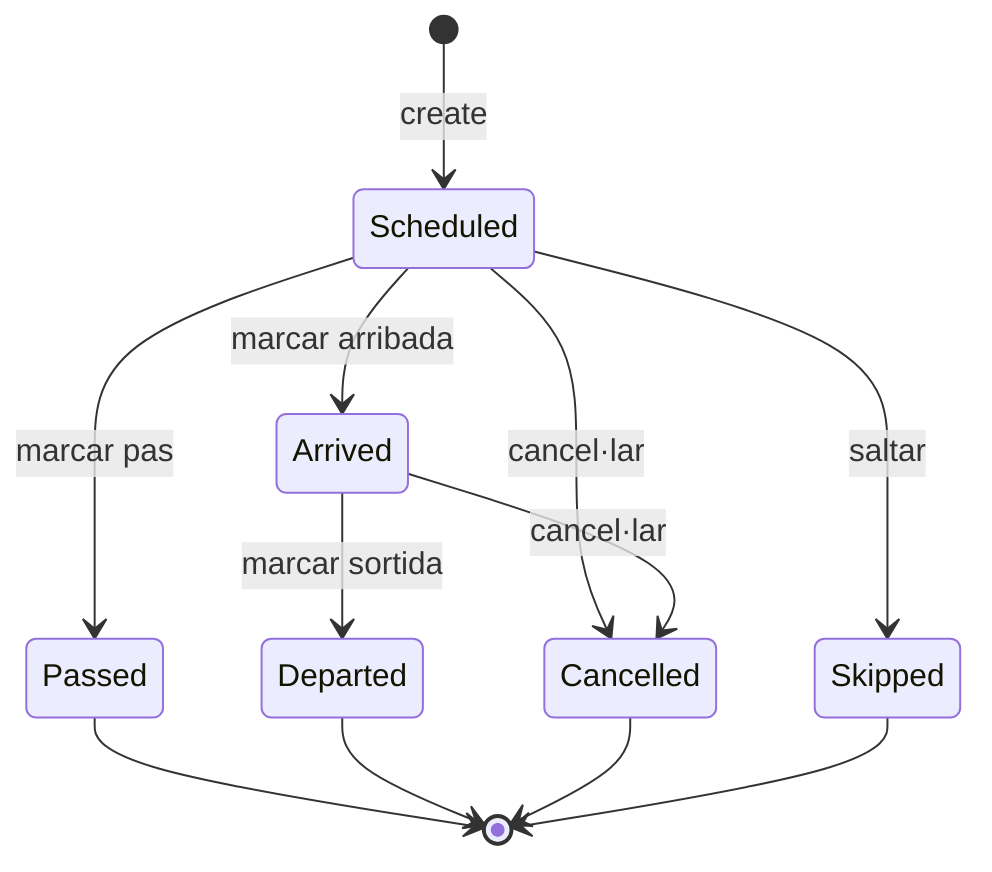

# Model de Domini — RailBoard

> Document del model de domini del sistema RailBoard, que descriu les entitats, relacions, estats i regles de negoci del sistema de panells informatius ferroviaris.

---

## 1. Glossari de domini

| Terme (CA) | Terme (EN) | Codi entitat | Descripció |
|---|---|---|---|
| Tren | Train | `Train` | Servei individual amb horari, estat, estació associada i destinació. Model "pla" (mono-estació). |
| Servei | Service | `Service` | Recorregut complet multi-parada amb origen i destí com a *places*. |
| Parada | ServiceStop | `ServiceStop` | Punt individual d'un servei a una estació, amb horaris programats/esperats/reals. |
| Operador | Operator | `Operator` | Companyia ferroviària que opera el tren (Renfe, Iryo, Ouigo…). |
| Tipus de tren | TrainType | `TrainType` | Categoria del tren (AVE, Cercanías, Avlo, Alvia…). |
| Estació | Station | `Station` | Estació física amb pantalla(s) de sortides/arribades. |
| Lloc | Place | `Place` | Ciutat o localitat de destí/origen d'un servei. |
| Ruta | Route | `RailRoute` | Recorregut ferroviari línia+estacions (ex: C-1 Madrid-Chamartín–Aeropuerto). |
| Icona | TrainIcon | `TrainIcon` | Imatge personalitzada de la llibreria d'icones per a trens. |
| Configuració | Config | `Config` | Paràmetres globals de l'aplicació. |
| Config pantalla | DisplayConfig | `StationDisplayConfig` | Configuració per estació (idioma, plataforma/sector, aparença). |
| Esdeveniment | ServiceEvent | `ServiceEvent` | Registre d'auditoria de canvis d'estat en serveis. |
| Moviment | Movement | — | Tipus de moviment: sortida (`departure`), arribada (`arrival`), pas (`pass`), mixt (`mixed`). |

---

## 2. Diagrama d'entitats (Mermaid ERD)

```mermaid
erDiagram
    Operator ||--o{ Train : "opera"
    Operator ||--o{ Service : "opera"
    TrainType ||--o{ Train : "classifica"
    TrainType ||--o{ Service : "classifica"
    Station ||--o{ Train : "mostra"
    Station ||--o| StationDisplayConfig : "configura"
    Station ||--o{ ServiceStop : "acull"
    Place ||--o{ Service : "origen"
    Place ||--o{ Service : "destí"
    Service ||--o{ ServiceStop : "conté"
    Service ||--o{ ServiceEvent : "genera"
    ServiceStop ||--o{ ServiceEvent : "referencia"
    ServiceStop }o--|| Station : "ubicat a"

    Operator {
        int id PK
        string name UK
        string logo_url
        string pre_announce_ogg
    }
    TrainType {
        int id PK
        string code UK
        string name
        string color
        string logo_url
        string pre_announce_ogg
        string destination_icon_url
    }
    Place {
        int id PK
        string name UK
        string logo_url
    }
    Station {
        int id PK
        string name
        string short
        string logo_url
        string pre_announce_ogg
        string color
        int sort_order
        datetime created_at
    }
    StationDisplayConfig {
        int station_id PK, FK
        string config_json
        datetime updated_at
    }
    Train {
        int id PK
        string number
        int operator_id FK
        int train_type_id FK
        string origin
        string destination
        string stops JSON
        string scheduled_time
        string expected_time
        string platform
        string sector
        string status
        int sort_order
        string observations
        int station_id FK
        string custom_icon_url
        string icon_mode
        int service_stop_id FK
        datetime created_at
    }
    TrainIcon {
        int id PK
        string name UK
        string icon_url
        datetime created_at
    }
    Service {
        int id PK
        string number UK
        int operator_id FK
        int train_type_id FK
        int origin_place_id FK
        int destination_place_id FK
        string status
        string notes
        datetime started_at
        datetime completed_at
        datetime cancelled_at
        datetime created_at
        datetime updated_at
    }
    ServiceStop {
        int id PK
        int service_id FK
        int station_id FK
        int stop_number
        string stop_type
        string arrival_scheduled
        string departure_scheduled
        string arrival_expected
        string departure_expected
        string arrival_actual
        string departure_actual
        string state
        string platform
        string sector
        int delay_minutes
        int delay_locked
        string notes
        datetime created_at
        datetime updated_at
    }
    ServiceEvent {
        int id PK
        int service_id FK
        int stop_id FK
        string event_type
        string details JSON
        datetime created_at
    }
    Config {
        string key PK
        string value
    }
```

---

## 3. Descripció detallada de les entitats

### 3.1. `Operator`

Representa una companyia ferroviària.

| Atribut | Tipus | Descripció |
|---|---|---|
| `id` | INTEGER PK | Identificador autoincremental |
| `name` | TEXT UNIQUE | Nom de l'operador (ex: "Renfe") |
| `logo_url` | TEXT | URL del logotip |
| `pre_announce_ogg` | TEXT | Àudio de pre-anunci per a megafonia |

**Relacions:**
- Un `Operator` pot estar associat a molts `Train`s (`operator_id` FK a `trains`)
- Un `Operator` pot estar associat a molts `Service`s (`operator_id` FK a `services`)

**Regles:**
- `name` és únic (UNIQUE constraint)

---

### 3.2. `TrainType`

Categoria de tren.

| Atribut | Tipus | Descripció |
|---|---|---|
| `id` | INTEGER PK | Identificador autoincremental |
| `code` | TEXT UNIQUE | Codi del tipus (ex: "AVE", "C", "MD") |
| `name` | TEXT | Nom descriptiu (ex: "Alta Velocidad") |
| `color` | TEXT | Color hexadecimal (#7c1d2e) |
| `logo_url` | TEXT | URL del logotip |
| `pre_announce_ogg` | TEXT | Àudio de pre-anunci |
| `destination_icon_url` | TEXT | Icona de destinació per al display |

**Relacions:**
- Un `TrainType` pot classificar molts `Train`s
- Un `TrainType` pot classificar molts `Service`s

**Regles:**
- `code` és la clau per a upsert (API POST /train-types fa upsert per `code`)

---

### 3.3. `Place`

Ciutat o localitat d'origen/destí.

| Atribut | Tipus | Descripció |
|---|---|---|
| `id` | INTEGER PK | Identificador autoincremental |
| `name` | TEXT UNIQUE | Nom del lloc (ex: "Barcelona Sants") |
| `logo_url` | TEXT | URL del logotip |

**Regles:**
- `name` és únic

---

### 3.4. `Station`

Estació física amb pantalla de sortides/arribades.

| Atribut | Tipus | Descripció |
|---|---|---|
| `id` | INTEGER PK | Identificador autoincremental |
| `name` | TEXT | Nom complet de l'estació |
| `short` | TEXT | Nom abreujat |
| `logo_url` | TEXT | URL del logotip |
| `pre_announce_ogg` | TEXT | Àudio de pre-anunci per a megafonia |
| `color` | TEXT | Color institucional (#1A3254 per defecte) |
| `sort_order` | INTEGER | Ordre de visualització als llistats |
| `created_at` | TEXT | Data de creació (ISO 8601) |

**Relacions:**
- Una `Station` pot tenir molts `Train`s associats
- Una `Station` té zero o un `StationDisplayConfig`
- Una `Station` pot acollir molts `ServiceStop`s

**Regles de negoci:**
- No es pot eliminar l'última estació (`countStations() <= 1` → error)
- `sort_order` determina l'ordre als llistats

---

### 3.5. `StationDisplayConfig`

Configuració específica per estació.

| Atribut | Tipus | Descripció |
|---|---|---|
| `station_id` | INTEGER PK, FK | Referència a `stations.id` amb ON DELETE CASCADE |
| `config_json` | TEXT | JSON amb configuració (idioma, colors, plataformes…) |
| `updated_at` | TEXT | Data de modificació |

**Hereta de `Config`:** Els valors globals actuen com a fallback. El `config_json` sobreescriu valors.

**Camps habituals dins `config_json`:**
- `station_name`, `logo_url`, `language`, `languages[]`, `routeRegion`
- `platformMin`, `platformMax`, `platformAllowEmpty`, `sectorMin`, `sectorMax`, `sectorAllowEmpty`
- `mode` (departures/arrivals), `displayMode` (single/multiple)
- `bgColor`, `headerBgColor`, `headerTextColor`, `rowBgColor`, `altBgColor`
- `showDestinationIcon`, `destinationFontSize`, `countdownFontSize`
- `timeFormat` (24h/12h), `clockMode` (real/fake), `clockFakeTime`
- `announce_departure`, `announce_arrival`, `announce_templates_map`, `announce_presets`
- `tts_rate`, `tts_pitch`, `tts_volume`, `tts_voice`, `tts_voice_map`

---

### 3.6. `Train` (model "pla" / mono-estació)

Representa un tren individual en un panell de sortides/arribades. Model legacy que conviu amb el model `Service` + `ServiceStop`.

| Atribut | Tipus | Descripció |
|---|---|---|
| `id` | INTEGER PK | Identificador autoincremental |
| `number` | TEXT | Número de tren (ex: "03104") |
| `operator_id` | INTEGER FK | Operador (ON DELETE SET NULL) |
| `train_type_id` | INTEGER FK | Tipus de tren (ON DELETE SET NULL) |
| `origin` | TEXT | Origen (string literal, no FK) |
| `destination` | TEXT | Destí (string literal, no FK) |
| `stops` | TEXT JSON | Array JSON de parades intermèdies (strings) |
| `scheduled_time` | TEXT | Horari programat (HH:mm) |
| `expected_time` | TEXT | Horari previst (HH:mm) |
| `platform` | TEXT | Via/andana ("-" per defecte) |
| `sector` | TEXT | Sector ("-" per defecte) |
| `status` | TEXT | Estat actual (vegeu §4) |
| `sort_order` | INTEGER | Ordre al panell |
| `observations` | TEXT | Observacions / notes |
| `station_id` | INTEGER FK | Estació on es mostra (ON DELETE SET NULL) |
| `custom_icon_url` | TEXT | URL d'icona personalitzada |
| `icon_mode` | TEXT | Mode d'icona: `destination`, `custom`, `type`, `operator`, `none` |
| `service_stop_id` | INTEGER FK | Enllaç opcional a `service_stops` (migració 003) |
| `created_at` | TEXT | Data de creació |

**Estats de `status`:** `Scheduled`, `Boarding`, `Delayed`, `Departed`, `Arrived`, `Cancelled`

---

### 3.7. `TrainIcon`

Llibreria d'icones personalitzades per a trens.

| Atribut | Tipus | Descripció |
|---|---|---|
| `id` | INTEGER PK | Identificador autoincremental |
| `name` | TEXT UNIQUE | Nom de la icona |
| `icon_url` | TEXT | URL del fitxer d'imatge |
| `created_at` | TEXT | Data de creació |

---

### 3.8. `Service` (model multi-parada)

Recorregut complet d'un tren amb múltiples parades.

| Atribut | Tipus | Descripció |
|---|---|---|
| `id` | INTEGER PK | Identificador autoincremental |
| `number` | TEXT UNIQUE | Número de servei (ex: "03104") |
| `operator_id` | INTEGER FK | Operador (ON DELETE SET NULL) |
| `train_type_id` | INTEGER FK | Tipus de tren (ON DELETE SET NULL) |
| `origin_place_id` | INTEGER FK | Lloc d'origen (Place, ON DELETE SET NULL) |
| `destination_place_id` | INTEGER FK | Lloc de destinació (Place, ON DELETE SET NULL) |
| `status` | TEXT | Estat actual |
| `notes` | TEXT | Notes generals |
| `started_at` | TEXT | Inici del servei (ISO 8601) |
| `completed_at` | TEXT | Finalització (ISO 8601) |
| `cancelled_at` | TEXT | Cancel·lació (ISO 8601) |
| `created_at` | TEXT | Data de creació |
| `updated_at` | TEXT | Data de modificació |

**Estats de `status`:** `Scheduled`, `In Progress`, `Completed`, `Cancelled`

---

### 3.9. `ServiceStop`

Punt individual d'un servei a una estació.

| Atribut | Tipus | Descripció |
|---|---|---|
| `id` | INTEGER PK | Identificador autoincremental |
| `service_id` | INTEGER FK | Servei al qual pertany (ON DELETE CASCADE) |
| `station_id` | INTEGER FK | Estació (ON DELETE RESTRICT) |
| `stop_number` | INTEGER | Número d'ordre a la ruta (1, 2, 3…) |
| `stop_type` | TEXT | Tipus: `Origin`, `Stop`, `Pass`, `Destination` |
| `arrival_scheduled` | TEXT | Hora programada d'arribada (ISO 8601) |
| `departure_scheduled` | TEXT | Hora programada de sortida (ISO 8601) |
| `arrival_expected` | TEXT | Hora prevista d'arribada |
| `departure_expected` | TEXT | Hora prevista de sortida |
| `arrival_actual` | TEXT | Hora real d'arribada |
| `departure_actual` | TEXT | Hora real de sortida |
| `state` | TEXT | Estat de la parada |
| `platform` | TEXT | Via/andana |
| `sector` | TEXT | Sector |
| `delay_minutes` | INTEGER | Retard acumulat (minuts) |
| `delay_locked` | INTEGER | Si és 1, no hereta retards de parades anteriors |
| `notes` | TEXT | Notes |
| `created_at` | TEXT | Data de creació |
| `updated_at` | TEXT | Data de modificació |

**Estats de `state`:** `Scheduled`, `Arrived`, `Departed`, `Passed`, `Cancelled`, `Skipped`

**UNIQUE:** `(service_id, station_id, stop_number)`

---

### 3.10. `ServiceEvent`

Registre d'auditoria per a canvis en serveis.

| Atribut | Tipus | Descripció |
|---|---|---|
| `id` | INTEGER PK | Identificador autoincremental |
| `service_id` | INTEGER FK | Servei associat (ON DELETE CASCADE) |
| `stop_id` | INTEGER FK | Parada associada (ON DELETE SET NULL) |
| `event_type` | TEXT | Tipus d'esdeveniment |
| `details` | TEXT | JSON amb detalls |
| `created_at` | TEXT | Data de creació |

**Tipus d'esdeveniment:** `service_created`, `service_updated`, `service_cancelled`, `service_completed`, `stop_arrival`, `stop_departure`, `stop_passed`, `delay_added`, `delay_propagated`

---

### 3.11. `Config`

Emmagatzematge clau-valor per a configuració global.

| Atribut | Tipus | Descripció |
|---|---|---|
| `key` | TEXT PK | Clau de configuració |
| `value` | TEXT | Valor |

**Claus predefinides:**
- `station_name`, `mode`, `displayMode`
- `platformMin`, `platformMax`, `platformAllowEmpty`
- `sectorMin`, `sectorMax`, `sectorAllowEmpty`
- `announce_departure`, `announce_arrival`, `announce_presets`, `announce_templates_map`
- `tts_rate`, `tts_pitch`, `tts_volume`, `tts_voice`, `tts_voice_map`

---

### 3.12. `RailRoute` (només en memòria / fitxer de rutes)

No emmagatzemat en DB. Les rutes es carreguen des de fitxers JSON/fixtures.

| Propietat | Tipus | Descripció |
|---|---|---|
| `code` | string | Codi de línia (ex: "C-1") |
| `name` | string | Nom (ex: "C-1 Madrid Chamartín – Aeropuerto") |
| `network` | string | Xarxa (ex: "Cercanías Madrid") |
| `operator` | string | Operador per defecte (ex: "Renfe") |
| `color` | string | Color hexadecimal |
| `headwayMin` | number | Interval mínim entre trens (minuts) |
| `platforms` | string[] | Vies habituals |
| `numbers` | string[] | Números de tren disponibles |
| `stations` | string[] | Llista d'estacions de la ruta |
| `notes` | string | Notes opcionals |

---

## 4. Diagrames d'estats

### 4.1. Estats de `Train`



### 4.2. Estats de `Service`



### 4.3. Estats de `ServiceStop`



---

## 5. Regles de negoci

### 5.1. Cicle de vida del tren

1. **Transició d'estats de Train:** `Scheduled` → `Boarding` → `Departed` / `Arrived`.
   - `Delayed` és un estat transversal: qualsevol estat excepte `Departed`/`Arrived`/`Cancelled` pot passar a `Delayed`, i des de `Delayed` es pot tornar a `Scheduled` o `Boarding`.
   - `Cancelled` es pot aplicar des de qualsevol estat excepte `Departed`/`Arrived`.

2. **Transició d'estats de Service:** `Scheduled` → `In Progress` → `Completed`; `Cancelled` des de `Scheduled` o `In Progress`.

3. **Transició d'estats de ServiceStop:** `Scheduled` → `Arrived` → `Departed`; `Passed`, `Cancelled`, `Skipped` són terminals des de `Scheduled`.

### 5.2. Propagació de retards

4. **Propagació automàtica:** Quan una parada arriba amb retard (`delay_minutes > 0`), el retard es propaga a les parades posteriors sumant-lo a `arrival_expected`, `departure_expected` i `delay_minutes`.

5. **Bloqueig de propagació:** Si `delay_locked = 1` en una parada, aquesta no rep la propagació de retards de parades anteriors.

6. **Propagació manual:** `addDelay` a una parada també es propaga a les posteriors (excepte si `delay_locked`).

### 5.3. Finalització de servei

7. **Compleció de Service:** Quan l'última parada (la de `stop_number` màxim) es marca com a `Departed`, el `Service` passa automàticament a `Completed`.

8. **Inici de Service:** Quan es marca la primera sortida d'un servei (qualsevol `Departed` d'un `ServiceStop`), el `Service` passa a `In Progress` (si no ho estava ja).

### 5.4. Restriccions d'integritat

9. **No es pot eliminar l'última estació:** El backend retorna error si `countStations() <= 1`.

10. **`clearTrains` requereix `X-Confirm: yes`:** El DELETE /trains requereix validador al header per evitar esborrats accidentals.

11. **`operator.name` és únic** (UNIQUE constraint).

12. **`place.name` és únic** (UNIQUE constraint).

13. **`train_type.code` és la clau per a upsert:** POST /train-types fa upsert basat en `code`.

14. **`service.number` és únic** (UNIQUE constraint).

15. **`train_icons.name` és únic** (UNIQUE constraint).

### 5.5. Gestió d'icones al panell

16. **`icon_mode` determina quina icona es mostra al panell:**
    - `destination` — icona de destinació del tipus de tren (`type_destination_icon`)
    - `custom` — icona personalitzada (`custom_icon_url`)
    - `type` — logotip del tipus de tren
    - `operator` — logotip de l'operador
    - `none` — sense icona

17. **`showDestinationIcon`:** Configuració global que, si és `false`, desactiva les icones de destinació independentment de `icon_mode`.

### 5.6. Altres regles

18. **`sort_order`** determina l'ordre de visualització dels trens al panell (ascendent) i de les estacions als llistats.

19. **Idiomes suportats:** `es`, `ca`, `en`, `fr`, `eu`, `gl`.

20. **Actualització en temps real:** Qualsevol canvi via endpoints admin (POST/PUT/PATCH/DELETE) emet un missatge WebSocket (`{ type: "update" }`) perquè els displays es refresquin.

21. **Rate limiting:** Les peticions POST/PUT/PATCH/DELETE a `/admin` tenen un límit de 30 per minut.

22. **Dualitat Train ⮀ Service:** El sistema suporta dos models concurrents:
    - `Train` (pla, directe) per a operació simple mono-estació
    - `Service` + `ServiceStop` (jeràrquic) per a operació multi-estació
    - L'endpoint `/stations/:id/board` intenta primer `Train`, després fa fallback a `Service`

---

## 6. Anàlisi de regles de negoci

### 6.1. Regles duplicades

| Regla | On es duplica | Impacte |
|---|---|---|
| Validació de tipus d'arxiu (img/àudio) | `routes.js:41-51` (img), `routes.js:57-69` (àudio) | Duplicació de lògica de `fileFilter` per a Multer |
| Normalització d'idiomes | `db.js:416-445` i `routes.js:648-678` | Lògica `normalizeDisplayLanguage` / `normalizeLanguageList` duplicada i lleugerament diferent |
| `normalizeStation` per cerca | `routes.js:105-115` i variants a `routes.js:1135` | No hi ha funció compartida |
| Lògica de generació de retards aleatoris (profile) | `routes.js:1101-1112` i `generate-random-train` | Hardcoded per codi de tipus |
| Lògica de càlcul de propagació de retards | `serviceStops.markArrival:738-748` i `serviceStops.addDelay:826-835` | Quasi idèntica |

### 6.2. Regles que només estan al frontend

| Regla | Fitxer | Descripció |
|---|---|---|
| Colors d'estat al panell | `Display.tsx:472-476` | `Cancelled` → opacitat reduïda, `Boarding` → fons groc |
| Filtre d'estats a l'admin | `Admin.tsx:1913-1916` | Colors de pill d'estat: verd `Departed`, ambre `Boarding`, gris `Cancelled` |
| Validació FormData per arxius | `api.ts:223-234` | Converteix `custom_icon_file` a FormData |
| `showDestinationIcon` per defecte | `DisplayConfig.tsx:32` | `showDestinationIcon: true` al formulari de configuració |
| `DEFAULT_CONFIG` parcialment duplicat | `DisplayConfig.tsx` | Els valors per defecte de `platformMin`, `sectorMin`, etc. es repeteixen respecte a `db.js:132-139` |

### 6.3. Valors màgics hardcodejats

| Valor | On apareix | Descripció |
|---|---|---|
| `#7c1d2e` | `db.js:29`, `routes.js:1045`, `seed.js:45` | Color per defecte per a AVE / train_type |
| `#1A3254` | `db.js:46`, `db.js:381` | Color per defecte per a estacions |
| `ADMIN_PASSWORD = "railboard"` | `routes.js:21` | Password admin per defecte |
| `rateLimitMax = 1000` (dev) / `120` (prod) | `index.js:36` | Rate limiting |
| `fileSize: 10 * 1024 * 1024` | `routes.js:39` | Límit d'imatges (10 MB) |
| `fileSize: 5 * 1024 * 1024` | `routes.js:56` | Límit d'àudio (5 MB) |
| `maxStopLimit = 9` | `routes.js:1189,1278` | Límit màxim de parades mostrades als stops d'un tren aleatori |
| `delayProb: 0.16, cancelledProb: 0.03` | `routes.js:1103` | Probabilitats de retard per tipus Cercanías |
| `delayProb: 0.09, cancelledProb: 0.02` | `routes.js:1108` | Probabilitats de retard per tipus AVE |
| Constants de regió `getRouteRegion` | `routes.js:153-167` | Mapa hardcodejat de regió per nom de ruta |
| `DEFAULT_CONFIG` | `db.js:132-139` | `platformMin: "1"`, `platformMax: "8"`, `sectorMin: "A"`, `sectorMax: "D"` |
| `baseOperators = ["Renfe", "Iryo", "Ouigo", "SNCF"]` | `routes.js:78` | Operadors base per a `ensureLearnedRailData` |
| `C-3` (cas especial de stops) | `routes.js:1190` | `C-3` mostra totes les parades sense truncar |
| `Xàtiva` (cas especial C-2) | `routes.js:1162-1165` | Lògica de desviament a Xàtiva per C-2 |
| `3` minuts headway (mínim random) | `routes.js:1180` | `lastOffset + headwayMin + randomInt(-3, 4)` |

### 6.4. Validacions que falten

| Manca de validació | On | Descripció |
|---|---|---|
| `origin` i `destination` no validats contra `places` | `createTrain`, `updateTrain` | S'accepta qualsevol string literal |
| `scheduled_time` / `expected_time` format | `createTrain` | No es valida format HH:mm al crear tren |
| `stops` JSON | `createTrain` | Es fa `JSON.stringify` però no es valida que sigui un array |
| `platform` / `sector` permesos contra config | `backend` | No es valida que platform estigui dins `platformMin`–`platformMax` al crear tren |
| Duplicat de `service.number` al crear | `services.create` | La DB llançarà error UNIQUE constraint, però no hi ha comprovació prèvia |
| `stop_type` és `Origin`/`Stop`/`Pass`/`Destination` | `serviceStops.create` | No es valida el valor (accepta qualsevol string) |
| `state` de `ServiceStop` és un valor permès | `serviceStops.*` | No es valida el valor |
| No es pot assignar `status = "Delayed"` sense canviar `expected_time` | `backend` | L'API `PATCH /trains/:id/status` permet posar qualsevol `status` sense tocar `expected_time` |
| No es pot assignar `status = "Departed"` sense `platform` | `backend` | No hi ha validació |
| No es pot crear un servei sense parades | `services.create` | Es permet crear un servei buit |
| `actual_time` ha de ser ISO 8601 vàlid | `serviceStops.markArrival` | Es fa `new Date(actual_time)` sense validar |

---

## 7. Cross-reference: entitat → taula → fitxers

| Entitat | Taula DB | Fitxer principal DB | Fitxer API | Fitxers frontend |
|---|---|---|---|---|
| `Operator` | `operators` | `db.js:18-23, 316-330` | `routes.js:836-866` | `api.ts:51, 266-285`, `Admin.tsx`, `Display.tsx` |
| `TrainType` | `train_types` | `db.js:25-32, 332-356` | `routes.js:900-966` | `api.ts:52, 287-308`, `Admin.tsx` |
| `Place` | `places` | `db.js:34-38, 358-365` | `routes.js:968-987` | `api.ts:66, 348-361` |
| `Station` | `stations` | `db.js:40-49, 376-398` | `routes.js:989-1021` | `api.ts:67, 327-332`, `Admin.tsx`, `DisplayConfig.tsx` |
| `StationDisplayConfig` | `station_display_configs` | `db.js:51-55, 459-502` | `routes.js:728-749` | `api.ts:334-340`, `DisplayConfig.tsx` |
| `Train` | `trains` | `db.js:57-72, 196-301` | `routes.js:751-833, 1083-1222` | `api.ts:14-49, 218-262`, `Admin.tsx`, `Display.tsx`, `Trains.tsx` |
| `TrainIcon` | `train_icons` | `db.js:74-79, 367-374` | `routes.js:878-898` | `api.ts:53, 311-325` |
| `Service` | `services` | `db.js:506-625` | `routes.js:1309-1387` | `api.ts:70-95, 372-388`, `ServicesPanel.tsx` |
| `ServiceStop` | `service_stops` | `db.js:627-863` | `routes.js:1391-1557` | `api.ts:97-119, 391-419`, `ServicesPanel.tsx` |
| `ServiceEvent` | `service_events` | `db.js:866-881` | — (via log intern) | `api.ts:379` (sols lectura) |
| `Config` | `config` | `db.js:13-16, 181-194` | `routes.js:720-725` | `api.ts:120-157, 214-216` |
| `RailRoute` | — (memòria) | `fixtures/routes.js` + `services/routeService.js` | `routes.js:868-876`, `railRoutesApi.js:142` | `api.ts:54-65`, `Display.tsx` |
