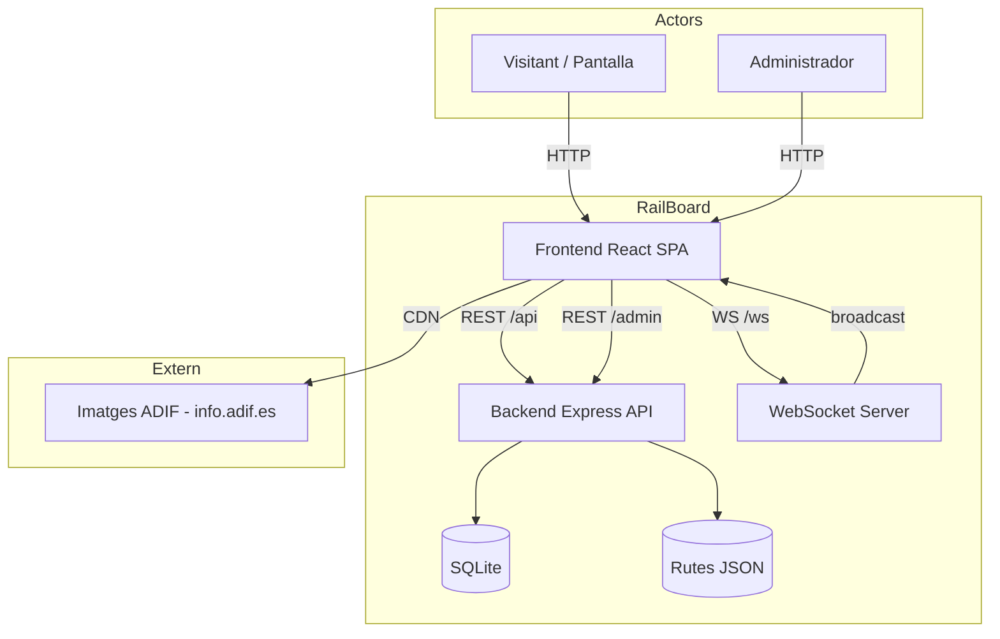
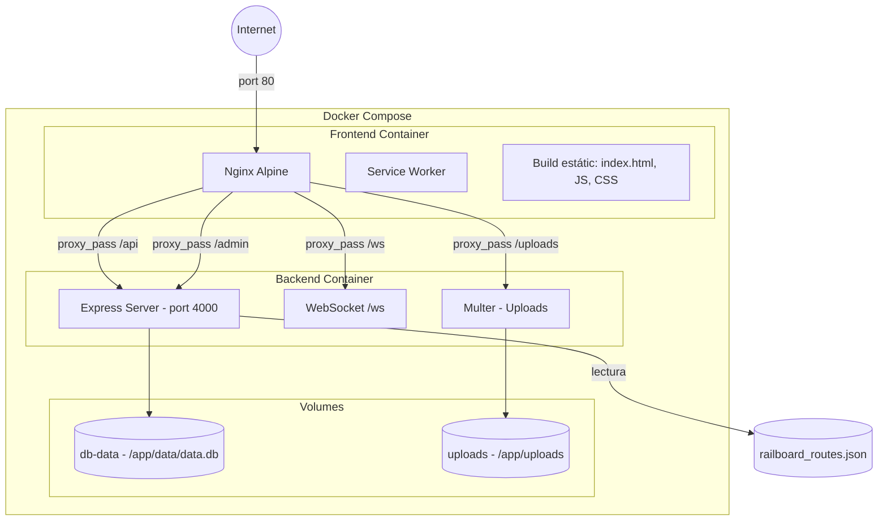
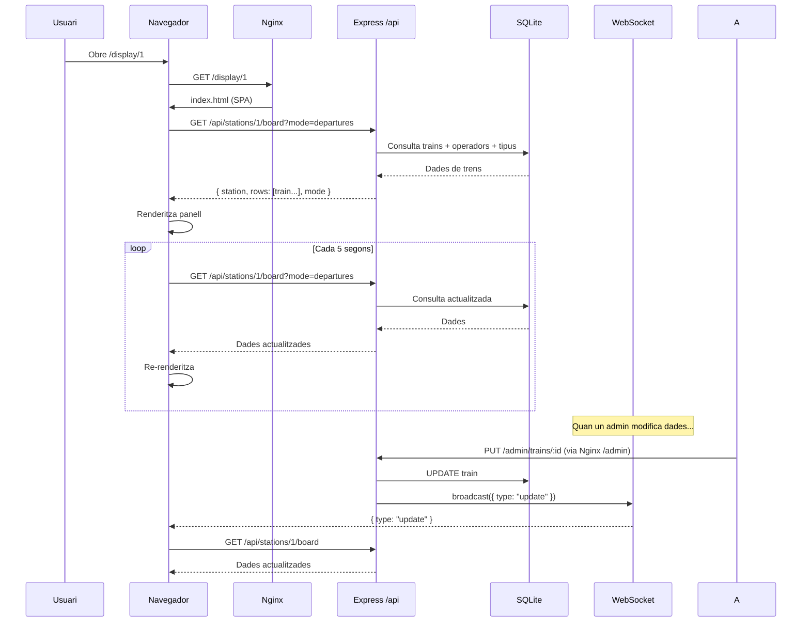
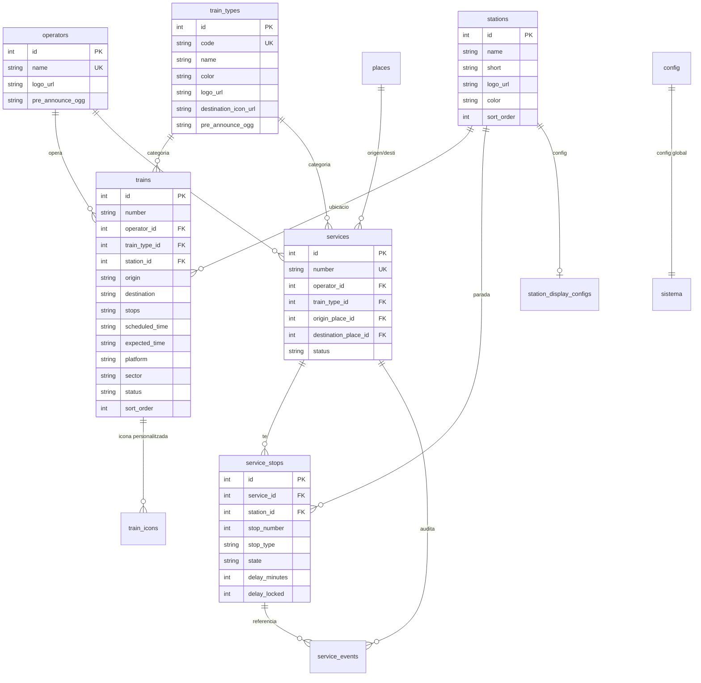

# Análisis Técnica del Proyecto RailBoard

> **Fecha:** 2026-07-17
> **Alcance:** Análisis completo del repositorio `/Users/andreu/Documents/Treball/railboard`
> **Analista:** Auditor técnico automatizado
> **Commit analizado:** Véase `git log --oneline -1`

## Índice

- [1. Resumen ejecutivo](#1-resumen-ejecutivo)
- [2. Inventario técnico](#2-inventario-técnico)
- [3. Arquitectura actual](#3-arquitectura-actual)
- [4. Documentación funcional](#4-documentación-funcional)
- [5. Modelo de dominio](#5-modelo-de-dominio)
- [6. Análisis de calidad del código](#6-análisis-de-calidad-del-código)
- [7. Análisis de deuda técnica](#7-análisis-de-deuda-técnica)
- [8. Matriz de priorización](#8-matriz-de-priorización)
- [9. Seguridad](#9-seguridad)
- [10. Testing y calidad](#10-testing-y-calidad)
- [11. Rendimiento y escalabilidad](#11-rendimiento-y-escalabilidad)
- [12. Observabilidad y operación](#12-observabilidad-y-operación)
- [13. Dependencias y obsolescencia](#13-dependencias-y-obsolescencia)
- [14. Experiencia de desarrollo](#14-experiencia-de-desarrollo)
- [15. Documentación que crear](#15-documentación-que-crear)
- [16. ADR: decisiones arquitectónicas](#16-adr-decisiones-arquitectónicas)
- [17. Roadmap de mejora](#17-roadmap-de-mejora)
- [18. Plan 30-60-90 días](#18-plan-30-60-90-días)
- [19. Quick wins](#19-quick-wins)
- [20. Riesgos](#20-riesgos)
- [21. Preguntas pendientes](#21-preguntas-pendientes)

---

## 1. Resumen ejecutivo

### Propósito del sistema

**RailBoard** es un simulador de paneles informativos de salidas/llegadas de trenes de estación, inspirado en los paneles de la red ferroviaria española (estilo Gravita/ADIF). El sistema genera datos sintéticos de trenes, los presenta en un panel visual tipo "board" optimizado para pantallas grandes, y ofrece una interfaz de administración para configurar estaciones, operadores, tipos de tren y locuciones.

### Usuarios principales

1. **Operadores de maquetas ferroviarias** — usan el panel como decoración/ambientación
2. **Administradores** — configuran estaciones, generan trenes, gestionan operadores y tipos
3. **Visitantes de exposiciones** — ven el panel en pantallas en eventos

### Funcionalidades esenciales

- **Panel de salidas/llegadas** en tiempo real con estilo Renfe/ADIF
- **Administración completa** de operadores, tipos de tren, estaciones, lugares
- **Generación automática** de trenes sintéticos basados en rutas reales
- **Soporte multiestación** — múltiples pantallas para diferentes estaciones
- **Multilingüe** — español, catalán, inglés, francés, vasco, gallego
- **Locuciones/TTS** — anuncios sonoros con plantillas y voces por idioma
- **Servicios multi-parada** — gestión de servicios con múltiples paradas y propagación de retrasos
- **PWA** — instalable offline con Service Worker

### Stack tecnológico

| Capa          | Tecnología                           | Versión         |
| ------------- | ------------------------------------ | --------------- |
| Frontend      | React 18 + TypeScript                | 18.3.x          |
| Bundler       | Vite                                 | 5.4.x           |
| Estilos       | Tailwind CSS 3                       | 3.4.x           |
| Backend       | Node.js + Express                    | 20 LTS / 4.21.x |
| Base de datos | SQLite (better-sqlite3)              | 11.3.x          |
| Realtime      | WebSocket (ws)                       | 8.18.x          |
| Auth          | HTTP Basic Auth (express-basic-auth) | 1.2.x           |
| Testing       | Vitest                               | 4.1.x           |

### Arquitectura general

```
[Navegador/PWA] ←→ [Nginx (proxy)] ←→ [Express (API + WS)]
                                           ↕
                                      [SQLite]
                                           ↕
                                   [railboard_routes.json]
```

Aplicación monolítica con frontend React SPA servido por nginx y backend Express con SQLite. Comunicación vía REST + WebSocket para actualizaciones en tiempo real.

### Estado técnico actual

El proyecto se encuentra en un estado **maduro pero activo** — tiene funcionalidades completas, tests que pasan, Docker Compose para producción, y PWA. No obstante, acumula **deuda técnica significativa** en forma de archivos masivos (>3000 líneas), lógica duplicada, y un modelo de datos que ha evolucionado por acumulación.

### Principales fortalezas

1. **Calidad visual del panel** — muy realista, estilo Gravita/ADIF
2. **Testing sólido** — 72 tests en el backend, cobertura de casos críticos
3. **Infraestructura en Docker** — despliegue sencillo con Docker Compose
4. **PWA + fuentes offline** — funciona sin conexión una vez cargado
5. **Generación inteligente de trenes** — basada en datos reales de rutas

### Riesgos más relevantes

1. **SQLite sin backups automáticos** — pérdida potencial de datos
2. **Admin panel monolítico** (`Admin.tsx` > 3100 líneas) — difícil de mantener
3. **Auth básica HTTP** — credenciales en texto plano, sin MFA, sin rotación
4. **No hay tests de frontend** — error de configuración impedía ejecutarlos, ahora se han resuelto pero no hay tests reales
5. **Subida de archivos sin validación de contenido** — riesgo de ejecución de archivos maliciosos
6. **Dependencias cruzadas entre backend y frontend** — tipos duplicados en TypeScript y JS

### Valoraciones

| Área                           | Puntuación (1-10) | Justificación                                                                   |
| ------------------------------ | :---------------: | ------------------------------------------------------------------------------- |
| **Salud técnica**              |         7         | Funciona correctamente, tests pasan, pero con deuda técnica moderada            |
| **Mantenibilidad**             |         5         | Archivos muy grandes, lógica duplicada, falta de separación en módulos          |
| **Seguridad**                  |         5         | Auth básica sin HTTPS forzado, subida de archivos sensible, secrets por defecto |
| **Escalabilidad**              |         4         | SQLite no escala a múltiples lectores/escritores, todo en un solo proceso       |
| **Observabilidad**             |         3         | Logs sin estructura, sin métricas, sin tracing, sin alertas                     |
| **Documentación**              |         6         | `docs/` con 11 archivos, pero desactualizados e incompletos                     |
| **Facilidad de incorporación** |         7         | Docker facilita el inicio, pero falta de onboarding estructurado                |

---

## 2. Inventario técnico

### Aplicación — stack completo

| Elemento               | Tecnología              | Versión     | Uso                           | Evidencia                                             | Estado               |
| ---------------------- | ----------------------- | ----------- | ----------------------------- | ----------------------------------------------------- | -------------------- |
| **Lenguaje backend**   | JavaScript (ESM)        | ES2022      | API y lógica de negocio       | `backend/src/*.js` "type": "module" a package.json    | ✅ Activo            |
| **Lenguaje frontend**  | TypeScript              | 5.x         | UI y lógica de cliente        | `frontend/src/*.tsx` / `.ts`                          | ✅ Activo            |
| **Framework backend**  | Express                 | 4.21.0      | Servidor HTTP                 | `backend/src/index.js`                                | ✅ Activo            |
| **Framework frontend** | React                   | 18.3.x      | UI reactiva                   | `frontend/src/main.tsx`                               | ✅ Activo            |
| **Bundler**            | Vite                    | 5.4.21      | Build y dev server            | `frontend/vite.config.ts`                             | ✅ Activo            |
| **Estilos**            | Tailwind CSS 3          | 3.4.x       | CSS utilitario                | `frontend/src/styles/index.css`, `tailwind.config.js` | ✅ Activo            |
| **Base de datos**      | SQLite (better-sqlite3) | 11.3.0      | Persistencia                  | `backend/src/db.js`                                   | ✅ Activo            |
| **Realtime**           | ws                      | 8.18.0      | WebSocket                     | `backend/src/ws.js`                                   | ✅ Activo            |
| **Auth**               | express-basic-auth      | 1.2.1       | HTTP Basic Auth               | `backend/src/routes.js`                               | ⚠️ Sin mantenimiento |
| **Rate limiting**      | express-rate-limit      | 8.5.2       | Protección abuso              | `backend/src/index.js`                                | ✅ Activo            |
| **Seguridad HTTP**     | helmet                  | 8.2.0       | Headers seguridad             | `backend/src/index.js`                                | ✅ Activo            |
| **Subida archivos**    | multer                  | 1.4.5-lts.1 | Upload imágenes/audio         | `backend/src/routes.js`                               | ⚠️ LTS antigua       |
| **Test runner**        | Vitest                  | 4.1.7       | Tests unitarios e integración | Ambos `vitest.config.*`                               | ✅ Activo            |
| **HTTP testing**       | supertest               | 7.2.2       | Tests de API                  | `backend/src/__tests__/`                              | ✅ Activo            |

### Frontend — detalle

| Elemento           | Tecnología                                                                       | Evidencia                                     |
| ------------------ | -------------------------------------------------------------------------------- | --------------------------------------------- |
| **Router**         | react-router-dom                                                                 | `Display.tsx` `useParams`, `Admin.tsx` `Link` |
| **Icons**          | lucide-react                                                                     | `Admin.tsx` línea 2                           |
| **DnD**            | @dnd-kit/core + @dnd-kit/sortable                                                | `Trains.tsx`                                  |
| **I18n**           | Propio (archivo `i18n.ts`)                                                       | `frontend/src/lib/i18n.ts`                    |
| **TTS**            | Web Speech API                                                                   | `frontend/src/lib/tts.ts`                     |
| **SW**             | Service Worker manual                                                            | `frontend/public/sw.js`                       |
| **Tipografías**    | Local (Bebas Neue, Inter, JetBrains Mono, Oswald, Roboto Condensed, Roboto Mono) | `frontend/public/fonts/`                      |
| **Gestor estados** | React hooks (useState, useEffect, useMemo, useRef)                               | No hay estado global (Redux, Zustand, etc.)   |

### Backend — detalle

| Elemento          | Tecnología                              | Evidencia                                                |
| ----------------- | --------------------------------------- | -------------------------------------------------------- |
| **Controladores** | Inline a `routes.js`                    | 1676 líneas en el archivo con todas las rutas            |
| **Capas**         | DB directa (db.js) + rutas (routes.js)  | Sin capa de servicio ni repositorio                      |
| **Migraciones**   | SQL migrator propio (`migrations.js`)   | Lee archivos .sql de `backend/migrations/`               |
| **Seed**          | Script `seed.js`                        | Crea operadores, tipos, lugares y trenes de demostración |
| **Rutas**         | JSON estático (`railboard_routes.json`) | 30+ rutas reales de red ferroviaria española             |

### Persistencia

| Elemento               | Detalle                                                                                                                                 | Evidencia                                                 |
| ---------------------- | --------------------------------------------------------------------------------------------------------------------------------------- | --------------------------------------------------------- |
| **Motor**              | SQLite (better-sqlite3)                                                                                                                 | `backend/src/db.js`                                       |
| **Modo WAL**           | Activado                                                                                                                                | `db.pragma("journal_mode=WAL")` a db.js                   |
| **Migraciones**        | SQL progresivo + ALTER TABLE en db.js                                                                                                   | `backend/migrations/*.sql` + lógica de detección en db.js |
| **Tablas principales** | config, operators, train_types, places, stations, station_display_configs, trains, train_icons, services, service_stops, service_events | db.js líneas 25-130                                       |
| **Backup**             | Ningún mecanismo implementado                                                                                                           | —                                                         |

### Infraestructura

| Elemento           | Tecnología                                 | Evidencia                        |
| ------------------ | ------------------------------------------ | -------------------------------- |
| **Contenedores**   | Docker + Docker Compose                    | `docker-compose.yml`             |
| **Proxy**          | Nginx (alpine)                             | `docker/nginx.conf`              |
| **Volúmenes**      | db-data (SQLite), uploads (imágenes/audio) | `docker-compose.yml`             |
| **Entornos**       | Un solo entorno (producción por defecto)   | `NODE_ENV=production` en compose |
| **CI/CD**          | Ninguno                                    | —                                |
| **Monitorización** | Ninguna                                    | —                                |

### Herramientas de desarrollo

| Elemento              | Tecnología          | Evidencia                             |
| --------------------- | ------------------- | ------------------------------------- |
| **Control versiones** | Git                 | `.git`                                |
| **Testing**           | Vitest              | `vitest.config.*`                     |
| **Linting**           | Ninguno configurado | No hay `.eslintrc*` ni `.prettierrc*` |

---

## 3. Arquitectura actual

### Diagrama de contexto



### Diagrama de contenedores



### Diagrama de flujo principal — Panel de salidas



### Mapa de módulos

| Módulo               | Responsabilidad                                  | Entradas          | Salidas         | Dependencias                      | Riesgos                                  |
| -------------------- | ------------------------------------------------ | ----------------- | --------------- | --------------------------------- | ---------------------------------------- |
| **index.js**         | Configuración Express, middleware, montaje rutas | Env vars          | Servidor HTTP   | express, helmet, cors, ws         | Configuración dispersa                   |
| **db.js**            | Capa de persistencia, CRUD, migraciones inline   | CRUD calls        | Datos SQL       | better-sqlite3                    | 882 líneas, mezcla migraciones con CRUD  |
| **routes.js**        | Todas las rutas admin, lógica de negocio inline  | Peticiones /admin | Respuestas JSON | db.js, multer, express-basic-auth | 1676 líneas, acoplamiento alto           |
| **railRoutesApi.js** | API pública /api, lógica del panel               | Peticiones /api   | Board data      | db.js                             | Duplica parte de routes.js               |
| **ws.js**            | WebSocket, broadcast                             | Servidor HTTP     | Mensajes WS     | ws                                | 18 líneas, responsabilidad mínima        |
| **migrations.js**    | Ejecución de migraciones SQL                     | Archivos .sql     | Esquema DB      | db.js, fs                         | Rollback hardcoded                       |
| **seed.js**          | Datos de demostración                            | —                 | DB poblada      | db.js, fs                         | Borra datos existentes                   |
| **routeService.js**  | Carga y consulta de rutas JSON                   | JSON estático     | Array de rutas  | fs                                | Datos en memoria, sin refresh automático |
| **Admin.tsx**        | Panel de administración completo                 | —                 | UI admin        | Todas las API                     | 3128 líneas, componente monolítico       |
| **Display.tsx**      | Panel de salidas/llegadas                        | stationId         | UI panel        | API /api                          | 841 líneas, lógica compleja              |

### Comunicaciones

| Tipo               | Origen   | Destino                 | Protocolo                        | Frecuencia                    |
| ------------------ | -------- | ----------------------- | -------------------------------- | ----------------------------- |
| Consulta panel     | Frontend | /api/stations/:id/board | REST (GET)                       | Cada 5s (polling) + WebSocket |
| Admin CRUD         | Frontend | /admin/*                | REST (GET/POST/PUT/PATCH/DELETE) | Bajo demanda                  |
| Actualizaciones    | Backend  | Frontend (WS)           | WebSocket                        | Después de cada mutación      |
| Archivos estáticos | Nginx    | Navegador               | HTTP                             | Una vez (cache 30d)           |
| Subida archivos    | Frontend | /admin/*                | REST multipart                   | Ocasional                     |

---

## 4. Documentación funcional

### Funcionalidad: Panel de salidas/llegadas

**Objetivo:** Mostrar en tiempo real un panel informativo de trenes con estilo Renfe/ADIF.

**Actores:** Visitante, Pantalla de estación.

**Precondiciones:** La estación tiene trenes asignados (tabla `trains`) o servicios (`services`/`service_stops`).

**Flujo principal:**

1. El usuario accede a `/display/:stationId` (o `/display` si displayMode="single")
2. El frontend carga configuración, estaciones y lugares
3. Hace GET `/api/stations/:id/board?mode=departures|arrivals`
4. El backend consulta `trains` (y fallback a `services`)
5. Retorna datos normalizados: número, operador, tipo, destino/origen, paradas, hora, andén, estado
6. El frontend renderiza el panel con columnas: HORA, DESTINO, PRODUCTO, ANDÉN
7. Cada 5 segundos re-polla; también recibe WebSockets
8. Cada 30 segundos actualiza el reloj

**Variantes:**

- Modo "arrivals" — muestra el origen en lugar del destino
- Modo "single" — ignora `stationId` de la URL, usa la estación de config global
- Modo "multiple" — cada display muestra una estación diferente
- Cambio de idioma cada 5 segundos si múltiples idiomas configurados

**Errores esperables:**

- 404 si stationId no existe
- Lista vacía si no hay trenes
- Error 500 de base de datos

**Permisos:** Público, no requiere autenticación.

**Datos implicados:** `trains`, `operators`, `train_types`, `stations`, `config/station_display_configs`.

**Archivos principales:**

- `frontend/src/pages/Display.tsx` (841 líneas)
- `backend/src/railRoutesApi.js` (209 líneas)
- `backend/src/routes.js` (endpoint `/admin/stations/:stationId/board`)
- `backend/src/db.js` (funciones `listTrains`, `getStationDisplayConfig`)
- `docker/nginx.conf` (proxy pass /api/)

### Funcionalidad: Administración de trenes

**Objetivo:** Gestionar el catálogo de trenes (crear, editar, eliminar, reordenar, importar, generar automáticamente).

**Actores:** Administrador.

**Flujo principal:**

1. El admin accede a `/admin` (cualquier ruta bajo `/admin`)
2. Nginx sirve el SPA React; el frontend hace routing interno
3. El admin puede:
   - Ver lista de trenes con detalles
   - Crear tren manualmente (formulario)
   - Editar tren (modal)
   - Eliminar tren (con confirmación)
   - Reordenar trenes (drag & drop)
   - Generar 1 tren aleatorio (basado en rutas reales)
   - Generar toda la parrilla
   - Cargar trenes ficticios de demostración
   - Auto-generar con intervalo configurable
   - Importar/exportar JSON

**Riesgos:**

- `clearTrains()` NO pide confirmación en todas las vías
- `seedTrains()` borra TODOS los datos existentes

### Funcionalidad: Gestión multiestación y servicios

**Objetivo:** Soportar múltiples estaciones con configuraciones independientes y servicios multi-parada.

**Flujo principal:**

1. El admin crea estaciones desde el panel de admin
2. Cada estación tiene: nombre, short, logo, color, pre-announce audio, sort_order
3. Cada estación puede tener config independiente (modo, idiomas, colores)
4. Los trenes se asignan a una estación (`station_id`)
5. El panel de display muestra los trenes de la estación correspondiente
6. Los servicios (`services`) son trenes multi-parada con:
   - Origen y destino (referencia a `places`)
   - Paradas intermedias (`service_stops`)
   - Propagación de retrasos entre paradas
   - Estados: Scheduled → Arrived → Departed → Completed
   - Audit trail de eventos (`service_events`)

**Archivos principales:**

- `backend/src/db.js` (funciones services/serviceStops/serviceEvents)
- `backend/src/routes.js` (endpoints /admin/services/_, /admin/stops/_)
- `backend/migrations/001-services.sql`, `002-service-events.sql`, `003-trains-compatibility.sql`

### Funcionalidad: Locuciones y TTS

**Objetivo:** Generar anuncios sonoros automáticos para las salidas/llegadas de trenes.

**Flujo principal:**

1. El admin configura plantillas de anuncio por idioma
2. Configura voces TTS (por idioma) vía Web Speech API
3. Configura presets de anuncio (bienvenida, cierre, retrasos, etc.)
4. El admin puede disparar anuncios manualmente desde el panel
5. El sistema reproduce el anuncio con la voz configurada

**Archivos principales:**

- `frontend/src/lib/tts.ts` (lógica TTS + plantillas)
- `frontend/src/components/admin/LocutionsPanel.tsx`
- `frontend/src/pages/Admin.tsx` (sección Locutions / Voice)

---

## 5. Modelo de dominio

### Glosario de dominio

| Término            | Significado                                              |
| ------------------ | -------------------------------------------------------- |
| **Train**          | Un servicio/tren individual con horario, andén, estado   |
| **Operator**       | Compañía operadora (Renfe, Avlo, Iryo, Ouigo)            |
| **Train Type**     | Categoría de tren (AVE, AVLO, ALVIA, Cercanías, etc.)    |
| **Station**        | Estación física con nombre y display config              |
| **Place**          | Destino/Origen genérico (ciudad)                         |
| **Service**        | Servicio multi-parada con recorrido completo             |
| **Service Stop**   | Parada individual dentro de un servicio                  |
| **Route**          | Ruta ferroviaria con estaciones, operador y horario tipo |
| **Display Config** | Configuración por pantalla (idioma, colores, modo)       |
| **Icon**           | Icono personalizado para tren o tipo                     |
| **Pre-announce**   | Audio pre-grabado para anuncios                          |

### Entidades principales

#### Train

- **Atributos:** id, number, operator_id (FK), train_type_id (FK), origin, destination, stops (JSON), scheduled_time, expected_time, platform, sector, status, station_id (FK), sort_order, custom_icon_url, icon_mode, observations
- **Estados:** Scheduled → Boarding → Departed / Arrived → Cancelled (cualquier estadio)
- **Reglas:** Si expected_time != scheduled_time → Delayed; Si status = "Delayed" → expected_time > scheduled_time
- **Operaciones:** CRUD, reorder, delay add, status change, platform change
- **Evidencia:** `backend/src/db.js` funciones `createTrain`, `updateTrain`, `rowToTrain`

#### Operator

- **Atributos:** id, name, logo_url, pre_announce_ogg
- **Reglas:** name es UNIQUE
- **Operaciones:** CRUD, logo upload, pre-announce upload/delete
- **Evidencia:** `backend/src/db.js` objeto `operators`

#### TrainType

- **Atributos:** id, code (UNIQUE), name, color, logo_url, destination_icon_url, pre_announce_ogg
- **Reglas:** code es clave natural (se usa para upsert)
- **Operaciones:** CRUD, logo upload, destination icon upload

#### Station

- **Atributos:** id, name, short, logo_url, pre_announce_ogg, color, sort_order
- **Reglas:** NO se puede eliminar la última estación; las estaciones tienen configs por display
- **Operaciones:** CRUD, display config get/set

#### Service

- **Atributos:** id, number, operator_id, train_type_id, origin_place_id, destination_place_id, status, notes, started_at, completed_at, cancelled_at
- **Estados:** Scheduled → In Progress → Completed; puede ir a Cancelled desde cualquier estado
- **Reglas:** Al marcar la última parada como Departed, el servicio pasa a Completed

#### ServiceStop

- **Atributos:** id, service_id, station_id, stop_number, stop_type (Origin/Stop/Pass/Destination), arrival_scheduled, departure_scheduled, arrival_expected, departure_expected, arrival_actual, departure_actual, state (Scheduled/Arrived/Departed/Passed/Cancelled/Skipped), platform, sector, delay_minutes, delay_locked
- **Reglas de negocio críticas:**
  - Cuando se llega a una parada, se calcula el retraso y se PROPAGA a las siguientes
  - Si delay_locked=1, NO hereda retrasos de paradas anteriores
  - Cuando se sale de la última parada → servicio "Completed"
  - El orden de paradas se mantiene por stop_number y se puede reordenar

### Diagrama de entidades



### Reglas de negocio detectadas

| Regla                                                    | Dónde está implementada                        | Problema                |
| -------------------------------------------------------- | ---------------------------------------------- | ----------------------- |
| No se puede eliminar la última estación                  | `routes.js:1200` (aprox)                       | ✅ Centralizada         |
| `delay_locked` evita propagación de retrasos             | `db.js:serviceStops.markArrival()`             | ✅ Documentada          |
| Al marcar última parada Departed → Completed             | `db.js:serviceStops.markDeparture()`           | ✅                      |
| `seedTrains()` borra todos los datos                     | `routes.js` endpoint POST `/admin/seed-trains` | ⚠️ No pide confirmación |
| `clearTrains()` requiere `X-Confirm: yes`                | `routes.js` DELETE `/admin/trains`             | ✅                      |
| `station_id` por defecto 1 en seed                       | `seed.js`                                      | ⚠️ Valor mágico         |
| Probabilidades de retraso por tipo de tren               | `routes.js:profileForType()`                   | ✅                      |
| Las rutas deben tener campos obligatorios                | `routeService.js`                              | ✅                      |
| Todas las claves i18n deben existir en todos los idiomas | `i18n.test.ts`                                 | ✅ Probado              |

---

## 6. Análisis de calidad del código

### Diseño

| Hallazgo                                                    | Evidencia                                                         | Impacto | Probabilidad | Severidad | Recomendación                          |
| ----------------------------------------------------------- | ----------------------------------------------------------------- | ------- | ------------ | --------- | -------------------------------------- |
| **Falta de separación de responsabilidades** en `routes.js` | 1676 líneas con lógica de negocio, validación, transformación     | Alto    | Alta         | Alta      | Extraer servicios a archivos separados |
| **Admin.tsx monolítico**                                    | 3128 líneas, mezcla sidebar + tablas + modales                    | Alto    | Alta         | Alta      | Dividir en subcomponentes              |
| **Duplicación de lógica de helper**                         | `normalizeStation` en routes.js y helpers.unit.test.js            | Medio   | Alta         | Medio     | Consolidar en un módulo compartido     |
| **Acoplamiento db.js ↔ routes.js**                          | routes.js depende de la estructura interna de db.js               | Medio   | Alta         | Alto      | Introducir repositorio/servicio        |
| **Mezcla migraciones SQL + ALTER TABLE inline**             | db.js: migraciones inline vía `PRAGMA table_info` + `ALTER TABLE` | Medio   | Alta         | Medio     | Unificar en SQL migrator               |

### Complejidad

| Hallazgo                                                            | Evidencia                              |
| ------------------------------------------------------------------- | -------------------------------------- |
| `Admin.tsx` — 3128 líneas, múltiples componentes inline             | `frontend/src/pages/Admin.tsx`         |
| `routes.js` — 1676 líneas, responsable de todas las rutas admin     | `backend/src/routes.js`                |
| `db.js` — 882 líneas, mezcla creación de tablas, migraciones y CRUD | `backend/src/db.js`                    |
| `Display.tsx` — 841 líneas, lógica de render + polling + WS         | `frontend/src/pages/Display.tsx`       |
| `DisplayConfig.tsx` — 1001 líneas                                   | `frontend/src/pages/DisplayConfig.tsx` |

### Legibilidad

| Aspecto              | Valoración                                                         |
| -------------------- | ------------------------------------------------------------------ |
| Nombres de variables | ✅ Generalmente claros (ej: `train.destination`, `scheduled_time`) |
| Convenciones         | ⚠️ Mezcla camelCase (JS) con snake_case (SQL/JSON API)             |
| Valores mágicos      | ⚠️ `station_id: 1` en seed.js                                      |
| Código muerto        | ✅ `Admin.tsx.bak` (backup), `routeService.ts` (duplicado de .js)  |
| Comentarios          | ⚠️ Pocos comentarios, ningún JSDoc                                 |

---

## 7. Análisis de deuda técnica

### DT-001: Componente admin monolítico

**Categoría:** Deuda de código / Deuda de arquitectura
**Componente:** `frontend/src/pages/Admin.tsx` (3128 líneas)
**Descripción:** El único componente de admin contiene sidebar, dashboard, tablas de trenes, modales de edición, gestión de operadores, tipos, lugares, estaciones, servicios, locuciones, voces, estilos, y más. No hay separación en archivos ni lazy loading.
**Origen:** Crecimiento incremental sin refactorización.
**Impacto actual:** Dificulta el mantenimiento, las revisiones de código y la adición de nuevas funcionalidades. Un solo cambio puede afectar múltiples áreas no relacionadas.
**Riesgo futuro:** Bloqueará la evolución del producto. Alta probabilidad de introducir regresiones.
**Probabilidad:** Alta | **Severidad:** Alta | **Esfuerzo:** L
**Naturaleza:** Accidental e imprudente
**Tipo:** Deuda estructural

### DT-002: Routes.js con responsabilidades múltiples

**Categoría:** Deuda de código / Deuda de arquitectura
**Componente:** `backend/src/routes.js` (1676 líneas)
**Descripción:** Contiene definición de rutas, lógica de negocio, validación, transformación de datos, generación de trenes aleatorios, y observaciones multilingües.
**Origen:** Arquitectura plana Express.
**Impacto actual:** Difícil de testear por unidades y de modificar sin riesgo.
**Esfuerzo:** M
**Naturaleza:** Accidental e imprudente

### DT-003: db.js con migraciones inline

**Categoría:** Deuda de datos / Deuda de código
**Componente:** `backend/src/db.js`
**Descripción:** Las migraciones de esquema se hacen tanto vía archivos .sql (migrations.js) como vía código inline en db.js (detectando columnas que faltan con `PRAGMA table_info` y haciendo `ALTER TABLE`).
**Origen:** Necesidad de añadir columnas sin crear archivos de migración.
**Impacto actual:** Dos fuentes de verdad para el esquema. Difícil de saber si una columna existe o no.
**Esfuerzo:** S
**Naturaleza:** Accidental y prudente
**Tipo:** Deuda localizada

### DT-004: Duplicación de tipos entre backend y frontend

**Categoría:** Deuda de datos
**Componente:** `backend/src/types/railRoute.ts`, `frontend/src/types/railRoute.ts`
**Descripción:** La interfaz `RailRoute` está definida tanto en el backend (TypeScript pero no se usa en JS) como en el frontend. No hay un package compartido.
**Origen:** Dos repositorios separados originalmente.
**Impacto actual:** Las definiciones pueden divergir.
**Esfuerzo:** XS

### DT-005: Falta de tests de frontend

**Categoría:** Deuda de testing
**Componente:** Frontend completo
**Descripción:** Los 3 tests existentes (StatusPill, Clock, i18n) son muy básicos. No hay tests de componentes complejos (Display, Admin, DisplayConfig, Trains). No hay tests de integración ni E2E.
**Origen:** No priorizado.
**Impacto actual:** Cambios en el frontend no tienen red de seguridad.
**Esfuerzo:** XL
**Naturaleza:** Deliberada e imprudente

### DT-006: Falta de linting y formato

**Categoría:** Deuda de experiencia de desarrollo
**Componente:** Ambos proyectos
**Descripción:** No hay ESLint, Prettier, ni ninguna herramienta de análisis estática configurada.
**Origen:** No priorizado.
**Impacto actual:** Inconsistencias de estilo, no se pueden automatizar correcciones.
**Esfuerzo:** XS

### DT-007: Auth básica para admin

**Categoría:** Deuda de seguridad
**Componente:** `backend/src/routes.js`
**Descripción:** La autenticación admin es HTTP Basic Auth con contraseña en texto plano. No hay MFA, tokens, sesiones, ni rotación de credenciales. La contraseña por defecto ("railboard") está documentada en el código.
**Origen:** Simplicidad inicial.
**Impacto actual:** Vulnerable a ataques de credenciales por defecto y escucha de red si no se usa HTTPS.
**Esfuerzo:** S

### DT-008: Subida de archivos sin validación de contenido

**Categoría:** Deuda de seguridad
**Componente:** `backend/src/routes.js` (multer)
**Descripción:** Multer filtra por extensión pero no valida el contenido real del archivo. Un archivo .png con contenido malicioso pasaría el filtro.
**Origen:** Mínimo necesario para funcionar.
**Impacto actual:** Riesgo de RCE o almacenamiento de archivos no permitidos.
**Esfuerzo:** S

### DT-009: Logs no estructurados

**Categoría:** Deuda de observabilidad
**Componente:** Backend completo
**Descripción:** Toda la salida de log es vía `console.log`. No hay niveles de log (`info`, `warn`, `error`), ni JSON, ni correlación de peticiones, ni request IDs.
**Origen:** Mínimo necesario.
**Impacto actual:** Difícil depurar incidentes en producción.
**Esfuerzo:** S

### DT-010: Sin backup de base de datos

**Categoría:** Deuda de infraestructura / Deuda de procesos
**Descripción:** No hay ningún mecanismo de backup automático para la base de datos SQLite ni para los archivos subidos.
**Origen:** No implementado.
**Impacto actual:** Pérdida total de datos en caso de fallo del volume Docker.
**Riesgo:** Crítico
**Esfuerzo:** XS

### DT-011: Valores mágicos

**Categoría:** Deuda de código
**Evidencia:** `seed.js` línea `station_id: 1`, `seedStationsAndTrains.mjs` valores hardcoded
**Impacto actual:** Si la estación 1 es borrada o reordenada, el seed genera datos incorrectos.
**Esfuerzo:** XS

### DT-012: Sin gestor de estado global en el frontend

**Categoría:** Deuda de arquitectura
**Descripción:** Todos los datos se cargan vía hooks `useState` + `useEffect` en cada componente. No hay caché compartida entre vistas.
**Impacto actual:** Cada vez que se navega entre administración y display, se recargan datos. Falta de estado compartido causa re-renders innecesarios.
**Esfuerzo:** M

### DT-013: routeService.ts no se usa

**Categoría:** Deuda de código
**Evidencia:** `backend/src/services/routeService.ts` — duplicado TypeScript de `routeService.js`, no importado por ningún archivo JS.
**Impacto actual:** Código muerto que puede confundir.
**Esfuerzo:** XS

### DT-014: Service Worker sin estrategia de caché robusta

**Categoría:** Deuda de rendimiento
**Descripción:** El SW en `frontend/public/sw.js` usa cache-first para estática y network-first para API, pero no tiene gestión de versiones ni purge de caché antigua.
**Esfuerzo:** S

---

## 8. Matriz de priorización

| Prioridad | ID     | Deuda                    | Impacto Técnico | Impacto Negocio | Riesgo Seguridad | Frecuencia | Coste Retraso | Esfuerzo | Puntuación | Recomendación                          |
| --------- | ------ | ------------------------ | :-------------: | :-------------: | :--------------: | :--------: | :-----------: | :------: | :--------: | -------------------------------------- |
| 1         | DT-010 | Sin backup DB            |        5        |        5        |        4         |     1      |       5       |    1     |    20.0    | Backup automático (WAL + cron/db-dump) |
| 2         | DT-007 | Auth básica              |        3        |        3        |        5         |     1      |       4       |    1     |    16.0    | Cambiar a token-based u OAuth2 proxy   |
| 3         | DT-008 | Upload sin validación    |        4        |        3        |        5         |     1      |       4       |    1     |    17.0    | Validar contenido con `file-type`      |
| 4         | DT-005 | Sin tests frontend       |        4        |        4        |        1         |     5      |       4       |    4     |    4.5     | Tests de Display y Admin               |
| 5         | DT-001 | Admin monolítico         |        4        |        3        |        1         |     4      |       3       |    5     |    3.0     | Refactorizar en subcomponentes         |
| 6         | DT-002 | routes.js masivo         |        4        |        3        |        1         |     3      |       3       |    3     |    4.7     | Extraer servicios                      |
| 7         | DT-003 | Migraciones inline       |        2        |        1        |        1         |     2      |       2       |    1     |    8.0     | Unificar en SQL migrator               |
| 8         | DT-009 | Logs no estructurados    |        3        |        2        |        2         |     5      |       4       |    1     |    16.0    | pino o winston                         |
| 9         | DT-006 | Linting ausente          |        2        |        1        |        1         |     5      |       3       |    1     |    12.0    | ESLint + Prettier                      |
| 10        | DT-011 | Valores mágicos          |        2        |        1        |        1         |     2      |       2       |    1     |    8.0     | Constantes con nombre                  |
| 11        | DT-012 | Sin gestor estado        |        3        |        1        |        1         |     3      |       2       |    3     |    3.3     | TanStack Query o Zustand               |
| 12        | DT-013 | Código muerto TypeScript |        1        |        1        |        1         |     1      |       1       |    1     |    5.0     | Eliminar archivo                       |
| 13        | DT-014 | SW sin versionado        |        2        |        1        |        1         |     1      |       2       |    1     |    7.0     | Añadir cache versioning                |

---

## 9. Seguridad

### Análisis defensivo

| Hallazgo                               | Tipo                   | Severidad | Descripción                                                                                                                                            | Mitigación                                             |
| -------------------------------------- | ---------------------- | --------- | ------------------------------------------------------------------------------------------------------------------------------------------------------ | ------------------------------------------------------ |
| **HTTP Basic Auth sin HTTPS**          | Configuración insegura | Alto      | Las credenciales viajan en base64 (texto plano) si no hay HTTPS. El Docker Compose no configura TLS.                                                   | Forzar HTTPS en el proxy o usar token-based auth       |
| **Contraseña por defecto**             | Configuración insegura | Crítico   | `ADMIN_PASSWORD=railboard` por defecto. Muchos usuarios no la cambiarán.                                                                               | Exigir cambio de password al primer inicio             |
| **Upload sin validación de contenido** | Riesgo potencial       | Alto      | Multer filtra por extensión, pero se puede cambiar la extensión de un ejecutable.                                                                      | Usar `file-type` para validar MIME real                |
| **Sin rate limit en /api**             | Riesgo potencial       | Medio     | El rate limit solo aplica a `/admin`. `/api/stations/:id/board` no tiene protección.                                                                   | Añadir rate limit a /api                               |
| **SQLite no cifrado**                  | Riesgo potencial       | Medio     | Si alguien accede al volume, puede leer la base de datos entera.                                                                                       | Cifrado a nivel de disco o SQLite Encryption Extension |
| **CORS demasiado permisivo**           | Configuración insegura | Medio     | En no-prod, permite cualquier origen `http://localhost:*`.                                                                                             | Restringir a orígenes conocidos                        |
| **Helmet desactivado parcialmente**    | Configuración insegura | Bajo      | `crossOriginResourcePolicy: "cross-origin"`                                                                                                            | Evaluar si es necesario                                |
| **Stops completos en logs**            | Riesgo potencial       | Bajo      | Si algún día se loguean peticiones, las contraseñas Basic Auth aparecerán.                                                                             | Usar middleware que sanitice headers                   |
| **Sin protección CSRF**                | Riesgo potencial       | Medio     | Aunque la auth Basic Auth vía headers no es vulnerable a CSRF clásico, las peticiones GET/POST a /admin con credenciales guardadas en el navegador sí. | Implementar CSRF token o SameSite cookies              |
| **XSS en el panel**                    | Riesgo potencial       | Medio     | Los datos de trenes (observations, stops) se renderizan como texto. Si un admin malicioso inyecta HTML, se podría ejecutar.                            | Revisar que React escapa correctamente                 |
| **IDOR en /api/stations/:id**          | Riesgo potencial       | Bajo      | La API pública no requiere auth. Se puede listar cualquier estación.                                                                                   | No relevante para el caso de uso (datos públicos)      |

### Clasificación final

| Nivel   |                             Contador                             |
| ------- | :--------------------------------------------------------------: |
| Crítico |                    1 (contraseña por defecto)                    |
| Alto    | 3 (Basic auth sin HTTPS, upload sin validación, rate limit /api) |
| Medio   |    4 (SQLite no cifrado, CORS permisivo, CSRF, XSS potencial)    |
| Bajo    |                         2 (Helmet, logs)                         |

---

## 10. Testing y calidad

### Tests existentes

| Suite              | Archivo                                                 |    Tests     | Tipo               |
| ------------------ | ------------------------------------------------------- | :----------: | ------------------ |
| DB unit tests      | `backend/src/__tests__/db.unit.test.js`                 |      —       | Unitario (temp DB) |
| Helpers unit tests | `backend/src/__tests__/helpers.unit.test.js`            |      —       | Unitario           |
| E2E API            | `backend/src/__tests__/e2e.test.js`                     |      —       | Integración        |
| Routes integration | `backend/src/__tests__/routes.integration.test.js`      |      —       | Integración        |
| Total backend      | 4 archivos                                              | **72 tests** | ✅ Todos pasan     |
| StatusPill         | `frontend/src/components/__tests__/StatusPill.test.tsx` |      8       | Unitario           |
| Clock              | `frontend/src/components/__tests__/Clock.test.tsx`      |      3       | Unitario           |
| i18n               | `frontend/src/lib/__tests__/i18n.test.ts`               |      10      | Unitario           |
| Total frontend     | 3 archivos                                              | **21 tests** | ✅ Todos pasan     |

### Cobertura aparente

La única área sin test cubrir es:

- **Frontend:** Display.tsx, Admin.tsx, DisplayConfig.tsx, Trains.tsx (componentes principales)
- **Backend:** ws.js, services/routeService.js

### Pirámide de testing propuesta

```
         ╱╲
        ╱ E2E ╲           → Playwright/Cypress (0 tests → 2-3 críticos)
       ╱────────╲
      ╱ Integración ╲      → supertest + Vitest (3 → 5 tests)
     ╱──────────────╲
    ╱   Components    ╲   → Testing Library (3 → 10 tests)
   ╱────────────────────╲
  ╱     Unit tests        ╲ → Vitest (72 → 80 tests backend; 0 → 20 frontend)
 ╱──────────────────────────╲
```

### Flujos críticos sin cobertura

1. **Panel de display** — renderizado con datos reales, cambio de idioma, marquee scrolling
2. **Generación de tren aleatorio** — cálculo de ruta, horario, retrasos
3. **Servicios multi-parada** — creación, propagación de retrasos, cambios de estado
4. **Subida de imágenes** — validez del archivo, almacenamiento, URL resultante
5. **WebSocket** — conexión, recepción de broadcast, reconexión

---

## 11. Rendimiento y escalabilidad

### Evaluación

| Aspecto                     | Estado                                                              | Riesgo                                                     |
| --------------------------- | ------------------------------------------------------------------- | ---------------------------------------------------------- |
| **SQLite sin concurrencia** | WAL mode permite lectores concurrentes, pero solo un escritor       | Cola de escritura en caso de muchas actualizaciones        |
| **Polling 5 segundos**      | GET /api/stations/:id/board cada 5s por cada cliente                | Con N clientes, N peticiones/5s                            |
| **Carga de rutas JSON**     | `railboard_routes.json` (1981 líneas) se carga en memoria al inicio | Datos estáticos, no necesita refresh                       |
| **Operaciones N+1**         | `routes.js` consulta datos relacionados con JOINs                   | ✅ Ya optimizado con JOINs en db.js                        |
| **Paginación**              | `listTrains()` no tiene paginación                                  | Aceptable para decenas de trenes; problemático con cientos |
| **Archivos estáticos**      | Nginx sirve directamente con cache 30d                              | ✅                                                         |
| **Uploads**                 | Almacenados en el sistema de archivos                               | Sin límite de tamaño por usuario (solo 15MB en nginx)      |

### Conclusión

El rendimiento actual es adecuado para el uso previsto (maquetas ferroviarias, exposiciones). No se identifican cuellos de botella críticos. En caso de crecer a cientos de clientes concurrentes, sería necesario:

1. Añadir Redis como caché para el panel
2. Limitar el polling y depender más de WebSocket
3. Indexar `station_id` + `status` en la tabla `trains`

---

## 12. Observabilidad y operación

### Estado actual

| Aspecto        | Estado                              |
| -------------- | ----------------------------------- |
| Logs           | `console.log` en todas partes       |
| Niveles de log | Ninguno (info/warn/error mezclados) |
| Request ID     | Ninguno                             |
| Métricas       | Ninguna                             |
| Tracing        | Ninguno                             |
| Health check   | GET /health → `{ ok: true }`        |
| Alertas        | Ninguna                             |
| Dashboard      | Ninguno                             |

### Propuesta mínima

**Métricas técnicas:**

- Número de trenes por estación
- Tiempo de respuesta /api/stations/:id/board
- Número de conexiones WebSocket
- Memoria y CPU del contenedor

**Alertas:**

- Health check falla 3 veces seguidas
- DB space < 100MB
- Tiempo de respuesta > 2s

**Runbooks necesarios:**

- Caída del servicio → `docker compose restart`
- Recuperación de base de datos → restaurar volume backup
- Rotación de logs → DOCKER no hace rotación por defecto

---

## 13. Dependencias y obsolescencia

| Dependencia                    | Versión      | Uso            | Estado                            | Riesgo | Acción                                            |
| ------------------------------ | ------------ | -------------- | --------------------------------- | ------ | ------------------------------------------------- |
| better-sqlite3                 | ^11.3.0      | Base de datos  | ✅ Soportada                      | Bajo   | Mantener                                          |
| express                        | ^4.21.0      | Framework      | ✅ Mantenido                      | Bajo   | Mantener                                          |
| ws                             | ^8.18.0      | WebSocket      | ✅ Mantenido                      | Bajo   | Mantener                                          |
| multer                         | ^1.4.5-lts.1 | Upload         | ⚠️ LTS (sin nuevas features)      | Bajo   | Mantener                                          |
| helmet                         | ^8.2.0       | Seguridad      | ✅ Mantenido                      | Bajo   | Mantener                                          |
| express-basic-auth             | ^1.2.1       | Auth           | ⚠️ Sin cambios desde 2021         | Medio  | Migrar a passport o auth middleware propio        |
| express-rate-limit             | ^8.5.2       | Rate limit     | ✅ Mantenido                      | Bajo   | Mantener                                          |
| lucide-react                   | ^1.24.0      | Iconos         | ✅ Activo                         | Bajo   | Mantener                                          |
| vitest                         | ^4.1.7       | Testing        | ✅ Última versión                 | Bajo   | Mantener                                          |
| supertest                      | ^7.2.2       | HTTP testing   | ✅ Mantenido                      | Bajo   | Mantener                                          |
| @dnd-kit                       | ^6           | Drag & drop    | ✅ Mantenido                      | Bajo   | Mantener                                          |
| tailwindcss                    | ^3.4         | CSS            | ✅ Mantenido                      | Bajo   | Mantener                                          |
| @rolldown/binding-darwin-arm64 | ^1.2.0       | Native binding | ⚠️ Causa problemas de instalación | Medio  | Eliminar o ignorar (no se necesita en producción) |

---

## 14. Experiencia de desarrollo

### Pasos actuales para empezar

1. Clonar repositorio
2. `docker compose up` → todo en marcha
3. Abrir `http://localhost` → panel
4. Abrir `http://localhost/admin` → admin (user: `admin`, password: `railboard`)

### Problemas identificados

| Problema                                | Impacto                                        | Solución                                                |
| --------------------------------------- | ---------------------------------------------- | ------------------------------------------------------- |
| No hay `.nvmrc` ni `.node-version`      | Un dev puede usar versión incorrecta de Node   | Añadir `.nvmrc` con "20"                                |
| No hay ESLint/Prettier                  | Inconsistencias de estilo                      | Configurar ESLint + Prettier                            |
| `README.md` existe pero está incompleto | Un nuevo dev no sabe por dónde empezar         | Mejorar README (véase ONBOARDING.md)                    |
| Docker requiere build inicial           | 2-3 minutos para el primer `docker compose up` | Documentar tiempo esperado                              |
| No hay scripts de seed automáticos      | Hay que ejecutar `node seed.js` manualmente    | Añadir al `CMD` del Dockerfile o a `docker-compose.yml` |

---

## 15. Documentación que crear

```text
docs/
├── README.md                    (mejorar el existente)
├── architecture/
│   ├── overview.md              (este ANALYSIS.md)
│   ├── context.md               (diagramas)
│   ├── containers.md            (diagrama Docker)
│   ├── decisions/
│   │   └── 001-sqlite.md        (ADR por qué SQLite)
├── domain/
│   ├── glossary.md              (tabla de términos)
│   ├── entities.md              (diagramas ER)
│   ├── business-rules.md        (listado completo)
├── development/
│   ├── setup.md                 (ONBOARDING.md)
│   ├── coding-standards.md      (convenciones)
│   ├── testing.md               (TESTING-STRATEGY.md)
│   └── troubleshooting.md       (problemas comunes)
├── operations/
│   ├── deployment.md            (Docker Compose)
│   ├── monitoring.md            (operaciones)
│   ├── backup.md                (backup/restore)
│   └── runbooks/                (incidentes)
└── security/
    ├── authentication.md        (auth actual y mejoras)
    └── security-controls.md     (lista de controles)
```

---

## 16. ADR: decisiones arquitectónicas

### ADR-001: SQLite como base de datos

**Estado:** Aparentemente aceptado (pendiente de validación con el equipo)
**Contexto:** Necesidad de una base de datos incrustada sin servidor, fácil de distribuir con Docker.
**Decisión aparente:** Usar better-sqlite3 con modo WAL.
**Alternativas:** PostgreSQL, MySQL, SQLite.
**Consecuencias positivas:** Zero configuración, sin servidor externo, copia de seguridad trivial.
**Consecuencias negativas:** Sin concurrencia de escritura, sin escalado horizontal.
**Riesgos:** Pérdida de datos en escritura concurrente (WAL mitiga pero no elimina), corrupción en caso de fallo de disco.

### ADR-002: HTTP Basic Auth para admin

**Estado:** Decisión consciente pendiente de revisión
**Contexto:** Necesidad de proteger las rutas de administración.
**Decisión:** Usar express-basic-auth con usuario fijo "admin" y contraseña configurable por variable de entorno.
**Alternativas:** Sessions, JWT, OAuth2, Auth proxy (Authelia, oauth2-proxy).
**Consecuencias:** Simple de implementar, pero inseguro para entornos expuestos a internet. Sin MFA, sin tokens.

### ADR-003: Frontend React SPA con Nginx

**Estado:** Confirmado
**Contexto:** Necesidad de una interfaz rica para el panel y la administración.
**Decisión:** React + Vite + Tailwind, servido por Nginx con SPA fallback.
**Alternativas:** Next.js (SSR), Vue, Svelte.
**Consecuencias positivas:** Experiencia reactiva rápida, despliegue estático sencillo.
**Consecuencias negativas:** SEO limitado (no relevante para el caso de uso), bundle grande (448KB JS).

---

## 17. Roadmap de mejora

### Fase 0: Estabilización inmediata

| Iniciativa                  | Problema | Dependencias | Esfuerzo | Riesgo | Resultado                          |
| --------------------------- | -------- | ------------ | -------- | ------ | ---------------------------------- |
| Backup automático DB        | DT-010   | Docker       | XS       | Bajo   | Script que copia data.db cada hora |
| Cambio password por defecto | DT-007   | ninguno      | XS       | Bajo   | Forzar cambio al primer inicio     |

### Fase 1: Visibilidad y control

| Iniciativa                | Problema | Dependencias | Esfuerzo | Riesgo | Resultado                      |
| ------------------------- | -------- | ------------ | -------- | ------ | ------------------------------ |
| Logs estructurados (pino) | DT-009   | ninguno      | S        | Bajo   | Logs JSON con niveles          |
| ESLint + Prettier         | DT-006   | ninguno      | XS       | Bajo   | Código consistente             |
| Health check ampliado     | —        | ninguno      | XS       | Bajo   | Verificar DB, uploads, memoria |
| CI (GitHub Actions)       | —        | Repo en GH   | S        | Bajo   | Tests automáticos en cada PR   |

### Fase 2: Reducción de deuda

| Iniciativa            | Problema | Dependencias | Esfuerzo | Riesgo | Resultado                         |
| --------------------- | -------- | ------------ | -------- | ------ | --------------------------------- |
| Tests de Display      | DT-005   | Fase 1       | M        | Medio  | Tests de los componentes críticos |
| Refactor routes.js    | DT-002   | ninguno      | M        | Medio  | Servicios separados               |
| Unificar migraciones  | DT-003   | ninguno      | S        | Bajo   | Una sola fuente de verdad         |
| Validación de uploads | DT-008   | ninguno      | XS       | Bajo   | file-type checking                |

### Fase 3: Evolución arquitectónica

| Iniciativa              | Problema | Dependencias | Esfuerzo | Riesgo | Resultado                     |
| ----------------------- | -------- | ------------ | -------- | ------ | ----------------------------- |
| Refactor Admin.tsx      | DT-001   | Fase 2       | L        | Medio  | Subcomponentes + lazy loading |
| Gestor de estado global | DT-012   | ninguno      | M        | Bajo   | Datos compartidos             |
| Migrar auth a tokens    | DT-007   | Fase 0       | M        | Medio  | JWT o Auth proxy              |

---

## 18. Plan 30-60-90 días

### Primeros 30 días

| Semana | Acción                                     | Entregable                                  |
| ------ | ------------------------------------------ | ------------------------------------------- |
| 1      | Backup DB + forzar cambio password         | Script backuper, `.env.example` actualizado |
| 2      | Logs estructurados + health check ampliado | PR con pino + /health mejorado              |
| 3      | ESLint + Prettier + CI                     | `.eslintrc`, `.prettierrc`, workflow GH     |
| 4      | Tests de Display + Admin básico            | 5-10 tests de componentes                   |

### Días 31-60

| Semana | Acción                              | Entregable                                             |
| ------ | ----------------------------------- | ------------------------------------------------------ |
| 5-6    | Refactor routes.js en servicios     | Archivos `trainService.js`, `operatorService.js`, etc. |
| 7      | Unificar migraciones SQL            | Migrar migraciones inline a archivos .sql              |
| 8      | Validación de uploads con file-type | Middleware de validación                               |

### Días 61-90

| Semana | Acción                               | Entregable                         |
| ------ | ------------------------------------ | ---------------------------------- |
| 9-10   | Refactor Admin.tsx en subcomponentes | 5-8 archivos nuevos                |
| 11     | TanStack Query o Zustand             | Caché compartida, menos peticiones |
| 12     | Documentación + onboarding           | README, docs/ actualizados         |

---

## 19. Quick wins

| Acción                                     | Beneficio             | Esfuerzo | Riesgo | Archivos afectados                     |
| ------------------------------------------ | --------------------- | -------- | ------ | -------------------------------------- |
| Backup automático (cron dentro contenedor) | Pérdida cero de datos | XS       | Bajo   | `docker-compose.yml`, script backup.sh |
| Cambio contraseña por defecto              | Seguridad mejorada    | XS       | Bajo   | `README.md`, `.env.docker`             |
| Validar contenido de archivos subidos      | Evita RCE             | XS       | Bajo   | `routes.js` (multer middleware)        |
| Eliminar `routeService.ts`                 | Código limpio         | XS       | Bajo   | `backend/src/services/routeService.ts` |
| Añadir `.nvmrc`                            | Experiencia dev       | XS       | Bajo   | `.nvmrc`                               |
| Añadir middleware `X-Request-ID`           | Depuración            | XS       | Bajo   | `index.js`                             |
| Añadir `rejectUnauthorized` a multer       | Seguridad             | XS       | Bajo   | `routes.js`                            |

---

## 20. Riesgos

| ID   | Riesgo                              | Causa                                                   | Probabilidad | Impacto | Mitigación                            | Contingencia                     |
| ---- | ----------------------------------- | ------------------------------------------------------- | :----------: | :-----: | ------------------------------------- | -------------------------------- |
| R-01 | Pérdida de datos                    | Fallo volume Docker, corrupción SQLite                  |     Baja     | Crítico | Backup automático a host              | Restaurar desde backup           |
| R-02 | Acceso no autorizado a admin        | Contraseña por defecto, Basic auth sin HTTPS            |    Media     |  Alto   | Forzar cambio de password, proxy auth | Revocar acceso, cambiar password |
| R-03 | RCE vía upload                      | Archivo malicioso con extensión válida                  |     Baja     | Crítico | Validar MIME real                     | Revisar logs, eliminar archivo   |
| R-04 | Bloqueo por falta de mantenibilidad | Admin.tsx + routes.js masivos                           |     Alta     |  Medio  | Refactorizar                          | Congelar features, solo refactor |
| R-05 | Fuga de información                 | Logs con datos sensibles                                |     Baja     |  Medio  | Sanitizar logs                        | Audit log, rotación              |
| R-06 | Incompatibilidad Node 22+           | Dependencias nativas (better-sqlite3)                   |    Media     |  Medio  | Testear con Node 22                   | Fijar Node 20 en Dockerfile      |
| R-07 | Pérdida de conocimiento             | Sin documentación de dominio, decisiones no registradas |    Media     |  Alto   | ADRs, documentación                   | Mantener al menos ANALYSIS.md    |

---

## 21. Preguntas pendientes

| Pregunta                                                                         | Para               | Impacto potencial                      |
| -------------------------------------------------------------------------------- | ------------------ | -------------------------------------- |
| ¿Cuál es el uso real del sistema? (número de despliegues, usuarios concurrentes) | Producto           | Severidad de DT-001 y R-04             |
| ¿Hay planes de exponerlo a internet?                                             | Producto/Seguridad | Cambio total de estrategia de auth     |
| ¿El sistema de rutas JSON se mantiene manualmente o se genera?                   | Operaciones        | Necesidad de refresh automático        |
| ¿Hay un entorno de staging?                                                      | Operaciones        | Prioridad de CI/CD                     |
| ¿Se hacen backups manualmente ahora?                                             | Operaciones        | Severidad de R-01                      |
| ¿El proyecto tiene un mantenedor activo?                                         | Equipo             | Todas las estimaciones de esfuerzo     |
| ¿Se espera soportar múltiples usuarios admin concurrentes?                       | Producto           | Necesidad de autenticación por usuario |

---

> **Fin del ANÁLISIS.**
> Documento generado el 2026-07-17. Basado en evidencias del código fuente, configuración, tests e infraestructura.
> Áreas no analizadas: rendimiento bajo carga, seguridad de red, cumplimiento GDPR/LOPD.
