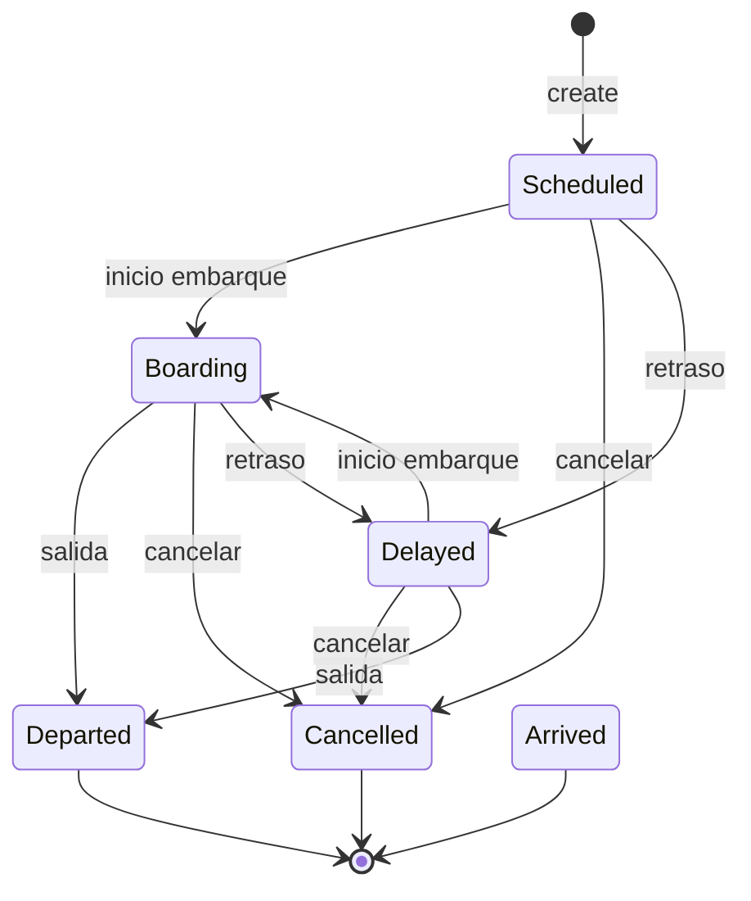
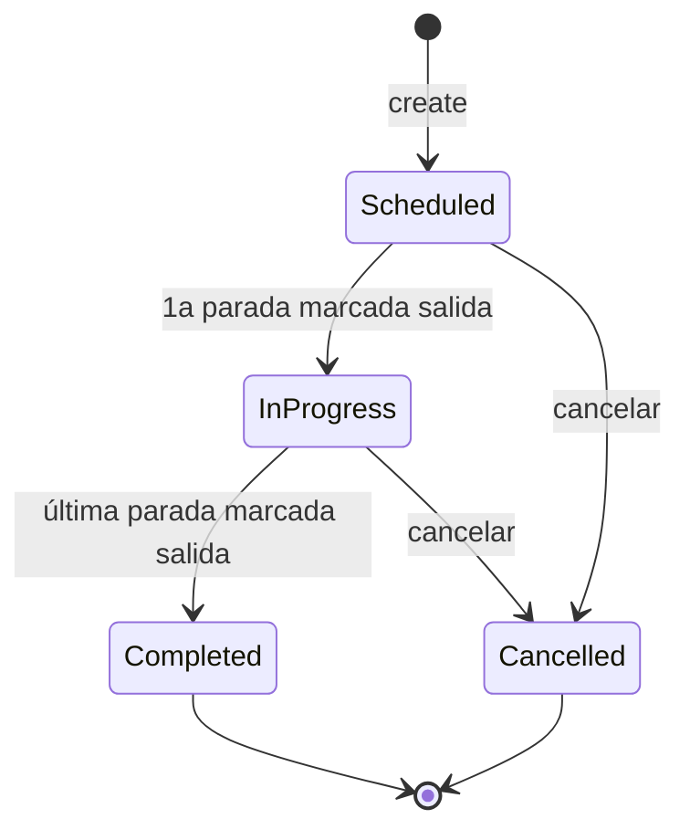
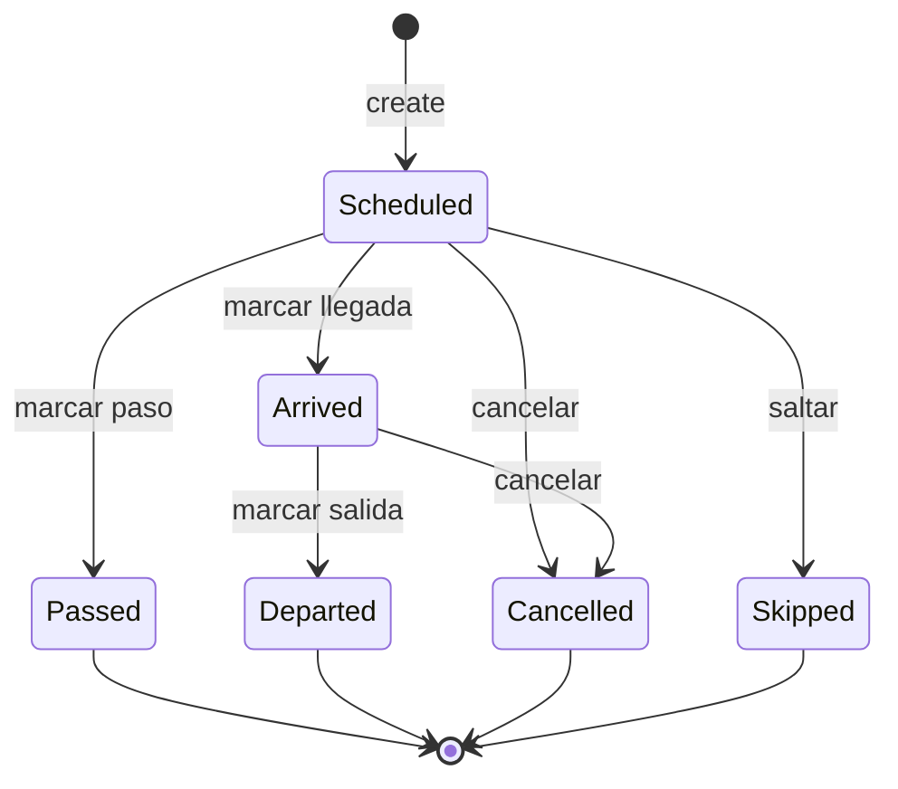

# Modelo de Dominio — RailBoard

> Documento del modelo de dominio del sistema RailBoard, que describe las entidades, relaciones, estados y reglas de negocio del sistema de paneles informativos ferroviarios.

---

## 1. Glosario de dominio

| Término (CA)    | Término (ES)    | Código entidad         | Descripción                                                                                           |
| --------------- | --------------- | ---------------------- | ----------------------------------------------------------------------------------------------------- |
| Tren            | Tren            | `Train`                | Servicio individual con horario, estado, estación asociada y destino. Modelo "plano" (mono-estación). |
| Servei          | Servicio        | `Service`              | Recorrido completo multi-parada con origen y destino como _places_.                                   |
| Parada          | Parada          | `ServiceStop`          | Punto individual de un servicio en una estación, con horarios programados/esperados/reales.           |
| Operador        | Operador        | `Operator`             | Compañía ferroviaria que opera el tren (Renfe, Iryo, Ouigo…).                                         |
| Tipus de tren   | Tipo de tren    | `TrainType`            | Categoría del tren (AVE, Cercanías, Avlo, Alvia…).                                                    |
| Estació         | Estación        | `Station`              | Estación física con pantalla(s) de salidas/llegadas.                                                  |
| Lloc            | Lugar           | `Place`                | Ciudad o localidad de destino/origen de un servicio.                                                  |
| Ruta            | Ruta            | `RailRoute`            | Recorrido ferroviario línea+estaciones (ej: C-1 Madrid-Chamartín–Aeropuerto).                         |
| Icona           | Icono           | `TrainIcon`            | Imagen personalizada de la librería de iconos para trenes.                                            |
| Configuració    | Configuración   | `Config`               | Parámetros globales de la aplicación.                                                                 |
| Config pantalla | Config pantalla | `StationDisplayConfig` | Configuración por estación (idioma, plataforma/sector, apariencia).                                   |
| Esdeveniment    | Evento          | `ServiceEvent`         | Registro de auditoría de cambios de estado en servicios.                                              |
| Moviment        | Movimiento      | —                      | Tipo de movimiento: salida (`departure`), llegada (`arrival`), paso (`pass`), mixto (`mixed`).        |

---

## 2. Diagrama de entidades (Mermaid ERD)

```mermaid
erDiagram
    Operator ||--o{ Train : "opera"
    Operator ||--o{ Service : "opera"
    TrainType ||--o{ Train : "clasifica"
    TrainType ||--o{ Service : "clasifica"
    Station ||--o{ Train : "muestra"
    Station ||--o| StationDisplayConfig : "configura"
    Station ||--o{ ServiceStop : "aloja"
    Place ||--o{ Service : "origen"
    Place ||--o{ Service : "destino"
    Service ||--o{ ServiceStop : "contiene"
    Service ||--o{ ServiceEvent : "genera"
    ServiceStop ||--o{ ServiceEvent : "referencia"
    ServiceStop }o--|| Station : "ubicado en"

    Operator {
        int id PK
        string name UK
        string logo_url
        string pre_announce_ogg
    }
    TrainType {
        int id PK
        string code UK
        string name
        string color
        string logo_url
        string pre_announce_ogg
        string destination_icon_url
    }
    Place {
        int id PK
        string name UK
        string logo_url
    }
    Station {
        int id PK
        string name
        string short
        string logo_url
        string pre_announce_ogg
        string color
        int sort_order
        datetime created_at
    }
    StationDisplayConfig {
        int station_id PK, FK
        string config_json
        datetime updated_at
    }
    Train {
        int id PK
        string number
        int operator_id FK
        int train_type_id FK
        string origin
        string destination
        string stops JSON
        string scheduled_time
        string expected_time
        string platform
        string sector
        string status
        int sort_order
        string observations
        int station_id FK
        string custom_icon_url
        string icon_mode
        int service_stop_id FK
        datetime created_at
    }
    TrainIcon {
        int id PK
        string name UK
        string icon_url
        datetime created_at
    }
    Service {
        int id PK
        string number UK
        int operator_id FK
        int train_type_id FK
        int origin_place_id FK
        int destination_place_id FK
        string status
        string notes
        datetime started_at
        datetime completed_at
        datetime cancelled_at
        datetime created_at
        datetime updated_at
    }
    ServiceStop {
        int id PK
        int service_id FK
        int station_id FK
        int stop_number
        string stop_type
        string arrival_scheduled
        string departure_scheduled
        string arrival_expected
        string departure_expected
        string arrival_actual
        string departure_actual
        string state
        string platform
        string sector
        int delay_minutes
        int delay_locked
        string notes
        datetime created_at
        datetime updated_at
    }
    ServiceEvent {
        int id PK
        int service_id FK
        int stop_id FK
        string event_type
        string details JSON
        datetime created_at
    }
    Config {
        string key PK
        string value
    }
```

---

## 3. Descripción detallada de las entidades

### 3.1. `Operator`

Representa una compañía ferroviaria.

| Atributo           | Tipo        | Descripción                         |
| ------------------ | ----------- | ----------------------------------- |
| `id`               | INTEGER PK  | Identificador autoincremental       |
| `name`             | TEXT UNIQUE | Nombre del operador (ej: "Renfe")   |
| `logo_url`         | TEXT        | URL del logotipo                    |
| `pre_announce_ogg` | TEXT        | Audio de pre-anuncio para megafonía |

**Relaciones:**

- Un `Operator` puede estar asociado a muchos `Train`s (`operator_id` FK a `trains`)
- Un `Operator` puede estar asociado a muchos `Service`s (`operator_id` FK a `services`)

**Reglas:**

- `name` es único (UNIQUE constraint)

---

### 3.2. `TrainType`

Categoría de tren.

| Atributo               | Tipo        | Descripción                               |
| ---------------------- | ----------- | ----------------------------------------- |
| `id`                   | INTEGER PK  | Identificador autoincremental             |
| `code`                 | TEXT UNIQUE | Código del tipo (ej: "AVE", "C", "MD")    |
| `name`                 | TEXT        | Nombre descriptivo (ej: "Alta Velocidad") |
| `color`                | TEXT        | Color hexadecimal (#7c1d2e)               |
| `logo_url`             | TEXT        | URL del logotipo                          |
| `pre_announce_ogg`     | TEXT        | Audio de pre-anuncio                      |
| `destination_icon_url` | TEXT        | Icono de destino para el display          |

**Relaciones:**

- Un `TrainType` puede clasificar muchos `Train`s
- Un `TrainType` puede clasificar muchos `Service`s

**Reglas:**

- `code` es la clave para upsert (API POST /train-types hace upsert por `code`)

---

### 3.3. `Place`

Ciudad o localidad de origen/destino.

| Atributo   | Tipo        | Descripción                              |
| ---------- | ----------- | ---------------------------------------- |
| `id`       | INTEGER PK  | Identificador autoincremental            |
| `name`     | TEXT UNIQUE | Nombre del lugar (ej: "Barcelona Sants") |
| `logo_url` | TEXT        | URL del logotipo                         |

**Reglas:**

- `name` es único

---

### 3.4. `Station`

Estación física con pantalla de salidas/llegadas.

| Atributo           | Tipo       | Descripción                               |
| ------------------ | ---------- | ----------------------------------------- |
| `id`               | INTEGER PK | Identificador autoincremental             |
| `name`             | TEXT       | Nombre completo de la estación            |
| `short`            | TEXT       | Nombre abreviado                          |
| `logo_url`         | TEXT       | URL del logotipo                          |
| `pre_announce_ogg` | TEXT       | Audio de pre-anuncio para megafonía       |
| `color`            | TEXT       | Color institucional (#1A3254 por defecto) |
| `sort_order`       | INTEGER    | Orden de visualización en los listados    |
| `created_at`       | TEXT       | Fecha de creación (ISO 8601)              |

**Relaciones:**

- Una `Station` puede tener muchos `Train`s asociados
- Una `Station` tiene cero o un `StationDisplayConfig`
- Una `Station` puede alojar muchos `ServiceStop`s

**Reglas de negocio:**

- No se puede eliminar la última estación (`countStations() <= 1` → error)
- `sort_order` determina el orden en los listados

---

### 3.5. `StationDisplayConfig`

Configuración específica por estación.

| Atributo      | Tipo           | Descripción                                            |
| ------------- | -------------- | ------------------------------------------------------ |
| `station_id`  | INTEGER PK, FK | Referencia a `stations.id` con ON DELETE CASCADE       |
| `config_json` | TEXT           | JSON con configuración (idioma, colores, plataformas…) |
| `updated_at`  | TEXT           | Fecha de modificación                                  |

**Herede de `Config`:** Los valores globales actúan como fallback. El `config_json` sobrescribe valores.

**Campos habituales dentro de `config_json`:**

- `station_name`, `logo_url`, `language`, `languages[]`, `routeRegion`
- `platformMin`, `platformMax`, `platformAllowEmpty`, `sectorMin`, `sectorMax`, `sectorAllowEmpty`
- `mode` (departures/arrivals), `displayMode` (single/multiple)
- `bgColor`, `headerBgColor`, `headerTextColor`, `rowBgColor`, `altBgColor`
- `showDestinationIcon`, `destinationFontSize`, `countdownFontSize`
- `timeFormat` (24h/12h), `clockMode` (real/fake), `clockFakeTime`
- `announce_departure`, `announce_arrival`, `announce_templates_map`, `announce_presets`
- `tts_rate`, `tts_pitch`, `tts_volume`, `tts_voice`, `tts_voice_map`

---

### 3.6. `Train` (modelo "plano" / mono-estación)

Representa un tren individual en un panel de salidas/llegadas. Modelo legacy que convive con el modelo `Service` + `ServiceStop`.

| Atributo          | Tipo       | Descripción                                                        |
| ----------------- | ---------- | ------------------------------------------------------------------ |
| `id`              | INTEGER PK | Identificador autoincremental                                      |
| `number`          | TEXT       | Número de tren (ej: "03104")                                       |
| `operator_id`     | INTEGER FK | Operador (ON DELETE SET NULL)                                      |
| `train_type_id`   | INTEGER FK | Tipo de tren (ON DELETE SET NULL)                                  |
| `origin`          | TEXT       | Origen (string literal, no FK)                                     |
| `destination`     | TEXT       | Destino (string literal, no FK)                                    |
| `stops`           | TEXT JSON  | Array JSON de paradas intermedias (strings)                        |
| `scheduled_time`  | TEXT       | Horario programado (HH:mm)                                         |
| `expected_time`   | TEXT       | Horario previsto (HH:mm)                                           |
| `platform`        | TEXT       | Vía/andén ("-" por defecto)                                        |
| `sector`          | TEXT       | Sector ("-" por defecto)                                           |
| `status`          | TEXT       | Estado actual (véase §4)                                           |
| `sort_order`      | INTEGER    | Orden en el panel                                                  |
| `observations`    | TEXT       | Observaciones / notas                                              |
| `station_id`      | INTEGER FK | Estación donde se muestra (ON DELETE SET NULL)                     |
| `custom_icon_url` | TEXT       | URL de icono personalizado                                         |
| `icon_mode`       | TEXT       | Modo de icono: `destination`, `custom`, `type`, `operator`, `none` |
| `service_stop_id` | INTEGER FK | Enlace opcional a `service_stops` (migración 003)                  |
| `created_at`      | TEXT       | Fecha de creación                                                  |

**Estados de `status`:** `Scheduled`, `Boarding`, `Delayed`, `Departed`, `Arrived`, `Cancelled`

---

### 3.7. `TrainIcon`

Librería de iconos personalizados para trenes.

| Atributo     | Tipo        | Descripción                   |
| ------------ | ----------- | ----------------------------- |
| `id`         | INTEGER PK  | Identificador autoincremental |
| `name`       | TEXT UNIQUE | Nombre del icono              |
| `icon_url`   | TEXT        | URL del archivo de imagen     |
| `created_at` | TEXT        | Fecha de creación             |

---

### 3.8. `Service` (modelo multi-parada)

Recorrido completo de un tren con múltiples paradas.

| Atributo               | Tipo        | Descripción                                  |
| ---------------------- | ----------- | -------------------------------------------- |
| `id`                   | INTEGER PK  | Identificador autoincremental                |
| `number`               | TEXT UNIQUE | Número de servicio (ej: "03104")             |
| `operator_id`          | INTEGER FK  | Operador (ON DELETE SET NULL)                |
| `train_type_id`        | INTEGER FK  | Tipo de tren (ON DELETE SET NULL)            |
| `origin_place_id`      | INTEGER FK  | Lugar de origen (Place, ON DELETE SET NULL)  |
| `destination_place_id` | INTEGER FK  | Lugar de destino (Place, ON DELETE SET NULL) |
| `status`               | TEXT        | Estado actual                                |
| `notes`                | TEXT        | Notas generales                              |
| `started_at`           | TEXT        | Inicio del servicio (ISO 8601)               |
| `completed_at`         | TEXT        | Finalización (ISO 8601)                      |
| `cancelled_at`         | TEXT        | Cancelación (ISO 8601)                       |
| `created_at`           | TEXT        | Fecha de creación                            |
| `updated_at`           | TEXT        | Fecha de modificación                        |

**Estados de `status`:** `Scheduled`, `In Progress`, `Completed`, `Cancelled`

---

### 3.9. `ServiceStop`

Punto individual de un servicio en una estación.

| Atributo              | Tipo       | Descripción                                       |
| --------------------- | ---------- | ------------------------------------------------- |
| `id`                  | INTEGER PK | Identificador autoincremental                     |
| `service_id`          | INTEGER FK | Servicio al que pertenece (ON DELETE CASCADE)     |
| `station_id`          | INTEGER FK | Estación (ON DELETE RESTRICT)                     |
| `stop_number`         | INTEGER    | Número de orden en la ruta (1, 2, 3…)             |
| `stop_type`           | TEXT       | Tipo: `Origin`, `Stop`, `Pass`, `Destination`     |
| `arrival_scheduled`   | TEXT       | Hora programada de llegada (ISO 8601)             |
| `departure_scheduled` | TEXT       | Hora programada de salida (ISO 8601)              |
| `arrival_expected`    | TEXT       | Hora prevista de llegada                          |
| `departure_expected`  | TEXT       | Hora prevista de salida                           |
| `arrival_actual`      | TEXT       | Hora real de llegada                              |
| `departure_actual`    | TEXT       | Hora real de salida                               |
| `state`               | TEXT       | Estado de la parada                               |
| `platform`            | TEXT       | Vía/andén                                         |
| `sector`              | TEXT       | Sector                                            |
| `delay_minutes`       | INTEGER    | Retraso acumulado (minutos)                       |
| `delay_locked`        | INTEGER    | Si es 1, no hereda retrasos de paradas anteriores |
| `notes`               | TEXT       | Notas                                             |
| `created_at`          | TEXT       | Fecha de creación                                 |
| `updated_at`          | TEXT       | Fecha de modificación                             |

**Estados de `state`:** `Scheduled`, `Arrived`, `Departed`, `Passed`, `Cancelled`, `Skipped`

**UNIQUE:** `(service_id, station_id, stop_number)`

---

### 3.10. `ServiceEvent`

Registro de auditoría para cambios en servicios.

| Atributo     | Tipo       | Descripción                           |
| ------------ | ---------- | ------------------------------------- |
| `id`         | INTEGER PK | Identificador autoincremental         |
| `service_id` | INTEGER FK | Servicio asociado (ON DELETE CASCADE) |
| `stop_id`    | INTEGER FK | Parada asociada (ON DELETE SET NULL)  |
| `event_type` | TEXT       | Tipo de evento                        |
| `details`    | TEXT       | JSON con detalles                     |
| `created_at` | TEXT       | Fecha de creación                     |

**Tipos de evento:** `service_created`, `service_updated`, `service_cancelled`, `service_completed`, `stop_arrival`, `stop_departure`, `stop_passed`, `delay_added`, `delay_propagated`

---

### 3.11. `Config`

Almacenamiento clave-valor para configuración global.

| Atributo | Tipo    | Descripción            |
| -------- | ------- | ---------------------- |
| `key`    | TEXT PK | Clave de configuración |
| `value`  | TEXT    | Valor                  |

**Claves predefinidas:**

- `station_name`, `mode`, `displayMode`
- `platformMin`, `platformMax`, `platformAllowEmpty`
- `sectorMin`, `sectorMax`, `sectorAllowEmpty`
- `announce_departure`, `announce_arrival`, `announce_presets`, `announce_templates_map`
- `tts_rate`, `tts_pitch`, `tts_volume`, `tts_voice`, `tts_voice_map`

---

### 3.12. `RailRoute` (solo en memoria / archivo de rutas)

No almacenado en DB. Las rutas se cargan desde archivos JSON/fixtures.

| Propiedad    | Tipo     | Descripción                                      |
| ------------ | -------- | ------------------------------------------------ |
| `code`       | string   | Código de línea (ej: "C-1")                      |
| `name`       | string   | Nombre (ej: "C-1 Madrid Chamartín – Aeropuerto") |
| `network`    | string   | Red (ej: "Cercanías Madrid")                     |
| `operator`   | string   | Operador por defecto (ej: "Renfe")               |
| `color`      | string   | Color hexadecimal                                |
| `headwayMin` | number   | Intervalo mínimo entre trenes (minutos)          |
| `platforms`  | string[] | Vías habituales                                  |
| `numbers`    | string[] | Números de tren disponibles                      |
| `stations`   | string[] | Lista de estaciones de la ruta                   |
| `notes`      | string   | Notas opcionales                                 |

---

## 4. Diagramas de estados

### 4.1. Estados de `Train`



### 4.2. Estados de `Service`



### 4.3. Estados de `ServiceStop`



---

## 5. Reglas de negocio

### 5.1. Ciclo de vida del tren

1. **Transición de estados de Train:** `Scheduled` → `Boarding` → `Departed` / `Arrived`.
   - `Delayed` es un estado transversal: cualquier estado excepto `Departed`/`Arrived`/`Cancelled` puede pasar a `Delayed`, y desde `Delayed` se puede volver a `Scheduled` o `Boarding`.
   - `Cancelled` se puede aplicar desde cualquier estado excepto `Departed`/`Arrived`.

2. **Transición de estados de Service:** `Scheduled` → `In Progress` → `Completed`; `Cancelled` desde `Scheduled` o `In Progress`.

3. **Transición de estados de ServiceStop:** `Scheduled` → `Arrived` → `Departed`; `Passed`, `Cancelled`, `Skipped` son terminales desde `Scheduled`.

### 5.2. Propagación de retrasos

4. **Propagación automática:** Cuando una parada llega con retraso (`delay_minutes > 0`), el retraso se propaga a las paradas posteriores sumándolo a `arrival_expected`, `departure_expected` y `delay_minutes`.

5. **Bloqueo de propagación:** Si `delay_locked = 1` en una parada, esta no recibe la propagación de retrasos de paradas anteriores.

6. **Propagación manual:** `addDelay` a una parada también se propaga a las posteriores (excepto si `delay_locked`).

### 5.3. Finalización de servicio

7. **Compleción de Service:** Cuando la última parada (la de `stop_number` máximo) se marca como `Departed`, el `Service` pasa automáticamente a `Completed`.

8. **Inicio de Service:** Cuando se marca la primera salida de un servicio (cualquier `Departed` de un `ServiceStop`), el `Service` pasa a `In Progress` (si no lo estaba ya).

### 5.4. Restricciones de integridad

9. **No se puede eliminar la última estación:** El backend retorna error si `countStations() <= 1`.

10. **`clearTrains` requiere `X-Confirm: yes`:** El DELETE /trains requiere validador en el header para evitar borrados accidentales.

11. **`operator.name` es único** (UNIQUE constraint).

12. **`place.name` es único** (UNIQUE constraint).

13. **`train_type.code` es la clave para upsert:** POST /train-types hace upsert basado en `code`.

14. **`service.number` es único** (UNIQUE constraint).

15. **`train_icons.name` es único** (UNIQUE constraint).

### 5.5. Gestión de iconos en el panel

16. **`icon_mode` determina qué icono se muestra en el panel:**
    - `destination` — icono de destino del tipo de tren (`type_destination_icon`)
    - `custom` — icono personalizado (`custom_icon_url`)
    - `type` — logotipo del tipo de tren
    - `operator` — logotipo del operador
    - `none` — sin icono

17. **`showDestinationIcon`:** Configuración global que, si es `false`, desactiva los iconos de destino independientemente de `icon_mode`.

### 5.6. Otras reglas

18. **`sort_order`** determina el orden de visualización de los trenes en el panel (ascendente) y de las estaciones en los listados.

19. **Idiomas soportados:** `es`, `ca`, `en`, `fr`, `eu`, `gl`.

20. **Actualización en tiempo real:** Cualquier cambio vía endpoints admin (POST/PUT/PATCH/DELETE) emite un mensaje WebSocket (`{ type: "update" }`) para que los displays se refresquen.

21. **Rate limiting:** Las peticiones POST/PUT/PATCH/DELETE a `/admin` tienen un límite de 30 por minuto.

22. **Dualidad Train ⮀ Service:** El sistema soporta dos modelos concurrentes:
    - `Train` (plano, directo) para operación simple mono-estación
    - `Service` + `ServiceStop` (jerárquico) para operación multi-estación
    - El endpoint `/stations/:id/board` intenta primero `Train`, luego hace fallback a `Service`

---

## 6. Análisis de reglas de negocio

### 6.1. Reglas duplicadas

| Regla                                                 | Dónde se duplica                                                     | Impacto                                                                                       |
| ----------------------------------------------------- | -------------------------------------------------------------------- | --------------------------------------------------------------------------------------------- |
| Validación de tipo de archivo (img/audio)             | `routes.js:41-51` (img), `routes.js:57-69` (audio)                   | Duplicación de lógica de `fileFilter` para Multer                                             |
| Normalización de idiomas                              | `db.js:416-445` y `routes.js:648-678`                                | Lógica `normalizeDisplayLanguage` / `normalizeLanguageList` duplicada y ligeramente diferente |
| `normalizeStation` para búsqueda                      | `routes.js:105-115` y variantes en `routes.js:1135`                  | No hay función compartida                                                                     |
| Lógica de generación de retrasos aleatorios (profile) | `routes.js:1101-1112` y `generate-random-train`                      | Hardcoded por código de tipo                                                                  |
| Lógica de cálculo de propagación de retrasos          | `serviceStops.markArrival:738-748` y `serviceStops.addDelay:826-835` | Casi idéntica                                                                                 |

### 6.2. Reglas que solo están en el frontend

| Regla                                   | Archivo                | Descripción                                                                                       |
| --------------------------------------- | ---------------------- | ------------------------------------------------------------------------------------------------- |
| Colores de estado en el panel           | `Display.tsx:472-476`  | `Cancelled` → opacidad reducida, `Boarding` → fondo amarillo                                      |
| Filtro de estados en el admin           | `Admin.tsx:1913-1916`  | Colores de pill de estado: verde `Departed`, ámbar `Boarding`, gris `Cancelled`                   |
| Validación FormData para archivos       | `api.ts:223-234`       | Convierte `custom_icon_file` a FormData                                                           |
| `showDestinationIcon` por defecto       | `DisplayConfig.tsx:32` | `showDestinationIcon: true` en el formulario de configuración                                     |
| `DEFAULT_CONFIG` parcialmente duplicado | `DisplayConfig.tsx`    | Los valores por defecto de `platformMin`, `sectorMin`, etc. se repiten respecto a `db.js:132-139` |

### 6.3. Valores mágicos hardcodeados

| Valor                                                | Dónde aparece                              | Descripción                                                                |
| ---------------------------------------------------- | ------------------------------------------ | -------------------------------------------------------------------------- |
| `#7c1d2e`                                            | `db.js:29`, `routes.js:1045`, `seed.js:45` | Color por defecto para AVE / train_type                                    |
| `#1A3254`                                            | `db.js:46`, `db.js:381`                    | Color por defecto para estaciones                                          |
| `ADMIN_PASSWORD = "railboard"`                       | `routes.js:21`                             | Password admin por defecto                                                 |
| `rateLimitMax = 1000` (dev) / `120` (prod)           | `index.js:36`                              | Rate limiting                                                              |
| `fileSize: 10 * 1024 * 1024`                         | `routes.js:39`                             | Límite de imágenes (10 MB)                                                 |
| `fileSize: 5 * 1024 * 1024`                          | `routes.js:56`                             | Límite de audio (5 MB)                                                     |
| `maxStopLimit = 9`                                   | `routes.js:1189,1278`                      | Límite máximo de paradas mostradas en los stops de un tren aleatorio       |
| `delayProb: 0.16, cancelledProb: 0.03`               | `routes.js:1103`                           | Probabilidades de retraso por tipo Cercanías                               |
| `delayProb: 0.09, cancelledProb: 0.02`               | `routes.js:1108`                           | Probabilidades de retraso por tipo AVE                                     |
| Constantes de región `getRouteRegion`                | `routes.js:153-167`                        | Mapa hardcodeado de región por nombre de ruta                              |
| `DEFAULT_CONFIG`                                     | `db.js:132-139`                            | `platformMin: "1"`, `platformMax: "8"`, `sectorMin: "A"`, `sectorMax: "D"` |
| `baseOperators = ["Renfe", "Iryo", "Ouigo", "SNCF"]` | `routes.js:78`                             | Operadores base para `ensureLearnedRailData`                               |
| `C-3` (caso especial de stops)                       | `routes.js:1190`                           | `C-3` muestra todas las paradas sin truncar                                |
| `Xàtiva` (caso especial C-2)                         | `routes.js:1162-1165`                      | Lógica de desvío a Xàtiva para C-2                                         |
| `3` minutos headway (mínimo random)                  | `routes.js:1180`                           | `lastOffset + headwayMin + randomInt(-3, 4)`                               |

### 6.4. Validaciones que faltan

| Falta de validación                                                  | Dónde                        | Descripción                                                                                  |
| -------------------------------------------------------------------- | ---------------------------- | -------------------------------------------------------------------------------------------- |
| `origin` y `destination` no validados contra `places`                | `createTrain`, `updateTrain` | Se acepta cualquier string literal                                                           |
| `scheduled_time` / `expected_time` formato                           | `createTrain`                | No se valida formato HH:mm al crear tren                                                     |
| `stops` JSON                                                         | `createTrain`                | Se hace `JSON.stringify` pero no se valida que sea un array                                  |
| `platform` / `sector` permitidos contra config                       | `backend`                    | No se valida que platform esté dentro de `platformMin`–`platformMax` al crear tren           |
| Duplicado de `service.number` al crear                               | `services.create`            | La DB lanzará error UNIQUE constraint, pero no hay comprobación previa                       |
| `stop_type` es `Origin`/`Stop`/`Pass`/`Destination`                  | `serviceStops.create`        | No se valida el valor (acepta cualquier string)                                              |
| `state` de `ServiceStop` es un valor permitido                       | `serviceStops.*`             | No se valida el valor                                                                        |
| No se puede asignar `status = "Delayed"` sin cambiar `expected_time` | `backend`                    | La API `PATCH /trains/:id/status` permite poner cualquier `status` sin tocar `expected_time` |
| No se puede asignar `status = "Departed"` sin `platform`             | `backend`                    | No hay validación                                                                            |
| No se puede crear un servicio sin paradas                            | `services.create`            | Se permite crear un servicio vacío                                                           |
| `actual_time` debe ser ISO 8601 válido                               | `serviceStops.markArrival`   | Se hace `new Date(actual_time)` sin validar                                                  |

---

## 7. Cross-reference: entidad → tabla → archivos

| Entidad                | Tabla DB                  | Archivo principal DB                              | Archivo API                                 | Archivos frontend                                                 |
| ---------------------- | ------------------------- | ------------------------------------------------- | ------------------------------------------- | ----------------------------------------------------------------- |
| `Operator`             | `operators`               | `db.js:18-23, 316-330`                            | `routes.js:836-866`                         | `api.ts:51, 266-285`, `Admin.tsx`, `Display.tsx`                  |
| `TrainType`            | `train_types`             | `db.js:25-32, 332-356`                            | `routes.js:900-966`                         | `api.ts:52, 287-308`, `Admin.tsx`                                 |
| `Place`                | `places`                  | `db.js:34-38, 358-365`                            | `routes.js:968-987`                         | `api.ts:66, 348-361`                                              |
| `Station`              | `stations`                | `db.js:40-49, 376-398`                            | `routes.js:989-1021`                        | `api.ts:67, 327-332`, `Admin.tsx`, `DisplayConfig.tsx`            |
| `StationDisplayConfig` | `station_display_configs` | `db.js:51-55, 459-502`                            | `routes.js:728-749`                         | `api.ts:334-340`, `DisplayConfig.tsx`                             |
| `Train`                | `trains`                  | `db.js:57-72, 196-301`                            | `routes.js:751-833, 1083-1222`              | `api.ts:14-49, 218-262`, `Admin.tsx`, `Display.tsx`, `Trains.tsx` |
| `TrainIcon`            | `train_icons`             | `db.js:74-79, 367-374`                            | `routes.js:878-898`                         | `api.ts:53, 311-325`                                              |
| `Service`              | `services`                | `db.js:506-625`                                   | `routes.js:1309-1387`                       | `api.ts:70-95, 372-388`, `ServicesPanel.tsx`                      |
| `ServiceStop`          | `service_stops`           | `db.js:627-863`                                   | `routes.js:1391-1557`                       | `api.ts:97-119, 391-419`, `ServicesPanel.tsx`                     |
| `ServiceEvent`         | `service_events`          | `db.js:866-881`                                   | — (via log interno)                         | `api.ts:379` (solo lectura)                                       |
| `Config`               | `config`                  | `db.js:13-16, 181-194`                            | `routes.js:720-725`                         | `api.ts:120-157, 214-216`                                         |
| `RailRoute`            | — (memoria)               | `fixtures/routes.js` + `services/routeService.js` | `routes.js:868-876`, `railRoutesApi.js:142` | `api.ts:54-65`, `Display.tsx`                                     |
