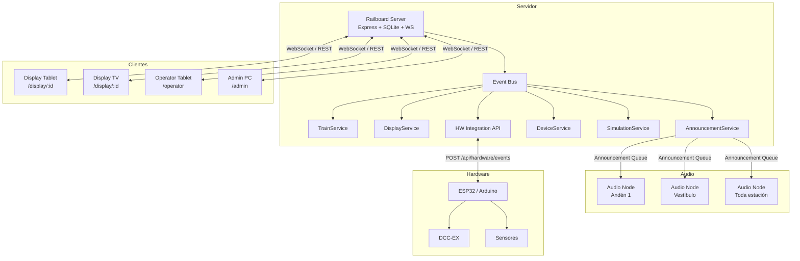
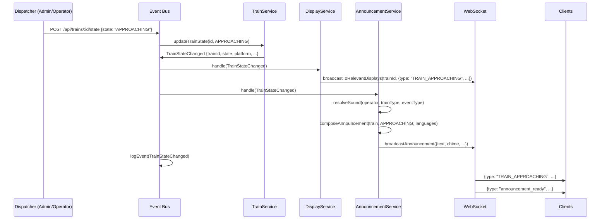
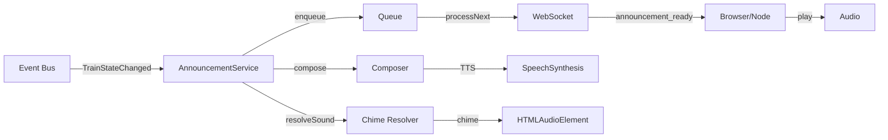

# Railboard — Sistema Distribuido de Simulación Ferroviaria

> **Propósito**: Convertir Railboard en un sistema distribuido de simulación ferroviaria para **modelismo ferroviario**, donde un servidor principal controle pantallas remotas, tablets, móviles, televisores, nodos de megafonía y, en el futuro, hardware de maqueta.
>
> Railboard **NO** es un sistema real para ADIF, Renfe ni explotación ferroviaria comercial. Es exclusivamente un sistema de simulación para modelismo ferroviario y recreación de estaciones.

---

## Arquitectura General



---

## Modelo de Datos

### displays

Almacena cada pantalla configurada en el sistema.

```sql
CREATE TABLE displays (
  id            TEXT PRIMARY KEY,          -- UUID corto (ej. "a3f8b2")
  name          TEXT NOT NULL,             -- "Pantalla vía 3"
  slug          TEXT UNIQUE,               -- "pantalla-via-3"
  station_id    INTEGER REFERENCES stations(id),
  display_type  TEXT NOT NULL              -- DEPARTURES|ARRIVALS|PLATFORM|TRAIN_INFO|CLOCK|DISRUPTIONS|CUSTOM
    CHECK(display_type IN ('DEPARTURES','ARRIVALS','PLATFORM','TRAIN_INFO','CLOCK','DISRUPTIONS','CUSTOM')),
  platform      TEXT,                      -- vía/sector
  sector        TEXT,
  orientation   TEXT DEFAULT 'LANDSCAPE'   -- LANDSCAPE|PORTRAIT
    CHECK(orientation IN ('LANDSCAPE','PORTRAIT')),
  language      TEXT DEFAULT 'ca',
  secondary_languages TEXT DEFAULT '["es","en"]',
  audio_enabled INTEGER DEFAULT 0,
  theme         TEXT DEFAULT 'default',
  font_scale    REAL DEFAULT 1.0,
  refresh_mode  TEXT DEFAULT 'realtime'    -- realtime|polling|manual
    CHECK(refresh_mode IN ('realtime','polling','manual')),
  device_id     TEXT,                      -- identificador único del dispositivo físico
  max_rows      INTEGER DEFAULT 10,        -- max filas visibles
  show_operator  INTEGER DEFAULT 1,
  show_train_type INTEGER DEFAULT 1,
  show_destination INTEGER DEFAULT 1,
  show_platform   INTEGER DEFAULT 1,
  show_time       INTEGER DEFAULT 1,
  show_status     INTEGER DEFAULT 1,
  show_notes      INTEGER DEFAULT 1,
  enabled       INTEGER DEFAULT 1,
  created_at    TEXT DEFAULT (datetime('now')),
  updated_at    TEXT DEFAULT (datetime('now'))
);
```

### devices

Registro de dispositivos conectados al sistema.

```sql
CREATE TABLE devices (
  id            TEXT PRIMARY KEY,          -- UUID
  name          TEXT NOT NULL,
  device_type   TEXT NOT NULL              -- DISPLAY|OPERATOR|AUDIO_NODE|HARDWARE
    CHECK(device_type IN ('DISPLAY','OPERATOR','AUDIO_NODE','HARDWARE')),
  display_id    TEXT REFERENCES displays(id),
  station_id    INTEGER REFERENCES stations(id),
  ip_address    TEXT,
  last_seen     TEXT,
  status        TEXT DEFAULT 'OFFLINE'     -- ONLINE|OFFLINE|UNKNOWN
    CHECK(status IN ('ONLINE','OFFLINE','UNKNOWN')),
  firmware      TEXT,
  capabilities  TEXT,                      -- JSON
  created_at    TEXT DEFAULT (datetime('now'))
);
```

### audio_nodes

Nodos de reproducción de megafonía.

```sql
CREATE TABLE audio_nodes (
  id            TEXT PRIMARY KEY,
  name          TEXT NOT NULL,
  station_id    INTEGER REFERENCES stations(id),
  zones         TEXT NOT NULL DEFAULT '[]', -- JSON array: ["hall","platform_1","platform_2","all"]
  device_id     TEXT REFERENCES devices(id),
  enabled       INTEGER DEFAULT 1,
  volume        REAL DEFAULT 1.0,
  status        TEXT DEFAULT 'OFFLINE'
    CHECK(status IN ('ONLINE','OFFLINE','PLAYING','ERROR')),
  created_at    TEXT DEFAULT (datetime('now'))
);
```

### simulation_events

Historial de eventos de simulación.

```sql
CREATE TABLE simulation_events (
  id            INTEGER PRIMARY KEY AUTOINCREMENT,
  event_type    TEXT NOT NULL,
  train_id      INTEGER,
  service_id    INTEGER,
  station_id    INTEGER,
  display_id    TEXT,
  source        TEXT,                      -- manual|automation|hardware|api
  details       TEXT,                      -- JSON
  created_at    TEXT DEFAULT (datetime('now'))
);
```

### simulation_clock

Estado del reloj de simulación.

```sql
CREATE TABLE simulation_clock (
  id            INTEGER PRIMARY KEY CHECK(id = 1),
  base_real     TEXT NOT NULL,             -- timestamp real cuando se inició
  base_sim      TEXT NOT NULL,             -- timestamp simulado correspondiente
  multiplier    REAL DEFAULT 1.0,          -- 1x, 2x, 5x, 10x
  paused        INTEGER DEFAULT 0,
  updated_at    TEXT DEFAULT (datetime('now'))
);
```

### train_state_machine (extensión de trains)

El modelo `trains` existente se extiende con columnas para la máquina de estados.

Columnas ya existentes: `id, number, operator_id, type_id, station_id, destination, platform, sector, time, expected, status, line, stops, accessible, ...`

Columnas a añadir (migración):

```sql
ALTER TABLE trains ADD COLUMN journey_id INTEGER;
ALTER TABLE trains ADD COLUMN state_updated_at TEXT;
ALTER TABLE trains ADD COLUMN state_source TEXT;  -- manual|automation|hardware
ALTER TABLE trains ADD COLUMN simulation_sequence_id INTEGER;
```

### journey_sequences

Secuencias de estados para automatización de una circulación.

```sql
CREATE TABLE journey_sequences (
  id            INTEGER PRIMARY KEY AUTOINCREMENT,
  name          TEXT,
  train_id      INTEGER REFERENCES trains(id),
  service_id    INTEGER REFERENCES services(id),
  enabled       INTEGER DEFAULT 1,
  current_step  INTEGER DEFAULT 0,
  loop          INTEGER DEFAULT 0,
  created_at    TEXT DEFAULT (datetime('now'))
);

CREATE TABLE journey_sequence_steps (
  id            INTEGER PRIMARY KEY AUTOINCREMENT,
  sequence_id   INTEGER REFERENCES journey_sequences(id) ON DELETE CASCADE,
  step_order    INTEGER NOT NULL,
  event_type    TEXT NOT NULL,
  delay_seconds INTEGER DEFAULT 0,         -- offset desde paso anterior
  relative_to   TEXT DEFAULT 'previous',   -- previous|absolute
  auto_proceed  INTEGER DEFAULT 1,
  created_at    TEXT DEFAULT (datetime('now'))
);
```

---

## Flujo de Eventos



---

## API

### Displays

```
GET    /admin/displays              → listar displays
GET    /admin/displays/:id           → obtener display
POST   /admin/displays               → crear display
PATCH  /admin/displays/:id           → actualizar display
DELETE /admin/displays/:id           → eliminar display
POST   /admin/displays/:id/duplicate → duplicar display
```

### Display público (sin auth)

```
GET    /display/:id                  → página pública del display
GET    /api/displays/:id/board       → datos del display (JSON)
```

### Dispositivos

```
GET    /admin/devices                → listar dispositivos
GET    /admin/devices/:id            → obtener dispositivo
PATCH  /admin/devices/:id            → actualizar dispositivo
DELETE /admin/devices/:id            → eliminar dispositivo
```

### Máquina de estados del tren

```
PATCH  /api/trains/:id/state         → { state: "APPROACHING" }
PATCH  /api/trains/:id/platform      → { platform }
PATCH  /api/trains/:id/delay         → { delayMinutes }
POST   /api/trains/:id/announcement  → lanzar anuncio manual
```

### Audio Nodes

```
GET    /admin/audio-nodes            → listar nodos
POST   /admin/audio-nodes            → crear nodo
PATCH  /admin/audio-nodes/:id        → actualizar nodo
DELETE /admin/audio-nodes/:id        → eliminar nodo
POST   /admin/audio-nodes/:id/play   → reproducir audio en nodo
```

### Hardware

```
POST   /api/hardware/events          → recibir evento desde hardware
GET    /admin/hardware/config        → configuración de integración
```

### Simulación

```
GET    /admin/simulation/clock        → estado del reloj
PATCH  /admin/simulation/clock        → { multiplier, paused }
POST   /admin/simulation/sequences    → crear secuencia
POST   /admin/simulation/sequences/:id/start → iniciar
POST   /admin/simulation/sequences/:id/pause → pausar
POST   /admin/simulation/sequences/:id/reset → reiniciar
GET    /admin/simulation/events       → historial
```

---

## Eventos WebSocket

### Formato general

```json
{
  "type": "EVENT_TYPE",
  "data": { ... },
  "timestamp": "2026-07-22T12:00:00Z"
}
```

### Eventos de display

```
display_update        → datos del display han cambiado
display_config_update → configuración del display modificada
```

### Eventos de tren

```
TRAIN_APPROACHING
TRAIN_ARRIVING
TRAIN_STOPPED
TRAIN_BOARDING
TRAIN_READY_TO_DEPART
TRAIN_DEPARTING
TRAIN_DEPARTED
TRAIN_DELAYED
TRAIN_CANCELLED
TRAIN_PLATFORM_CHANGED
TRAIN_DESTINATION_CHANGED
TRAIN_STATE_CHANGED      → estado genérico
```

### Eventos de megafonía

```
announcement_ready       → nuevo anuncio listo para reproducir
announcement_played      → anuncio reproducido
```

### Eventos de sistema

```
device_connected
device_disconnected
heartbeat
update                   → recarga genérica
```

### Suscripción por display

Los clientes se suscriben enviando un mensaje al conectar:

```json
// Cliente → Servidor
{
  "type": "subscribe",
  "displayId": "a3f8b2"
}

// O para múltiples
{
  "type": "subscribe",
  "displayIds": ["a3f8b2", "c7d1e3"]
}
```

---

## Pantallas de Display

### /display/:id

Renderiza la pantalla según su `displayType`:

| Tipo | Componente | Descripción |
|------|-----------|-------------|
| `DEPARTURES` | DeparturesBoard | Panel general de salidas |
| `ARRIVALS` | ArrivalsBoard | Panel general de llegadas |
| `PLATFORM` | PlatformBoard | Display de andén/vía |
| `TRAIN_INFO` | TrainInfoBoard | Información detallada de tren |
| `CLOCK` | ClockDisplay | Reloj |
| `DISRUPTIONS` | DisruptionsBoard | Incidencias |
| `CUSTOM` | CustomBoard | Configurable |

### PLATFORM (Display de Andén)

```
┌─────────────────────────────────────┐
│  Renfe              EUROMED  01182  │
│                                     │
│          13:10                      │
│                                     │
│    FIGUERES VILAFANT                │
│                                     │
│         VÍA 3 · SECTOR B            │
│                                     │
│    Próximas paradas:                │
│    • Camp de Tarragona  13:24       │
│    • Barcelona Sants    13:42       │
│    • Girona             14:05       │
│    • Figueres Vilafant  14:30       │
│                                     │
│    ─── Aproximándose ───            │
└─────────────────────────────────────┘
```

### DEPARTURES (Panel General)

```
┌────────────────────────────────────────────┐
│  SALIDAS                    Estación Centro │
│                                             │
│  13:10  EUROMED    Figueres Vilafant     V3 │
│  13:24  REG.EXP.   Barcelona E. França   V1 │
│  13:45  CERCANÍAS  Castelló              V5 │
│  14:00  AVE        Madrid Puerta Atocha  V2 │
│  14:15  ALVIA      Bilbao Abando          R │
│  14:30  REGIONAL   Lleida Pirineus       V4 │
│  14:45  CERCANÍAS  Tarragona             V1 │
│                                             │
│  🟢 13:10  EUROMED 01182  Aproximándose     │
└────────────────────────────────────────────┘
```

---

## Integración con Megafonía

El sistema de megafonía existente se integra mediante el Event Bus:



Los chimes se configuran por:
- Operador (Renfe Cercanías, Renfe MD, AVE, Euromed, Ouigo, Iryo...)
- Tipo de tren (CERCANIAS, REGIONAL, AVE, ALVIA...)
- Estación
- Tipo de evento (APPROACHING, DEPARTING, DELAYED...)

---

## Roadmap de Implementación

### FASE 1 — Display Manager
- [x] Migración `019-displays.sql` (tabla displays)
- [ ] CRUD displays en backend (`db.js` + `routes.js`)
- [ ] Display Manager UI en Admin (sidebar "Pantallas")
- [ ] Ruta pública `/display/:id`
- [ ] Componente PlatformBoard (andén)
- [ ] Componente DeparturesBoard (salidas)
- [ ] QR y copiar URL en cada display
- [ ] PWA básico para displays

### FASE 2 — WebSocket y Tiempo Real
- [ ] Suscripción por display (subscribe/unsubscribe)
- [ ] Heartbeat de dispositivos
- [ ] Device entity + tabla
- [ ] Online/offline tracking
- [ ] Eventos específicos por display en lugar de broadcast global

### FASE 3 — Máquina de Estados y Dispatcher
- [ ] Migración `020-train-states.sql`
- [ ] Train State Machine (SCHEDULED→APPROACHING→...→DEPARTED)
- [ ] Event Bus central
- [ ] Página `/operator` mobile-first
- [ ] Botonería rápida de dispatcher

### FASE 4 — Megafonía Integrada
- [ ] Event Bus → AnnouncementService bridge
- [ ] Chimes configurables por estado de tren
- [ ] Secuencias de anuncios (chime + TTS + chime cierre)
- [ ] Audio Nodes abstracción

### FASE 5 — Reloj de Simulación
- [ ] Simulation Clock (multiplicador 1x/2x/5x/10x)
- [ ] Journey Sequences (automatización por horarios)
- [ ] Pausa/reanudar/reiniciar simulación
- [ ] Eventos temporizados

### FASE 6 — Dispositivos y Hardware
- [ ] Device Manager UI
- [ ] Audio Nodes UI
- [ ] API de hardware (`POST /api/hardware/events`)
- [ ] Preparación para ESP32/Arduino/DCC

---

## Reutilización de Componentes Existentes

| Componente/Servicio Actual | Uso en el nuevo sistema |
|---------------------------|------------------------|
| `boardService.js` | Base para datos de display (normaliza trains + services) |
| `AnnouncementService` | Integrado vía Event Bus en FASE 4 |
| `announcementComposer.js` | Generación de textos multi-idioma |
| `announcementQueue.js` | Cola de anuncios para Audio Nodes |
| `announcementSoundResolver.js` | Selección de chimes por reglas |
| `useAnnouncementPlayer.ts` | Reproducción en cliente (chime + SpeechSynthesis) |
| `connectWS()` | Conexión WebSocket con auto-reconexión |
| `MegaphonyPanel.tsx` | Admin de megafonía (se mantiene) |
| `Display.tsx` | Base para PlatformBoard y DeparturesBoard |
| `TrainTypeBadge` | Insignias de tipo de tren en displays |
| `ScrollText` | Texto con scroll horizontal en displays |
| `SteamTrain` | Elemento decorativo |
| `api.ts` types | Extender con Display, Device, AudioNode types |
| `i18n.ts` + locales | Sistema multi-idioma para displays |

---

## URLs Amigables

```
/display/:id                  → Display por ID (principal)
/display/station/:slug/departures  → Salidas de estación
/display/station/:slug/arrivals    → Llegadas de estación
/display/station/:slug/platform/:p → Andén específico
/operator                     → Panel de dispatcher
/admin                        → Admin completo
/admin/displays               → Display Manager
/admin/devices                → Device Manager
/admin/audio-nodes            → Audio Nodes
/admin/simulation             → Control de simulación
```
