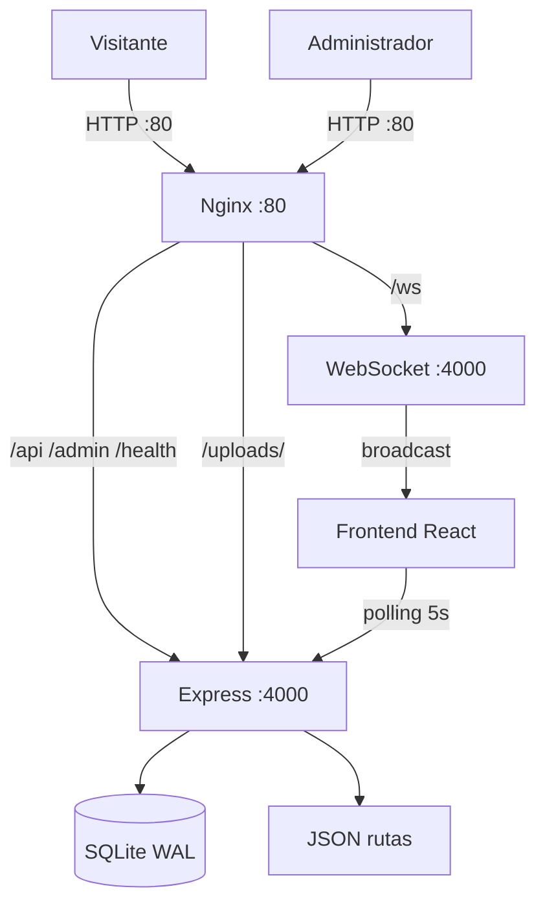
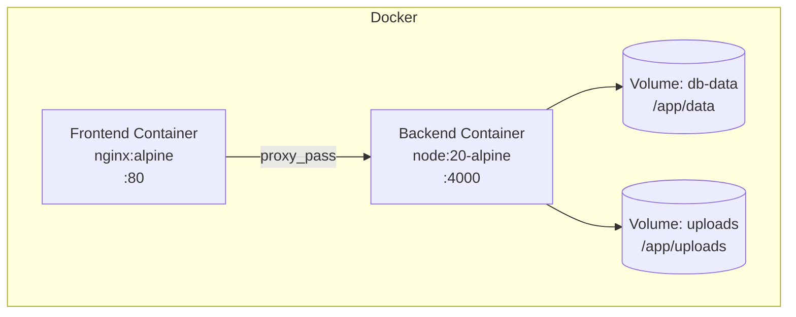
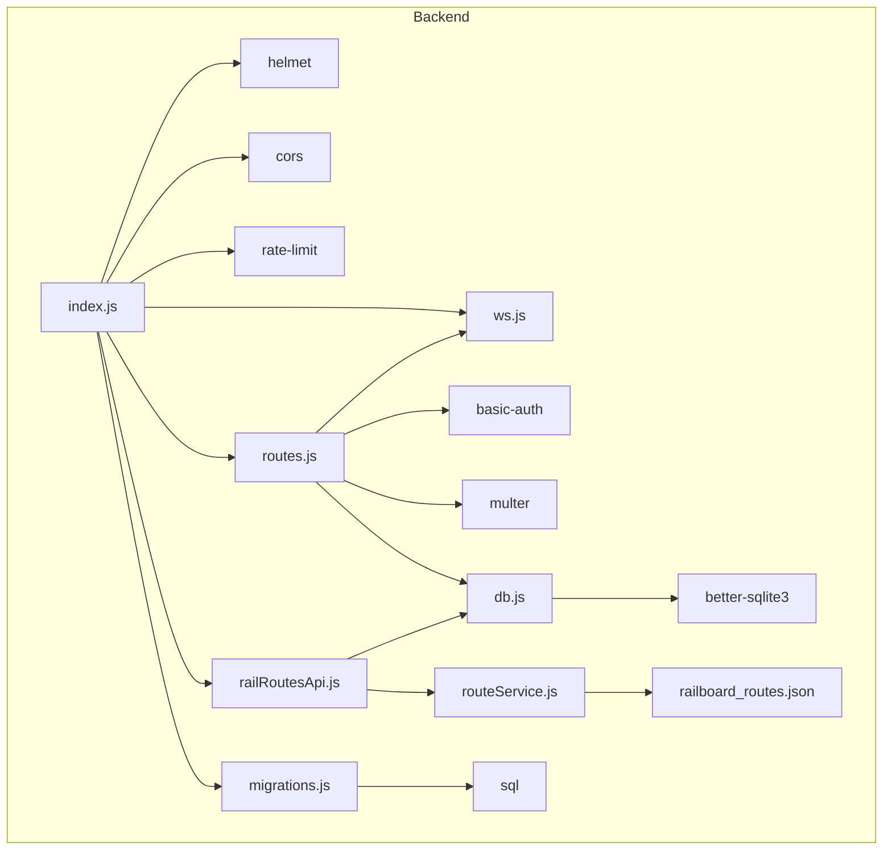
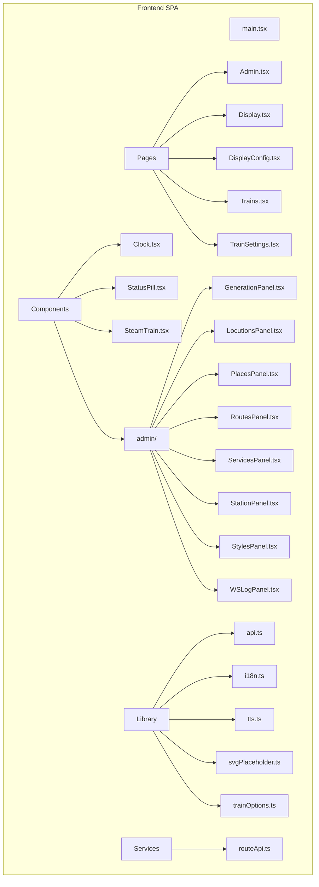
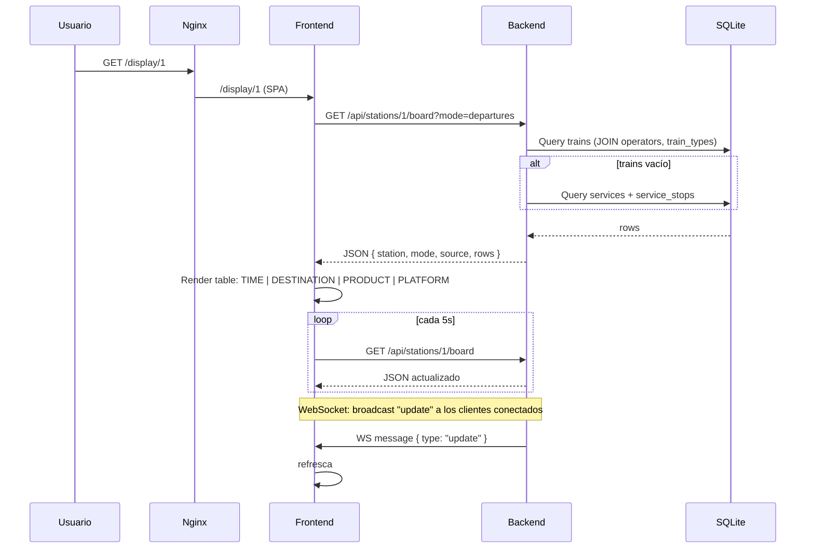
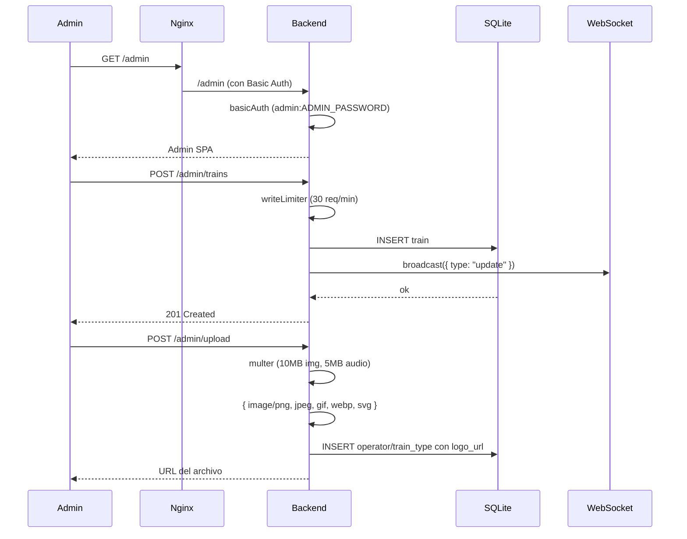

# Arquitectura de RailBoard

## 1. Visión general

RailBoard es un sistema monorepo para la visualización de paneles informativos ferroviarios en estaciones. Consta de dos subsistemas: un _backend_ Express con SQLite y WebSocket, y un _frontend_ React con Vite y Tailwind. El despliegue se realiza mediante Docker Compose con un proxy Nginx que enruta el tráfico a los contenedores correspondientes.

| Subsistema | Tecnología | Puntos de entrada |
|---|---|---|
| Backend | Express (Node 20), better-sqlite3, ws | `:4000` |
| Frontend | React + Vite + Tailwind, Nginx (prod) | `:80` |
| Base de datos | SQLite (WAL) | archivo `data.db` |
| Tiempo real | WebSocket | `/ws` |

**Archivos clave:**
- `backend/src/index.js` (89 líneas) — punto de entrada del backend
- `backend/src/routes.js` (1676 líneas) — rutas administrativas
- `backend/src/railRoutesApi.js` (209 líneas) — API pública
- `backend/src/db.js` (882 líneas) — capa de base de datos
- `backend/src/ws.js` (18 líneas) — servidor WebSocket
- `frontend/src/pages/Admin.tsx` (3128 líneas) — panel de administración
- `frontend/src/pages/Display.tsx` (841 líneas) — pantalla de visualización
- `docker-compose.yml` (47 líneas) — orquestación de servicios
- `docker/nginx.conf` (89 líneas) — configuración del proxy inverso

---

## 2. Diagrama de contexto



- El visitante accede al panel informativo vía `GET /display/:stationId`.
- El administrador accede al panel de control vía `/admin`.
- Nginx actúa como proxy inverso único: todo el tráfico pasa por él.
- El frontend se comunica con el backend vía REST y WebSocket.
- El backend lee de SQLite y de un archivo JSON estático de rutas.

---

## 3. Diagrama de contenedores



**Configuración de los contenedores:**

| Servicio | Dockerfile | Base | Expose | Healthcheck |
|---|---|---|---|---|
| Backend | `backend/Dockerfile` (14 líneas) | `node:20-alpine` | 4000 | `GET /health` cada 30s |
| Frontend | `frontend/Dockerfile` (21 líneas, multi-stage) | `nginx:alpine` | 80 | — |

**Volúmenes persistentes:**
- `db-data`: base de datos SQLite (`/app/data/data.db`)
- `uploads`: archivos subidos (logotipos, audio)

---

## 4. Diagrama de componentes

### 4.1 Backend



### 4.2 Frontend



### 4.3 Base de datos

**Tablas principales** (creadas automáticamente en `db.js:12-80`):

| Tabla | Finalidad | Clave foránea |
|---|---|---|
| `config` | Configuración clave/valor | — |
| `operators` | Operadores ferroviarios | — |
| `train_types` | Tipos de tren (AVE, Avlo, Cercanías…) | — |
| `places` | Lugares/orígenes/destinos | — |
| `stations` | Estaciones | — |
| `station_display_configs` | Configuración por estación | `station_id` → `stations(id)` |
| `trains` | Trenes individuales (modo simple) | `operator_id`, `train_type_id`, `station_id` |
| `train_icons` | Iconos personalizados | — |
| `services` | Servicios/expediciones (modo multiciudad) | `operator_id`, `train_type_id`, `origin_place_id`, `destination_place_id` |
| `service_stops` | Paradas de un servicio | `service_id`, `station_id` |
| `service_events` | Registro de eventos | `service_id`, `stop_id` |
| `schema_migrations` | Control de migraciones | — |

**Migraciones SQL** (directorio `backend/migrations/`):
1. `001-services.sql` — tablas `services` y `service_stops`
2. `002-service-events.sql` — tabla `service_events`
3. `003-trains-compatibility.sql` — compatibilidad con trenes

**Datos de demo:** `backend/src/seed.js` (206 líneas) crea operadores (Renfe, Avlo, Iryo, Ouigo), tipos de tren (AVE, Alvia, IC, MD, Avant, Cercanías), lugares y trenes de demostración con logotipos SVG generados inline.

---

## 5. Flujos de datos

### 5.1 Flujo principal: Panel informativo



**Detalles de la consulta** (`railRoutesApi.js:166-196`):
1. Se lee la configuración de la estación (`getStationDisplayConfig`)
2. Primero se intenta obtener datos de la tabla `trains` (`buildRowsFromTrains`)
3. Si no hay trenes, se recurre a los servicios (`buildRowsFromServices`)
4. Las filas se ordenan por hora esperada y número de tren
5. Se retorna JSON con `station`, `mode`, `source` ("trains" | "services"), `rows`

**Columnas renderizadas** (`Display.tsx`):
- **TIME** — 11.17% ancho, hora prevista
- **DESTINATION** — 56.33% ancho, destino + paradas intermedias
- **PRODUCT** — 18% ancho, logotipo del tipo + número
- **PLATFORM** — 7.5% ancho, vía
- **STATUS** — fila inferior bajo TIME
- **STOPS** — fila inferior bajo DESTINATION

### 5.2 Flujo administrativo



**Rutas administrativas** (`routes.js`): CRUD completo para operadores, tipos de tren, lugares, estaciones, trenes, servicios, paradas, configuración, subida de archivos y audio, gestión de rutas, iconos, etc. Cada mutación emite un `broadcast` vía WebSocket.

---

## 6. Patrones de comunicación

| Patrón | Protocolo | Origen → Destino | Uso |
|---|---|---|---|
| Síncrono (REST) | HTTP | Frontend → Backend | CRUD, consultas de panel |
| Síncrono (REST) | HTTP | Admin → Backend | Operaciones de escritura |
| Asíncrono (pub/sub) | WebSocket | Backend → Frontend | Notificaciones de cambios (`{ type: "update" }`) |
| Polling | HTTP | Frontend → Backend | Refresco periódico cada 5s (Display.tsx:280) |
| Servicio de archivos | HTTP | Nginx → Backend | Archivos estáticos en `/uploads/` |
| Proxy inverso | HTTP | Nginx → Backend | `/api/`, `/admin/`, `/ws`, `/health`, `/uploads/` |

**WebSocket** (`ws.js:5-9`):
- Servidor montado en el mismo puerto HTTP con `path: "/ws"`
- Envía un mensaje `{ type: "hello" }` al conectarse
- `broadcast(data)` envía a todos los clientes conectados

**Conexión del frontend** (`api.ts:430-462`):
- Convierte `http://` a `ws://` automáticamente
- Reconexión automática con 1.5s de retardo
- Soporte para _listeners_ de eventos específicos

---

## 7. Arquitectura de seguridad

### 7.1 Autenticación
- **HTTP Basic Auth** para todas las rutas `/admin` (`routes.js:23-27`)
- Usuario fijo: `admin`
- Contraseña: variable de entorno `ADMIN_PASSWORD`, valor por defecto `"railboard"`
- Implementado con `express-basic-auth` con `challenge: true`

### 7.2 Capas de seguridad HTTP
- **Helmet** con `crossOriginResourcePolicy: "cross-origin"` (necesario para imágenes de terceros)
- **CORS** configurado dinámicamente: origin exacto `CORS_ORIGIN` o cualquier `localhost:*` en desarrollo
- **Rate limiting**:
  - `/admin` general: 120 req/min en producción, 1000 en desarrollo
  - Operaciones de escritura (POST/PUT/PATCH/DELETE): 30 req/min
- **Headers de seguridad Nginx** (`nginx.conf:85-88`):
  - `X-Frame-Options: SAMEORIGIN`
  - `X-Content-Type-Options: nosniff`
  - `X-XSS-Protection: 1; mode=block`
  - `Referrer-Policy: strict-origin-when-cross-origin`

### 7.3 Validación de archivos
- Imágenes (multer): 10MB máximo, solo PNG/JPG/GIF/WebP/SVG
- Audio: 5MB máximo, solo OGG/Opus/MP3
- Tamaño máximo del body JSON: 1MB

### 7.4 Carencias de seguridad
- **Sin HTTPS** (el cifrado se delega al proxy externo o load balancer)
- **Sin CSRF** (no hay tokens anti-CSRF)
- **Sin MFA** (la autenticación es solo Basic Auth)
- Contraseña por defecto débil (`"railboard"`)

---

## 8. Arquitectura de despliegue

### 8.1 Entornos

| Entorno | Puerto | CORS_ORIGIN | RATE_LIMIT_MAX | ADMIN_PASSWORD |
|---|---|---|---|---|
| Desarrollo | `:4000` (backend directo) | `http://localhost:5173` | 1000 | `railboard` |
| Producción (Docker) | `:80` (Nginx) | `http://localhost` | 120 | Variable |

### 8.2 Proxy Nginx

```
:80
├── /               → sirve SPA (try_files → index.html)
├── /admin          → proxy_pass http://backend:4000
├── /admin/         → proxy_pass http://backend:4000 (15m body)
├── /api/           → proxy_pass http://backend:4000
├── /health         → proxy_pass http://backend:4000
├── /uploads/       → proxy_pass http://backend:4000 (cache 7d)
├── /ws             → proxy_pass http://backend:4000 (Upgrade WebSocket, timeout 86400s)
└── /*.js|css|png…  → static files (cache 30d)
```

### 8.3 Volúmenes y persistencia
- La base de datos SQLite se guarda en el volumen `db-data:/app/data`
- Las subidas se guardan en el volumen `uploads:/app/uploads`
- Las migraciones SQL se aplican automáticamente al iniciar el backend (`runMigrations` en `index.js:82`)

### 8.4 PWA
- `manifest.json` para instalación como aplicación
- `sw.js` (service worker) para caché offline
- Fuentes locales servidas desde `/fonts/`
- El frontend se construye con Vite y se despliega como SPA con fallback a `index.html`

---

## 9. Decisiones arquitectónicas clave

### 9.1 SQLite en lugar de PostgreSQL/MySQL
**Evidencia:** `backend/src/db.js` utiliza `better-sqlite3` con modo WAL.
**Razón:** Proyecto monousuario o de pequeña escala. SQLite simplifica el despliegue (no requiere servidor de base de datos externo), las copias de seguridad y la configuración. El modo WAL permite lecturas concurrentes sin bloqueos.

### 9.2 Monorepo con dos contenedores separados
**Evidencia:** `docker-compose.yml` define `backend` y `frontend` como servicios independientes.
**Razón:** Separación de responsabilidades. El frontend puede desarrollarse y escalarse independientemente del backend. Nginx actúa como proxy y servicio de archivos estáticos.

### 9.3 WebSocket en el mismo puerto HTTP
**Evidencia:** `index.js:78-79`: el WebSocket se conecta al mismo servidor HTTP (`http.createServer` + `attachWebSocket`).
**Razón:** Evita configuraciones complejas de puertos adicionales y simplifica el despliegue detrás de Nginx (que gestiona el upgrade de protocolo).

### 9.4 Polling + WebSocket
**Evidencia:** `Display.tsx:280` establece un `setInterval(refresh, 5000)` y `Display.tsx:294` conecta WebSocket.
**Razón:** El polling garantiza actualizaciones incluso si el WebSocket se pierde; el WebSocket proporciona actualizaciones inmediatas cuando hay cambios. Patrón híbrido de robustez y baja latencia.

### 9.5 `station_id` opcional en la tabla `trains`
**Evidencia:** `db.js:109-112`: columna añadida posteriormente mediante migración.
**Razón:** Soporte para múltiples estaciones se añadió después del diseño inicial. La columna es opcional (`SET NULL` en cascada) para compatibilidad hacia atrás.

### 9.6 Sistema dual: `trains` y `services`
**Evidencia:** `railRoutesApi.js:174-176`: primero prueba `buildRowsFromTrains`, si no hay resultados recurre a `buildRowsFromServices`.
**Razón:** El modo `trains` (tabla plana) es más sencillo y fue el primero en implementarse. El modo `services` (con paradas múltiples y gestión de retrasos en cadena) es más completo y se añadió posteriormente para el soporte multiciudad. Ambos conviven para compatibilidad.

### 9.7 Configuración por estación heredada de la global
**Evidencia:** `db.js:468-478`: `getStationDisplayConfig` combina `getConfig()` global, valores por defecto de la estación y `config_json` de `station_display_configs`.
**Razón:** Patrón de configuración por capas (global → estación → override JSON), similar a CSS.

### 9.8 Nginx como proxy inverso y servidor web
**Evidencia:** `docker/nginx.conf`: gestiona SPA, API, WebSocket, archivos estáticos y caché.
**Razón:** Nginx es eficiente sirviendo archivos estáticos y gestionando conexiones WebSocket de larga duración. El backend Express se centra exclusivamente en la lógica de negocio.

---

## 10. Riesgos arquitectónicos

| Riesgo | Descripción | Impacto | Mitigación |
|---|---|---|---|
| **Concurrencia SQLite** | SQLite no escala con escrituras concurrentes elevadas | Pérdida de datos o bloqueos en alta carga de administradores | Modo WAL, operaciones de escritura limitadas a 30 req/min |
| **Contraseña por defecto** | `ADMIN_PASSWORD` por defecto es `"railboard"` | Acceso no autorizado al panel de administración | Documentar cambio obligatorio en producción; variable de entorno `ADMIN_PASSWORD` |
| **Pérdida de datos en reinicio** | SQLite almacenado en volumen Docker | Pérdida de datos si el volumen se borra o corrompe | Copias de seguridad externas; healthcheck para detectar errores |
| **Falta de HTTPS** | El tráfico entre navegador y Nginx va en claro | Intercepción de contraseñas y datos | Delegar HTTPS a un reverse proxy externo (Traefik, Caddy, cloud LB) |
| **Falta de CSRF** | No hay protección contra CSRF en las rutas de admin | Ataques de falsificación de peticiones | La autenticación Basic Auth mitiga parcialmente (el navegador no envía credenciales cruzadas automáticamente) |
| **Dependencia de `better-sqlite3`** | Es una dependencia nativa compilada para Node 20 | Errores al actualizar Node o plataforma no compatible | `package-lock.json` fija la versión; Alpine Linux compatible |
| **Retardo en WebSocket** | El WebSocket se reconecta cada 1.5s al caer | Pequeña ventana de desactualización en el panel | Polling cada 5s como fallback garantiza actualización ≤5s |
| **Tamaño de `routes.js`** | 1676 líneas en un solo archivo | Mantenibilidad reducida, dificultad de testing | Refactorización en módulos más pequeños (`routes/` directorios) |
| **Tamaño de `Admin.tsx`** | 3128 líneas en un solo componente | Mantenibilidad reducida, renderizado lento | Dividir en subcomponentes (ya existen 8 paneles en `components/admin/`) |
